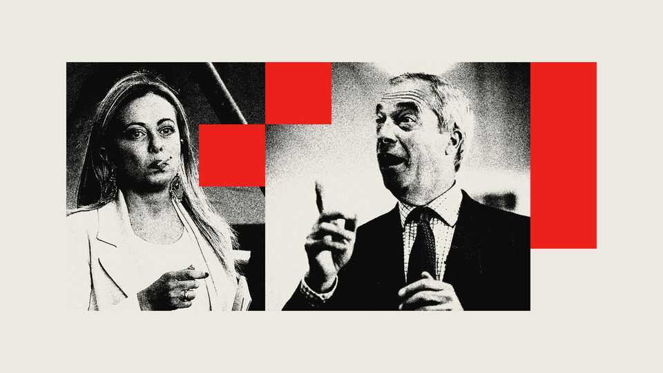

Britain | The acrobat and the knife-thrower
Giorgia Meloni and Nigel Farage compared
The power and the fury of two of Europe’s hard-right leaders
November 6th 2025

The entrance to the Britannia International Hotel in Canary Wharf, in London’s Docklands, where the British government housed some asylum- seekers, is blocked by scruffy metal barriers. The copper-coloured structures, the drawn curtains, the locked-up restaurant, the sheer size: the Britannia resembles a Bulgarian hotel in the Warsaw Pact years, the kind Westerners visited in search of news, business or prostitutes. The Britannia International as a migrant hostel: there is irony in the choice. But the Home Office, clearly, didn’t get it. Giorgia Meloni, Italy’s prime minister, would never do such a thing. An Albergo Italia for asylum-seekers, on the bank of the Tiber in Rome? No way. Out of sight, out of mind is her rule. To detain illegal migrants she

created a facility in Albania. It’s not working (the Italian judiciary opposed the transfer) but most voters don’t seem bothered by that detail.

Ms Meloni is the leader of Brothers of Italy, a party born in 2012 from the ashes of National Alliance and the neo-fascist Italian Social Movement. She took it from 4% of the vote in 2018 to 26% in the general election of 2022, a surge admired by a fellow European leader on the populist right, Nigel Farage of Reform UK. After three years in government, she has the support of around 30% of Italians in most polls.

While in opposition, she belittled the European Union, praised Brexit, opposed sanctions on Russia and lashed out against immigration. As soon as she became prime minister, on October 22nd 2022, she changed her tune. She started to play the reliable European leader, siding with Ukraine without hesitation. On one issue she has not budged much: immigration.

In that respect, her views and those of Mr Farage are not that different. Both use harsh words about migrants to rally their electoral base. There is a difference, however: she’s in power, he isn’t (yet).

Mr Farage simplifies everything: Britain must, as Vote Leave’s slogan put it, “take back control”. The catchphrases of the Brexit campaign still seem to work—not because they say anything concrete, but because they feel right to millions.

Every time I’ve tried to remind Mr Farage’s supporters of the broken promises of Brexit—on a beach in Brighton, on a train in Essex, in a pub in Bromley, where Reform won its first London council seat—I’m met with a shrug and told that things will be different under a Reform government. Yesterday’s disappointment seems forgotten (or blamed on others). It’s today’s indignation that moves hearts and votes.

So when Mr Farage talks about immigration, he talks in tabloid headlines: “a flood”, “a threat”, “an invasion”. Ms Meloni, before winning, was equally virulent. Taxing shopkeepers? “Un pizzo di Stato” (a state extortion). The euro? “Not irreversible”. Migrants? “A planned and deliberate invasion. It has a name: ethnic replacement!” But now she has to govern, all this is forgotten. Mr Farage doesn’t need a coherent migration policy, because his

role is not to manage immigration, it is to weaponise it. He’s selling resentment.

Ms Meloni needs to produce results. Italy is on the front line of the Mediterranean migration route. Boats arrive, detention centres fill up. Ms Meloni knows she can’t afford to just talk about immigrants, she has to manage them. This means budgets, legal frameworks, agreements with Tunisia and Libya, ignoring their brutal treatment of migrants gathering on their shores. It means playing both the anti-immigration card and the pro- Europe card—often in the same speech. It’s a balancing act. But she’s a skilled acrobat.

Watching her perform up there, on the political tightrope, it’s hard to tell what she really believes. Are her choices tactical or strategic, you wonder? But, for sure, she can walk that rope. Her government has announced that, in 2026-28, half a million foreign workers with temporary visas will be allowed into Italy, which badly needs them. Yet Ms Meloni still portrays newcomers as a threat to national identity.

Italians have come to realise that there are two Melonis. One travels the world, meets her foreign colleagues, looks composed and sounds pragmatic. The other speaks to her voters, gets animated and wants to sound tough. One talks about national identity and “defending our borders”. The other invokes “European solidarity” and “legal migration channels”.

It’s a vocabulary that would sound alien coming from Mr Farage. He thrives on confrontation. Remember when he stood in front of that infamous UKIP billboard showing a long queue of mainly dark-skinned migrants and the words “Breaking Point”? It was the stunt of a knife-thrower.

Mr Farage helped bring about Brexit, in part by turning immigration into a seemingly existential question. “Taking back control” did not fix the issue. It merely removed the ability to blame Brussels. Ms Meloni is trying to do what Mr Farage never attempted: turn slogans into policies. She has supported unrealistic naval blockades and pushed for changes to EU asylum rules. Mr Farage loves a show. Ms Meloni looks for compromise and a catchy phrase to please voters.

If Mr Farage came to power, would he “melonise” himself? Donald Trump didn’t; nor did Geert Wilders in the Netherlands (who has just lost an election). Would the knife-thrower climb onto the acrobat’s platform and walk the tightrope? That would be a spectacle. ■

For more expert analysis of the biggest stories in Britain, sign up to Blighty, our weekly subscriber-only newsletter.

This article was downloaded by zlibrary from https://www.economist.com//britain/2025/10/31/giorgia-meloni-and-nigel-farage- compared