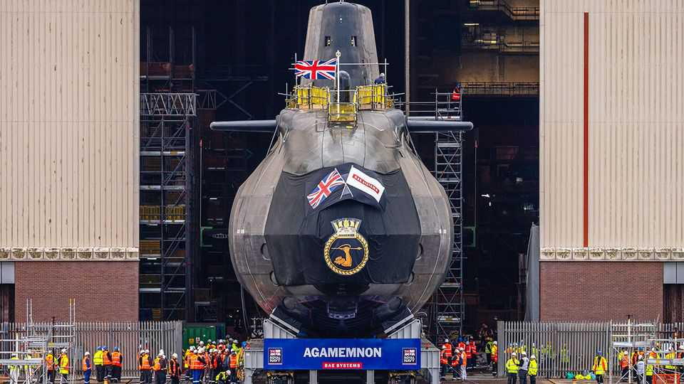
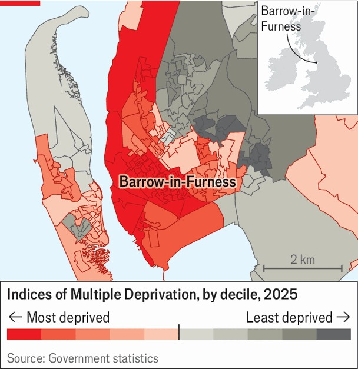
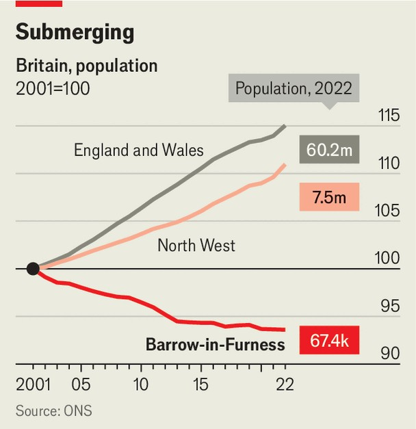
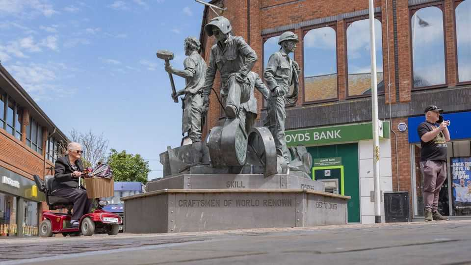
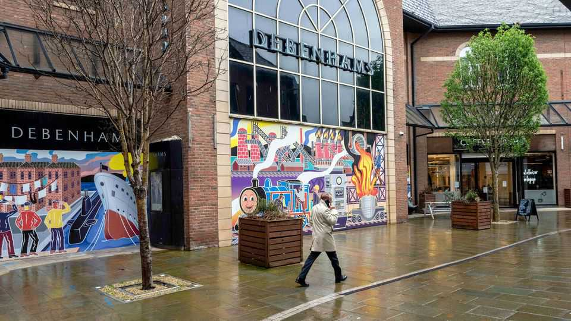

Britain | Urban renewal in a remote place
Boom times in a British manufacturing town
But submarines are not enough
November 6th 2025

Politicians and wonks who agree on little else believe that many economic and social ills could be cured by a good dose of manufacturing. The sector pays well, they point out. It provides jobs for people (particularly working- class men) who struggle with formal education. The decline of manufacturing seems to have boosted right-wing populist parties, which suggests that a revival of manufacturing would crush them. It all sounds vaguely plausible, until you consider the experience of Barrow-in-Furness. The town of some 67,000 people in north-west England is one of Britain’s busiest workshops. The Office for National Statistics estimated that one- third of Barrow’s workers were employed in manufacturing in 2022, compared with less than one-tenth in Britain as a whole. Those jobs, which

mostly involve building nuclear-powered submarines, are both well-paid and plentiful, and will almost certainly become even more so.

bae Systems, a large defence firm that employs more than 14,000 people in Barrow, has almost finished building seven attack submarines. (One of them, hms Agamemnon, floats incongruously next to a b&Q hardware store, behind much fencing and threatening signage.) The firm is already constructing four huge nuclear-armed submarines for the Royal Navy. Next will come attack submarines for the Aukus defence partnership, which unites America, Australia and Britain. bae’s order book is full for decades.

Barrow-in-Furness is poor all the same. Large parts of it are ranked among the 5% most deprived places in England (see map). In the town centre, jaunty murals cover the boarded-up windows of vacant shops. Dean McSkimmings, a board member of Love Barrow Families, a community group, calmly tells hair-raising stories of crime, suicides and a plague of rats, which are thought to have been displaced by construction nearby. Someone has spray-painted “THIS IS EGLAND” on the side of a building—a xenophobic warning as pointless as it is illiterate, since Barrow has almost no immigrants.

The town has always been “a bit boom-and-bust”, says Gill Jepson, a local historian. It swelled in the late 19th century, powered first by iron production, then by shipbuilding. At one point, demand for housing was so extreme that some workers lived in a condemned ocean liner. During the cold war Barrow went all-in on submarines. The collapse of communism in Europe was a calamity: between 1992 and 2002 bae Systems went from employing 13,000 people in the town to fewer than 3,000. In the three decades to 2022 Barrow’s population fell by 200 people a year, on average (see chart).

The current submarine-building boom has already more than reversed the job losses in the submarine industry, though not the broader population decline. But Peter Anstiss, the chief executive of Team Barrow, a public- private partnership that aims to improve the town, wants to escape the pattern of defence-driven growth and decline. Now that Barrow is in the feast phase of the feast-and-famine cycle, as he puts it, it has an opportunity to deal with its underlying problems.

Its curse is its location. Barrow is a fine place to build boats, thanks to its protected harbour. It is a terrible place to do almost anything else, on account of its remoteness. Liverpool and Manchester, the nearest big cities, are both at least two hours away by road or rail. Furness General Hospital may lose an intensive-care unit because it cannot recruit enough doctors.

Many of the people who build nuclear submarines in Barrow do not live in the town. They reside elsewhere, in places their spouses prefer, and drive in for a few days each week. These “contractors”, as they are known locally, stay in hotels or in rented houses near the docks, leading to the strange sight of new Audis and bmws parked in Victorian terraced streets where homes are on the market for as little as £60,000 ($78,000) each.

In an attempt to persuade more people to settle, the town is determinedly building new homes. Some 800 are going up in a site called Marina Village, where the national government has paid to clear the land of contaminants and lizards. bae is turning a shuttered Debenham’s department store into a training centre, which ought to bring young people into the shopping district.

Most important, in September the University of Cumbria opened a small campus in Barrow. A few mechanical engineers have enrolled in a degree programme that is so new, some of the machines they will use were being unpacked when your correspondent visited. Most of the students are not from Barrow, but have been drawn by the promise of graduate jobs in defence or energy. What do they make of the town? “It’s fine. Let’s leave it at that,” says one young man. “It’s got potential,” adds another, politely.

Down a freshly painted hallway other people are training to be nurses. Those students are older, more female and more local. Julie Mennell, vice- chancellor of the University of Cumbria, says that trainee nurses in Barrow used to have to travel to Lancaster, at least an hour away. That was a formidable barrier, especially for single mothers; the new campus means it need not be crossed.

Barrow still has severe problems. Last year only 34% of teenagers earned a grade five or better in their English and Maths gcse exams, compared with 46% in England. The town centre has far too many commercial premises, and will probably have to knock some down. Transport could be better. But at least Barrow is thinking about the distant future. If submarines ever fall from favour, it should be ready.■

For more expert analysis of the biggest stories in Britain, sign up to Blighty, our weekly subscriber-only newsletter.

This article was downloaded by zlibrary from https://www.economist.com//britain/2025/11/06/boom-times-in-a-british- manufacturing-town