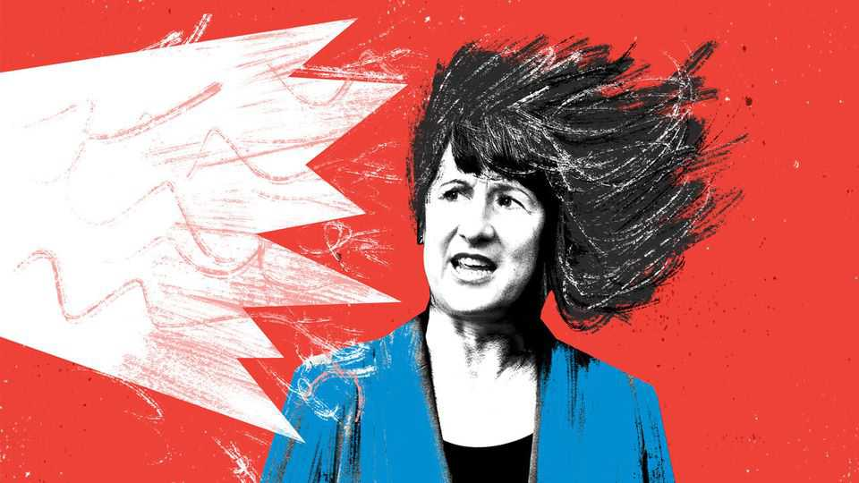

Britain | Bagehot
If Labour cranks up income taxes, the left will boo loudest
Many seem to believe in the common good without shared sacrifice
November 6th 2025

“If we are to build the future of Britain together, we will all have to contribute,” said Rachel Reeves, the chancellor, in a dreary speech from Downing Street on November 4th. “Each of us must do our bit.” It was a predictable centre-left cry from a predictably centre-left politician. Since sweeping spending cuts are politically impossible, broad tax rises, most likely an increase in income tax, are coming. Predictable yelps of protest came from across the right of the political spectrum. But so did less predictable complaints to Labour’s left. “Tax wealth, not work,” said Zack Polanski, the new leader of the Green Party, which is a margin-of-error blip behind Labour in the polls. In a strange turn, it is the

left which will lead the fight against the broad tax rises of Ms Reeves. “Tax wealth, not work” is a phrase popularised by Gary Stevenson, an economics YouTuber with a massive reach, a few million quid in the bank and a near- genius for self-promotion. Millions watch his videos filmed in his kitchen, which explain how their taxes can go down if taxes on a few go up. At the very point Labour has begun to crank taxes higher, low-tax leftism is on the rise.

At the heart of low-tax leftism is a reasonable question. Rather than hit workers, why can’t the rich pay more? They already do. It is the Tories’ darkest secret: they made tax too woke. As well as a pile of debt and knackered public services, they also left behind an unbelievably progressive tax system. Under the previous Conservative government, the share of income tax paid by the top 1% of all earners went from 25% to 29%, even while their share of income remained basically flat at 13%. Labour has to raise income from those in the middle because the rich have already had their pips squeaked.

On the left, tax has turned from a fundamental bargain with the state to a cost-of-living issue. Why should young grumpy professionals who dominate the British left pay more when they receive so little? “Nick, 30 ans”, a French meme about an overtaxed young professional, is beloved by the online right in Britain, who assume that fed up yuppies will flock to the right for lower taxes. Run this demographic through a pollster’s table and it soon becomes clear “Nick” probably voted Labour at the last election. Would he still, if Labour put up his taxes? “Cut bills, tax billionaires,” says Mr Polanski. After all, “Nick” is not a billionaire.

Ignoring broad taxes is another way of ignoring reality. Coming of age during the bizarre zero-interest-rate era in the 2010s drove an entire political generation mad. Having spent a decade howling for Tory governments to borrow for free and build things, Labour has entered government at a point when fiscal constraints are both real and very tight. Borrowing more isn’t an option. Bad luck. Accepting that the world has changed is hard, whether it comes to fiscal policy or throwing out a pair of skinny jeans.

Rather than try to stiffen the left’s resolve when it comes to tax, left-wing think-tanks do the opposite. Think-tankers, who are policy merchants, worry

too much about politics. The result is fractal cowardice, where policy is shrunk before it is sent to politicians, who thin it further still. Sir Tony Blair, no leftie by Labour’s standards, liked to cite advice from Paul Keating, a former Australian prime minister: “‘Don’t ever put up income tax, mate,’ he used to say to me. ‘Take it off them anyhow you please, but do that and they’ll rip your fucking guts out.’” Walk into the New Economics Foundation or Institute for Public Policy Research and they will say the same, without the swearing.

Not all of this is new. Some taxes have always been loathed by the left. A hatred of vat is constant, even if it is one of the less economically damaging taxes and much higher in Nordic countries otherwise adored by British lefties. vat is, according to the British left, regressive, since poor people spend more of their income on everyday items, like clothes and crisps. In this way, increasing VAT by 2.5 percentage points is regressive because, although it would add £5,000 ($6,500) to a new Aston Martin db12, it would put 3p on a multipack of Walkers.

By protesting so loudly about higher taxes, the British left is turning to what Americans call “anti-bedtime leftism”, when any of society’s obligations is greeted in the same way a toddler reacts to bedtime. Usually, it manifests itself in anarchic ways, such as the strange defences of fare-dodging or littering. With tax, it is an idea that someone else can always pay for health care, welfare or defence—and preferably a billionaire, in Mr Polanski’s vision. It is a world of common good without sacrifice; a vision of socialism without society.

Labour’s response is, if anything, “pro-bedtime”. Voters will be annoyed that Labour broke its promise not to increase income tax, but they will be more annoyed if it fails to improve public services, points out Steve Akehurst, a pollster at Persuasion. Doing it now gives Labour three years to make things better, ensuring voters are not grumpy on the morning of the next election.

For Ms Reeves to survive an onslaught from both sides of the political spectrum requires skills that neither she nor her lead-footed boss, Sir Keir Starmer, possesses. Would she resign for breaking her manifesto commitment? “And what do you think would happen in financial markets if

I did that?” she replied. Voters might not like her but the gilt market does. Vote Labour!

A miserable young voter watching this unfold on their iPhone can swipe away Ms Reeves and flick onto Instagram. There, in Gary’s kitchen, an easier, more tempting offer is made: “If we tax them more, we can tax you less,” he says. “You’ll have more money…your kids can have assets, you can own things. You can be rich.” Who could possibly say no? ■

Subscribers to The Economist can sign up to our Opinion newsletter, which brings together the best of our leaders, columns, guest essays and reader correspondence.

This article was downloaded by zlibrary from https://www.economist.com//britain/2025/11/05/if-labour-cranks-up-income-taxes-the- left-will-boo-loudest

International

A new industry of AI companions is emerging China places a Hong Kong-sized bet on Western decline