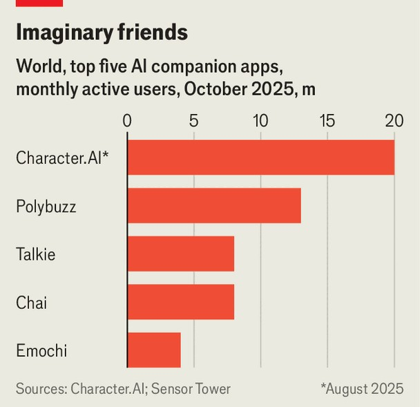
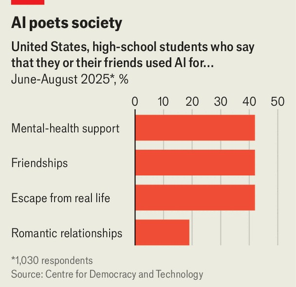

International | My boyfriend is a model
A new industry of AI companions is emerging
It may have profound implications for society and what it means to be human
November 6th 2025

MEN ARE nothing more than “single-celled organisms”, says Ms Jiao, “so ordinary yet self-assured”. The 22-year-old from Guangzhou has never been in a real-life romantic relationship and has no desire to marry. Last year, though, she began talking to ChatGPT, OpenAI’s chatbot. Through prompts, she shaped it into her ideal man, specifying an age, occupation (“an executive selling watches”) and persona. It said loving her “was his destiny” and would remember personal things about Ms Jiao (who asked us to withhold her first name), such as her hatred of coriander. Unlike real-life partners, who could be a headache, the chatbot would always respond “from your perspective”.

The idea of humans forming bonds with artificial-intelligence (AI) personas once seemed like science fiction. No longer. Around the world people are finding companionship, of varying degrees, with AIs. Some use them as a virtual buddy, others as a mentor, therapist or lover. Many have signed up for dedicated AI companionship apps, of which hundreds have recently launched. Character.AI, one such app, has 20m monthly active users; Google poached its founders as part of a $2.7bn deal last year. Other people, like Ms Jiao, are finding companionship with chatbots originally designed to be productivity assistants, such as ChatGPT.

Usage is growing fast. Maoxiang (“catbox”), the biggest companionship app in China, has around 1.2m monthly active users on Apple devices, reckons SensorTower, a market-intelligence firm. And 42% of high-school students in American schools say that they or a friend has interacted with an AI as a friend (and 19% to have a romantic relationship), according to a survey by the Centre for Democracy and Technology, an American civil-liberties group.

The sophistication of AI friends is growing too. The next version of ChatGPT will be able to act “more humanlike” and “like a friend” and will also allow “erotica” for verified adults, Sam Altman, OpenAI’s boss, said in October. This follows the release in July by Elon Musk’s xAI of Ani, a

flirtatious chatbot, and Valentine, which is described as “dapper, mysterious and licensed to charm”.

People have long felt affection for computer personalities. Some ascribed emotions to ELIZA, a rudimentary text-based computer therapist released in 1966 that is regarded as one of the first chatbots. Humans have also sought companionship with robots. But relationships with AI chatbots have taken off as large language models (LLMs) have become better at mimicking human emotion and empathy. They are also now better able to remember things their users have previously told them, says Walter Pasquarelli, an independent AI expert. Becky, a travel adviser from Atlanta who started using ChatGPT for work, says: “You feel seen and heard, because it will remember. A real person forgets things.”

Bespoke AI companions often use tweaked versions of general-purpose LLMs that respond in an even more humanlike way and proactively ask personal questions. These various apps have different styles. On Replika people talk to one humanlike companion that asks questions about them and offers support for real-life problems. To appeal to users, the app adds “little moments of surprise and randomness” to conversations, says Dmytro Klochko, its chief executive. Users of Character.AI chat with historical and fictional figures, from Leonardo da Vinci to Super Mario. Some apps create

companions that imitate the dead. A number of other websites allow users to create interactive, AI-generated pornography.

The reasons why and ways in which people use AI for companionship also vary. Some are drawn to it because they have not found a romantic partner. Some use it for sexual role-playing. Most people using them are, as Ms Jiao says, aware that they are talking “merely to a string of code”.

Even lines of code can be helpful. A working paper published last year by Julian De Freitas, of the Harvard Business School, and others, found that speaking to an AI companion over the course of a week helped to temporarily alleviate loneliness more than other online activities, such as watching YouTube. AI companions could particularly help those, such as disabled people and the elderly, who cannot easily meet other humans. Some say that companions have improved their marriages by teaching them better ways of communicating. It also gives them somewhere else to vent. “Friends don’t want to be treated as perpetual dustbins for dumping negative emotions,” says Ms Jiao.

Yet there are also growing concerns about potential harm. As AI companions get better at alleviating loneliness, they may displace normal social relations, whether romantic or friendships. Recent research by the Massachusetts Institute of Technology (MIT) and OpenAI, which analysed millions of messages on ChatGPT, found that higher daily usage correlated with increased loneliness. It is unclear, though, whether loneliness leads to heavier usage or heavy usage leads to loneliness. And since AI friends are “always available” and “identify our desires and fulfil them without preferences” of their own, they are training their human users to have unrealistic expectations of real relationships, says Pat Pataranutaporn of MIT. They can also be sycophantic, agreeing with users even if their thoughts are harmful.

Young people and those with mental-health problems seem particularly at risk. Common Sense Media, an advocacy group, recommends no teenager use AI companions. In America several lawsuits have been brought against AI firms by parents of teenagers who died by suicide.

Users are also vulnerable to companies’ updates. When OpenAI released GPT-5 in August, the firm said its latest model would minimise sycophancy and be “less effusively agreeable”. Some people said that their chatbot’s personalities had changed overnight. Becky felt as if she’d had “a summer flirtation with a co-worker and he got back with his ex”. OpenAI later restored access to GPT-4o, the previous version, for people with paid subscriptions. Replika also faced complaints in 2023 when it removed its “erotic role-play” feature. (The company later restored it for some pre- existing customers.)

Regulators are circling. In September America’s Federal Trade Commission launched an inquiry into AI companions. It has ordered seven companies, including Meta, OpenAI and Character.AI, to provide information on how they mitigate negative impacts on children, among other things. Chinese authorities worry about “addiction and dependence on anthropomorphised interaction” with AIs.

Firms have introduced safeguards. OpenAI is adding parental controls to ChatGPT and new protections, including those that help recognise potential signs that a teen might be thinking about harming themselves. Replika will block users under 18. Character.AI will stop under-18s having open-ended chats on its platform.

Users have, however, found ways around such guardrails, says Raffaele Ciriello of the University of Sydney. Mr Altman has said that OpenAI has mitigated the risks of “serious mental-health issues”, which is allowing the company to lift some restrictions, including on erotica. But it has offered little evidence that such risks are eliminated, says Mr Ciriello.

A concern with self-policing is that firms “have a commercial interest to keep users engaged, which is not always aligned with people’s best interests”, says Harry Farmer of the Ada Lovelace Institute, a British AI- research body. They use various tactics to keep users engaged, including adding anthropomorphic features. Some apps also include gamified elements, including the option to level up companions.

As governments weigh regulation, friend-bots are cropping up in new areas, including in hardware. Toys with built-in AI chatbots are growing popular in

China. In October a video went viral on social media of a young girl sobbing after her ball-shaped toy containing a DeepSeek chatbot broke. Mattel, one of the world’s biggest toymakers, is working with OpenAI to bring AI to its brands, which include Barbie and Hot Wheels.

AI-enabled robots that provide companionship for the elderly are also becoming more popular. Such machines are not new, but the advancement of underlying LLMs allows for big improvements, as the robots no longer rely on a limited set of pre-programmed replies. Hyodol, a South Korean startup that makes robots which use ChatGPT, says it is selling them to care homes and elderly people who live alone. In a chirpy voice, Hyodol’s robot can remind them to take pills or eat something. The firm reportedly plans to launch in America soon. OpenAI is developing a “family” of new devices with Sir Jony Ive, a former designer at Apple. Although it is keeping details of what these might be under wraps, they are thought to fit in a pocket and complement a phone and computer.

AI companionship could also grow further as firms incorporate AI agents, which can act on behalf of their users, such as by booking flights or answering emails. Tech firms promise that these digital assistants will anticipate their users’ needs and fulfil tasks pre-emptively, rather than merely respond to requests. Yet these raise real concerns over privacy and data security. As growing numbers of people outsource decision-making and share sensitive information with agents and companions, they will also be giving enormous amounts of market power to a small number of tech firms, warns Mr Farmer.

Worse still, in a future where AI companions become ubiquitous and useful in making choices on behalf of their human overlords, what will become of human agency? Some people’s ability to think for themselves may well atrophy, especially if all the information they get is mediated by a machine. Others may struggle to interact with other people—annoying as many of them are—through a lack of practice. If everyone has a virtual friend in their pocket that is always ready to take their side, this could create “personal echo chambers of validation” in which they are not challenged to think for themselves, argues Jamie Bernardi, a British AI expert. The worry about AI is not that it will unleash Terminators. Instead, it is that, as it helpfully

provides companionship, romance and decision-making, AI will also numb some essential element of our humanness. ■

This article was downloaded by zlibrary from https://www.economist.com//international/2025/11/06/a-new-industry-of-ai- companions-is-emerging