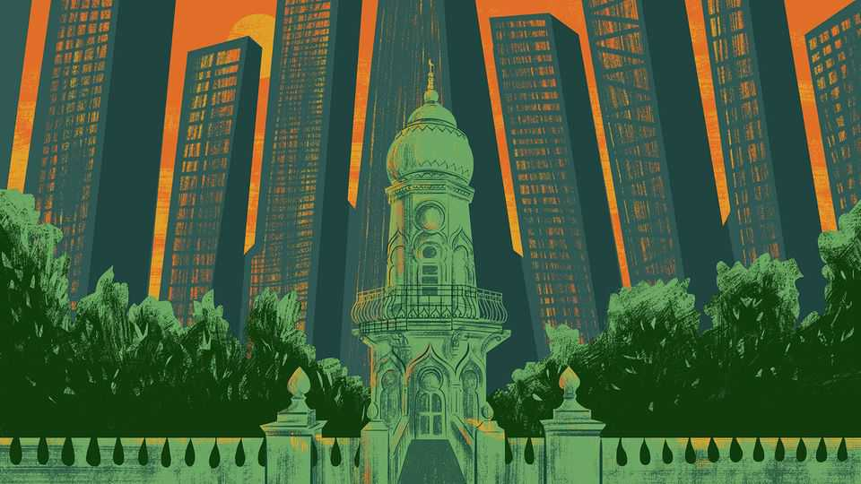

International | The Telegram
China places a Hong Kong-sized bet on Western decline
The territory aims to prove that a non-free society can be a global financial hub
November 6th 2025

AFTER 110 years of existence, the tiny Jamia Mosque in Hong Kong is safe from a developer’s wrecking ball. Declared an official monument in 2022, the landmark can probably thank geopolitics for its protected status. The pale-green mosque is straight from a picture book, with its pointed arches and delicate minaret, shaded by banyan trees. Though hemmed in by skyscrapers, its gardens have a village-like tranquillity. The first mosque was built on the site in 1849, serving merchants and troops from British-ruled India, just after Hong Kong’s founding as a colony. But in this city of ceaseless demolition and construction, few buildings are saved by beauty

alone. Sure enough, worshippers describe a government campaign to make Hong Kong a Muslim-friendly destination, involving everything from Islamic tourism to restaurants serving halal food.

The Middle East has money, explains Sabzali Khan. This white-bearded son of a Pakistani father and Chinese mother has lived in the mosque’s grounds for over 70 years. In his view seeking new markets “makes a lot of sense” as President Donald Trump plays the “tariff crusader”, and Westerners spread “rumours” that Hong Kong’s common-law system is crumbling.

A brisk walk downhill, in the central business district, Western diplomats take a gloomier view. In its latest report on the territory’s investment climate, America’s State Department charges that a security law adopted in 2024 under pressure from Beijing, threatens business confidence with its “extremely broad and vague definitions” of such terms as espionage, state secrets and external interference in Hong Kong’s affairs. The European Union has raised questions about “Hong Kong’s long-term attractiveness as an international business hub”, after dozens of democracy activists and journalists were imprisoned, including a man jailed for 14 months for wearing a T-shirt bearing a protest slogan.

The emphasis on business is no accident. Knowing how Hong Kong aspires to be a free-market gateway to mainland China, and to remain the world’s third-largest financial centre, Western envoys outline a binary choice for the territory. To keep its self-proclaimed status as “Asia’s World City”, they urge Hong Kong to maintain the fundamental rights it enjoyed when British rule ended in 1997, and that China promised to preserve under the rubric “one country, two systems”. Otherwise, Western governments declare, Hong Kong risks becoming just another mainland Chinese city and losing its special relevance.

For years, Hong Kong authorities have accused critics of lying about lost freedoms, insisting that “one country, two systems” has been updated to make Hong Kong safe and stable, notably after anti-government protests in 2019 that Chinese officials blame on America and other powers.

Now, Hong Kong’s leaders have a new argument. In effect, they reject the choice between being a Chinese or a world city, if “world” is another way of

saying “Western”. Hong Kong officials insist that the territory can prosper without hewing to liberal, democratic values. They note that Western fund managers, who not long ago called China “uninvestable”, poured billions of dollars into a string of China’s most successful companies as they listed on Hong Kong’s stock exchange over the past year.

At the same time, with America and China locked in long-term competition, Hong Kong is diversifying. Its leaders have led delegations to Gulf Arab states, south-east Asia and beyond to woo big corporations, investors and family offices. Authorities have issued Islamic bonds, and touted the city’s legal and financial services to countries involved in China’s Belt and Road Initiative. A Hong Kong-based expert describes helping Chinese entrepreneurs heading to do business and raise finance in the Gulf.

In October senior Chinese officials inaugurated the International Organisation for Mediation. This Hong Kong-based body, chaired by a Chinese vice-foreign minister, will resolve disputes between governments, or between companies, using Chinese traditions of dialogue and harmonious co-existence. Kenya, Nicaragua, Pakistan and Venezuela are among its first members.

Though the new body sounds benign, Western diplomats fret that China is promoting its preferred vision of governance to countries of the global south, involving ultra-pragmatic, interests-based compromises, in opposition to Western-style litigation on the basis of absolute legal rights. Chinese officials say the mediation centre is well aligned with the Global Governance Initiative, a set of non-Western principles promoted by China’s leader, Xi Jinping. Hong Kong’s chief executive, John Lee, declares the organisation to be on a par with the International Court of Justice and the Permanent Court of Arbitration in The Hague. His list is telling. That court of arbitration enraged China by ruling against it over territorial disputes in the South China Sea.

It is time to stop benchmarking Hong Kong against the political model it used in 1997, says Regina Ip, a member of Hong Kong’s Legislative Council and its Executive Council. In her view, the multiparty system that Britain left behind degenerated into demagoguery and dysfunction. Hong Kong remains keen on doing business with London, New York and other Western cities

and offering companies a familiar, dependable legal system, at least for commercial disputes. But to Mrs Ip such regions as the Middle East offer both growing markets and glimpses of a new world order. “Dubai is a good example. You don’t need to have Western-style democracy to be a financial hub,” she says.

Globalisation is changing and fragmenting, as the balance of power shifts away from the West. Hong Kong, a mercantile melting pot since its founding, sees ways to profit from all sides. ■

Subscribers to The Economist can sign up to our Opinion newsletter, which brings together the best of our leaders, columns, guest essays and reader correspondence.

This article was downloaded by zlibrary from https://www.economist.com//international/2025/11/04/china-places-a-hong-kong-sized- bet-on-western-decline

Special report

The world’s renewable-energy superpower Solar in China has become too big to fail Cleaning up a coal-fired mess China’s air-quality improvements have hastened global warming How China sparked a rooftop solar revolution in Pakistan Why climate change now threatens China’s future