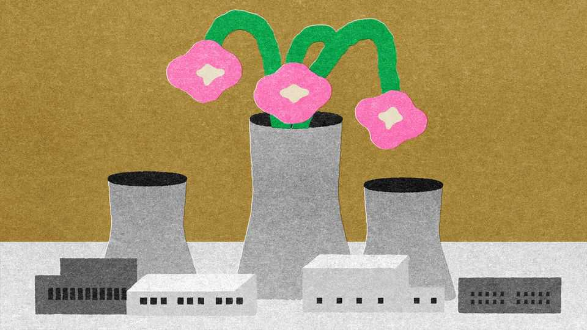
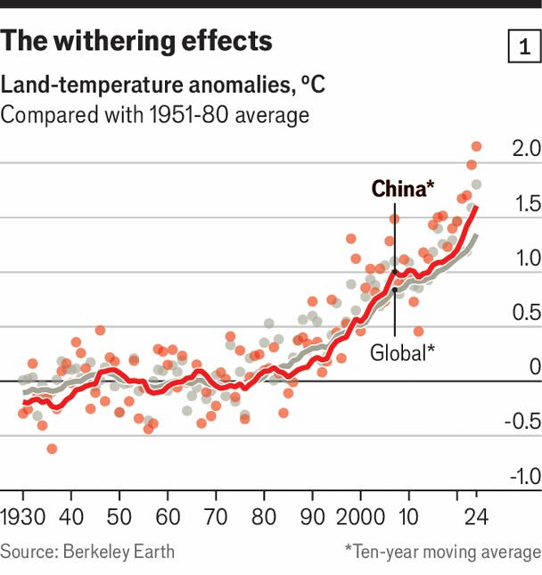
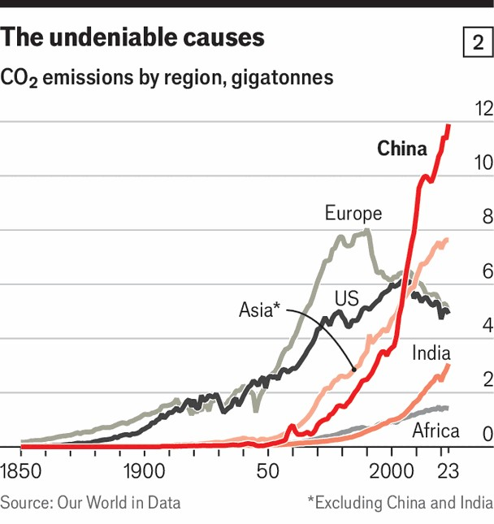
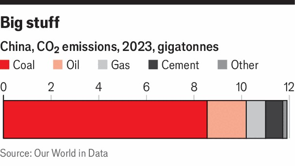

Special report | China, energy and climate
The world’s renewable-energy superpower
China’s moment for climate leadership has arrived
November 6th 2025

ONE HUNDRED years from now, the Earth is in the throes of an environmental apocalypse. Mutant spores released by humans—specifically, a hapless former logger called Vick—have led to the planet being overwhelmed by giant pink predatory mushrooms. Drastic action is needed. Happily, two benevolent bears are on hand to tame this excessively fungal future with appropriate high technology: a bio-engineered “spore purification” agent, seed-dispensing drones, and a laser cannon powered by renewables. This is the plot of “Boonie Bears: Future Reborn”, the eleventh instalment of a popular Chinese animated film series, released in January 2025. It stands out from many state-approved Chinese cultural works in the optimism and

scope of its environmental message. The clarity of the subtext is striking, too. Vick—bald, middle-aged and out of his depth—can be read as a Westerner. Briar and Bramble, the heroes, are feisty Asiatic black bears (though not, for some reason, actually black) clearly culturally coded as Chinese. The actions of others, the film seems to say, have created an urgent environmental crisis. Technology is the solution. And China is taking the lead.

The message resonates. China is building and deploying renewable-energy capacity on a scale that is hard to comprehend. This deployment is now central to the expansion of the electricity supply on which the Chinese economy depends, and it has gone far enough that the country’s emissions of carbon dioxide, though still vast, appear either about to peak, or to have recently done so. The innovation, economies of scale and cut-throat competition associated with this boom have seen the costs of solar panels, batteries and wind turbines plummet. As a result people in the global south, from which most carbon-dioxide emissions come, are increasingly able to afford cheap electricity.

This makes possible a virtuous circle. The more other countries invest cost- effectively in fossil-fuel-free growth, the better it is for Chinese industry. The success of the world’s second biggest economy is increasingly aligned with the world’s level of ambition in tackling the climate crisis.

When it comes to climate change, China has a level of agency no other country can match. By dint of the immense size of its own emissions it is one of the few countries capable of making a significant dent in those of the world as a whole purely through its own actions. And its renewable-energy industry now gives it an unmatched ability to enable and encourage other countries to do the same.

It has strong incentives to act. Although its wealth, state capacity and technological chops mean that China is better placed to adapt to rising temperatures than many countries, it is also profoundly threatened. It is peculiarly exposed to the risks of rising sea level and increasingly severe droughts and heatwaves (temperatures have gone up sharply in the past few years—see chart 1). Warding off these threats could be a source of political legitimacy for Xi Jinping, China’s leader. It is in the context of “unprecedented challenges to people’s lives, property, security and socioeconomic development”, China’s National Center for Climate Change Strategy and International Cooperation told The Economist, that “proactively adapting to climate change has become a real and urgent task.”

China’s climate agenda, though, is not simply about protecting the people. The country sees a vast economic and geopolitical opportunity. Installing renewables at rates that match or surpass those managed by the rest of the world put together is understood as a crucial motor of growth. Exporting them is an opportunity to build up soft power through technical assistance and diplomatic co-ordination. It could lead to more access to natural resources, to more heft in international negotiations, even to more sites for military bases. Action on climate dovetails with concerns about energy and food security.

And much of this can be done at its greatest rival’s expense. In a world where China and America vie for advantage of all sorts, climate is an area where China has a particularly strong hand—and President Donald Trump has folded America’s.

Signs of something shifting have piled up in recent months. In early October Ember, a think-tank, reported that in the first half of 2025 the world got more of its electricity from renewables than from coal. What is more, the added energy from renewables over those six months more than matched the increase in energy demand. China’s massive deployment of renewables is the biggest single factor in both those changes.

Before that came the meeting of the UN General Assembly, which offered a stark superpower contrast. In his address on September 23rd Mr Trump dismissed climate change as a “con job”. He called out China for its hypocrisy in exporting wind turbines—which he genuinely appears to loathe —while barely using them at home. “You know, they use coal, they use gas, they use almost anything, but they don’t like wind. But they sure as hell like selling the windmills.”

The idea that China abjures wind power at home is just nonsense—it leads the world in wind capacity. That it sells a lot of turbines elsewhere is good business. China now makes a lot more from exporting wind turbines, electric cars, solar cells and the like than drill-baby-drill America makes selling fossil fuels.

The next day Mr Xi announced that in the run up to the COP 30 climate conference, which begins in Brazil on November 10th, China was committing itself to a 7-10% cut in greenhouse-gas emissions between the time of their peak and 2035. It is not as ambitious a goal as researchers seriously concerned about climate would like. But it is a real, quantitative commitment, and one that China looks likely to honour.

Until just over ten years ago, China’s position on climate change was that cutting its emissions would impose huge costs on its economy and that such actions were the responsibility of the developed countries which, Vick-the- logger-like, had filled the atmosphere with carbon dioxide in the first place. By the middle of the 2010s the second part of this was untenable to the point of absurdity. China had overtaken America to become the world’s biggest carbon-dioxide emitter in 2006 (see chart 2); by 2012 it was responsible for more than one in four of 36bn tonnes of emissions. In the autumn of 2014 Mr Xi met Barack Obama to agree on how to make the following year’s COP a success. As part of the agreement reached at that Paris COP, China pledged that by “around 2030” its emissions would peak and renewables would make up about 20% of its primary-energy consumption.

China’s market-Stakhanovite approach to solar panels and wind turbines means it surpassed that 20%-green-energy target this year. The Paris- promised peak in overall emissions seems to have come around five years early, too. Many analysts say it will be reached this year. Some say it has already been passed. Few, if any, think it more than a year or two off.

As well as promising a quantifiable reduction in emissions (if one measured with respect to an as-yet-unknown peak value) by 2035, Mr Xi’s UN speech promised that by then China’s wind and solar capacity would be 3,600

gigawatts (GW), up from 1,700GW today. The EU’s installed wind and solar capacity at the end of 2024 was 570GW, America’s 330GW. Even though the pace of China’s deployments is all but certain to slow over coming years, it is not unreasonable to think this goal, too, could be met early.

None of this changes the fact that China is still the world’s biggest emitter of greenhouse gases. It now accounts for almost a third of the total. It still relies on coal as its chief energy source. It has not yet reduced emissions per unit of GDP to the extent that it said it would in Paris. Its current pledges do not set it on a course for carbon neutrality by 2060, which it has tabled as its long-term aspiration. Mr Xi’s new pledge to cut emissions is far less than the 20% reduction considered necessary to put China in line with the principal goal agreed in Paris—that of keeping the global increase in temperature, compared with that of 1850, well below 2°C (3.6°F).

It does, though, change the context of those brutal facts. When the party’s “Made in China 2025” industrial-policy plan was enacted in 2015, no one could foresee the degree to which China’s goal of dominating cutting-edge industries would come to the aid of the climate process embodied in the Paris agreement. China now supplies 60-80% of the world’s solar panels, wind turbines, electrical vehicles (EVs) and lithium batteries. In 2024, the green-tech sector which was one of Made in China’s darlings accounted for 10% of China’s GDP and provided 26% of its GDP growth—overtaking property, the previous, and increasingly problematic, motor. It is a recognised pillar of Mr Xi’s mission to achieve “socialist modernisation” by 2035 and to “rejuvenate the Chinese nation” by mid-century.

The benefits are held to go well beyond emissions reduction. China produces only a quarter of the amount of oil it consumes, a constant worry for a nation which is deeply invested in self-sufficiency. Concerns about the stability of the regions that supply its oil are exacerbated by worries about the supply routes along which it travels. China has long feared that America could block its supplies in a potential conflict over Taiwan; current sparring with Mr Trump’s administration has sharpened that concern. Green tech, and in particular EVs, offer a way of reducing the country’s dependence on supplies from elsewhere.

It also provides a way to enhance China’s appeal to the countries on the sidelines of that tussle between the giants. China scaled back its global Belt and Road infrastructure scheme after 2019, partly because of the covid-19 pandemic, partly because of the excessive borrowing it had itself encouraged. Now the project is getting back into gear with a new focus on green energy. And private-sector exports of solar panels have exploded over the past few years, with huge effects in countries such as South Africa and Pakistan.

Mr Xi will be 82 in 2035; this could be his last decade in power. Li Shuo, director of the China Climate Hub at the Asia Society Policy Institute, a think-tank, poses the choices which face him thus: “There’s this temptation that if the rest of the world is not working on this, why should we? On the other hand, the economic incentives are all emerging—the self-interest argument. And in addition, the global PR argument is there as well. Who is the adult in the room? Who is the more responsible player on the global stage?”

To be responsible, though, involves a willingness to make hard choices and see them acted on. In 2021 Mr Xi pledged to “strictly limit” any increase in coal consumption. But severe blackouts in that same year reinforced China’s perennial view that coal is all but synonymous with energy security. So

China kept building coal-fired power plants. In 2024 it started work on 100GW of new coal-fired capacity, roughly equivalent to post-coal Britain’s gas-fired, nuclear and renewable generating capacity combined.

Plans to phase out coal will face resistance from plant operators and from local governments. Dealing with that will require not just political exertion, but also a commitment to making the vast electricity system better capable of dealing with renewables. That means very large investments, careful regulatory planning and levels of market-driven flexibility that a system historically based on tight control will resist.

A second big challenge is keeping growth and the energy transition in step. China’s green-tech sector is struggling with oversupply; the retrenchment already under way could be bloody. If renewable energy capacity fails to expand in line with demand from power-hungry industries such as artificial intelligence, the government might fall back on fossil fuels. A broader economic slowdown might prompt it to ramp up investment in cement, steel and other carbon-intensive industries in search of jobs and tax revenues.

Lastly, geopolitics. China’s dominant position is fuelling protectionism in other countries, both developed and developing. Its demonstrated willingness to use its carefully constructed strategic grip on various critical minerals in its trade war with America will deepen concern. If decarbonisation means relying on a China that does such things, its political price rises even as its economic price falls.

Earning and keeping a position as the world’s climate leader will not be easy. But if China takes the opportunity, it could do a lot to limit the harms done to people everywhere by climate change—and to rearrange geopolitics to its less high-minded advantage. ■

This article was downloaded by zlibrary from https://www.economist.com//special-report/2025/11/03/the-worlds-renewable-energy- superpower