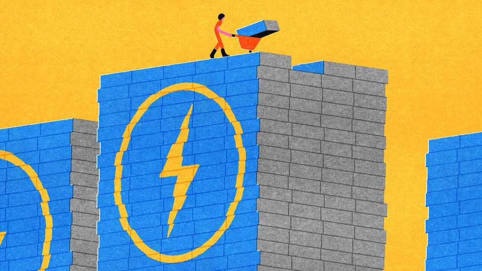
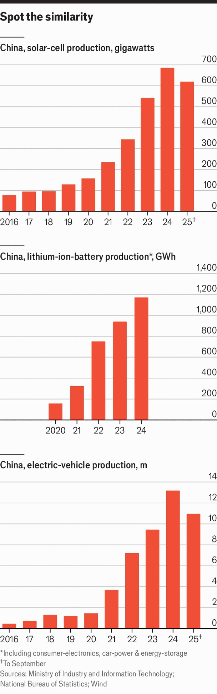

Special report | Gigawatts-a-go-go
Solar in China has become too big to fail
No other country could have done it
November 6th 2025

Given that the industry is built on light, it is surprisingly dim inside this solar factory in Chengdu, a city in south-western China. But the workers do not mind. They are almost all robots, whirring around carrying square slices of a grey crystalline “polysilicon” 16cm across and a hair’s breadth thick. As they move through the factory these wafers are heated, lasered, bathed in acid and engraved with silver circuits. They come out as solar cells. This factory can churn out enough of those photovoltaic (PV) cells in a week to build a power plant with a capacity of more than 500 megawatts—which is about as big as current solar plants get outside China, India and the Gulf. Two months of work produces the capacity to generate considerably more electricity over the course of a year than a large nuclear reactor.

Tongwei, the company which runs that factory in Chengdu, provided the solar cells for one in seven of the solar panels sold worldwide last year. Other Chinese firms made almost all the rest; all told, the industry produced 680 gigawatts of capacity. For comparison, the total amount of generating capacity in Britain is about 100GW.

If those 680GW were tiled over a desert edge-to-edge, they would cover something like 4,000 square kilometres—an area about the size of Rhode Island, or a bit less than half that of Wales. (Installed in practical power plants, the area would be a lot more.) If they worked, on average, at 25% of their peak capacity—fairly typical for a good installation in a sunny place— they would in principle produce 1.4m gigawatt-hours, or 1,400 terawatt- hours (a terawatt being 1,000GW) in the course of a year. The world’s total consumption of electricity last year was a bit over 30,000TWhrs.

There is a lot more to a fossil-fuel-free electricity system than simple generating power. But if China just went on producing 680GW of additional solar capacity every year until the end of this decade, that would be enough, in principle, to meet a third of the world’s current electricity demand.

The industry’s growth has now brought about a crisis of oversupply, meaning that there is some pain ahead. But this looks more like a bump in

the road than its end. And PVs are not the whole story.

Solar power is the most spectacular of China’s clean-energy game changers; its fruits can be seen all around the world and at every scale, from balconies in Baden Baden to seas of glass in the Saudi desert. But in the same industrial park as that Tongwei facility is a factory owned by BYD, the world’s biggest manufacturer of electric vehicles (EVs). China made 13m EVs last year; production has been growing by an average of 70% year on year since 2020. Part of making EVs is the capacity to make batteries— which grew 65% year on year over the same period. At a mere 50% annual growth since 2020 PVs seem almost laggardly.

Solar, batteries and EVs together make up what the government, with pride, has dubbed the “new three” industries. The growth of wind has been a fair bit slower, but is set to matter more and more—its output continues during darkness and some of its fluctuations are predictable, both things which help energy systems. Last year, for the first time, the four biggest wind-turbine manufacturers in the world were all Chinese companies. They accounted for more than 70% of the 122GW of wind-power capacity installed.

The speed of all this has blown past the expectations of both foreign analysts and the Chinese Communist Party itself. In 2021 the International Energy Agency, a forecaster, published an optimistic “accelerated” scenario in which China installed another 480GW of solar power by 2026. It has already added nearly twice that much. Ten years ago, China’s state-planners hoped that Chinese companies might sell 3m EVs in 2025. They were out by at least a factor of four.

The party sees these industries as a “new productive force”, a buzzword for the high-value-added industries that it hopes will shape its economic future. Tongwei calls its contribution “a great gift from China to all mankind”.

Gift is a little strong. Cheap as they are, the company’s solar cells are not handed out as freebies. But China’s policy of driving up both demand for renewable technologies and the production capacity needed to fulfill that demand has provided a huge benefit to consumers everywhere: the prices get lower and lower. For most manufacturing, the fall in costs associated with a doubling in capacity is pretty predictable. For solar, it seems to be around

30%. Rocketing production has thus meant plummeting prices; in 2024 solar panels cost a little more than a 20th what they cost in 2005. If the solar panels, EVs and wind turbines are not gifts in themselves, their ever shrinking prices are an undoubted, and most welcome, boon.

It is not surprising that China is good at making green tech. Abundant capital, dense supply chains, growing technological sophistication and a skilled labour force mean it is good at making almost everything. The green- industrial complex has also benefited from specific subsidies and the success of smart companies—but so have various other sectors. The thing which has really set it apart has been the sheer scale of China’s demand for electricity.

The party’s interest in cleaner energy began when citizens became restive about atrocious air- and water-pollution in the 1990s and 2000s; policymakers feared a “social crisis” was building, says one government adviser. Urgency mounted after the bid-winning promise that Beijing’s 2008 Olympics would be a “green” games. But there were other attractions, too. Chinese officials like to compare the country’s energy supplies to a bowl of rice which “must be held firmly in our own hands”. Technologies offering potential reductions in oil and gas imports were welcome.

And solar cells, in particular, were an opportunity; there were growing export markets abroad. In the 2000s first Germany and then Spain put in place extremely generous and uncapped subsidies for solar. Chinese companies swooped. Established polysilicon companies elsewhere hesitated about investing in capital- and energy-intensive new foundries to serve the growing solar market (their main business was silicon chips). Chinese state- owned enterprises seized the opening, building new foundries in Xinjiang and other western regions powered, in one of the industry’s great ironies, by very cheap Chinese coal.

Companies in other businesses rushed into clean technologies; Tongwei was a fish-food producer before it pivoted to solar in the 2000s. They were encouraged by cheap credit and generous promises of land, as well as by direct subsidies. China’s EV-makers received $231bn in various forms of subsidies between 2009 and 2023, according to the Centre for Strategic and International Studies (CSIS), a think-tank in Washington, DC. The American

government’s bail out of Detroit after the global financial crisis, by way of comparison, amounted to about $80bn.

The sector also benefited from China’s control of many relevant raw materials. Its state-owned companies first came to dominate the refining of rare earths in the 1990s, part of a strategy conceived well before concerns about decarbonisation. And the country refines the lion’s share of the world’s cobalt, lithium and graphite—essential ingredients for today’s batteries.

As the industry has grown, subsidies and favourable tariffs have been largely withdrawn: most notably, guaranteed feed-in tariffs for new renewable power plants ended in June. Clean-technology firms are increasingly fending for themselves, relying on innovation to stay ahead. They filed around 75% of global patent applications in clean technology last year, up from 5% in 2000, according to Ember, a consultancy.

Fierce competition spreads innovation through the industry like wildfire. Jenny Chase, a solar-power analyst at BloombergNEF, a data outfit, remembers that over the course of four months’ maternity leave in 2018 PV technologies that had been rare—monocrystalline silicon, diamond-wire saws—became industry standards. But there are also less subtle ways to compete. Chinese wind-power companies have made turbines more efficient in part by building larger ones, which can capture more energy with each sweep (compared with foreign firms, China excels at “biggification”, notes one Chinese turbine engineer). They are also introducing more new types of turbine than rivals elsewhere. Many will fail. Some won’t.

Behind all this, though, lies the crucial factor of huge domestic demand. China has an unequalled demand for electricity, and that demand continues to grow. Last year’s increase in generation was the same as Germany’s total. The scale of demand for new capacity, allied with preferred prices for renewables which are now being phased out, has been the main driver for the astronomical run-up in production and consequent dive in prices.

So impressive has the growth in the clean-power industries been, though, that bits of the front-running solar industry have expanded beyond even China’s appetite for power. Amazing as it is that China churned out solar

cells with a capacity of 680GW last year, its polysilicon foundries are thought to have had the capacity to produce 1,200GW. According to Reuters, the industry has shed a third of its jobs in the past year, amid losses of $60bn.

The industry thus faces a wave of consolidation in which the big foundry- based companies force the smaller fry out of business; there is talk of a cartelisation to produce an “OPEC for solar”. But the risks are not purely the preserve of the industry’s minnows. In the solar-industry shakeout which took place in the first half of the 2010s, the country’s biggest manufacturer went bankrupt owing to debts and overcapacity.

The government also wants a leaner but more profitable solar industry. They have started railing against what they call “involutionary” competition, in which vicious price wars leave no real winners. Officials have said China’s next five-year plan (to be released in March) will include measures to crush the local protectionism which keeps weaker firms in business.

There may be a hard road ahead. But a significant long-term dip in solar production seems very unlikely. As Ilaria Mazzocco of CSIS says, the sector has become “too big to fail”. And the other two of the “new three” go from strength to strength. BloombergNEF thinks China’s EV firms will be making a third of the world’s cars by 2030. Demand for batteries will stay strong inside and outside China because they make both new and already-installed solar capacity more lucrative.

The immense power of China’s learning by doing will thus continue; a lack of renewable hardware is unlikely to be a problem for its decarbonisation. As the next article will argue, though, the same cannot be said for its continuing devotion to coal.  ■

This article was downloaded by zlibrary from https://www.economist.com//special-report/2025/11/03/solar-in-china-has-become-too- big-to-fail