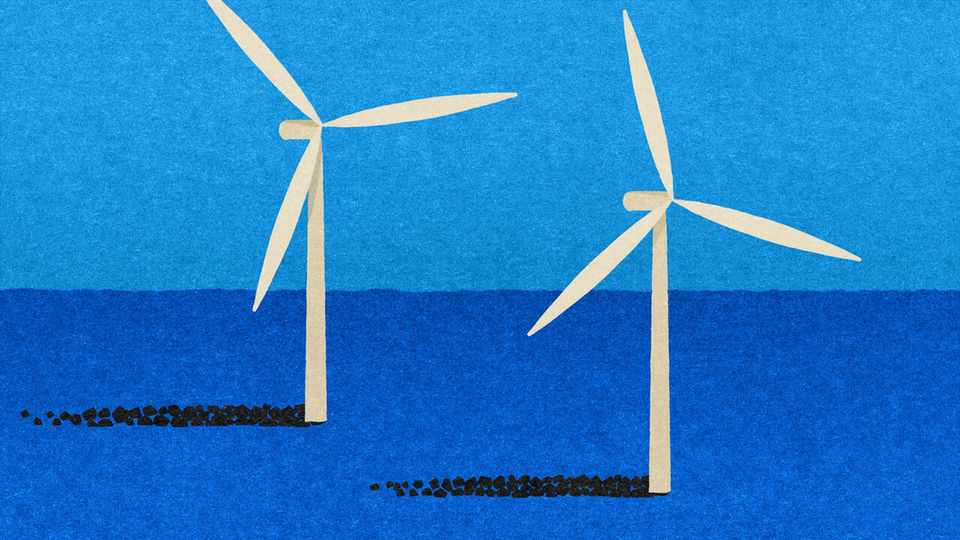
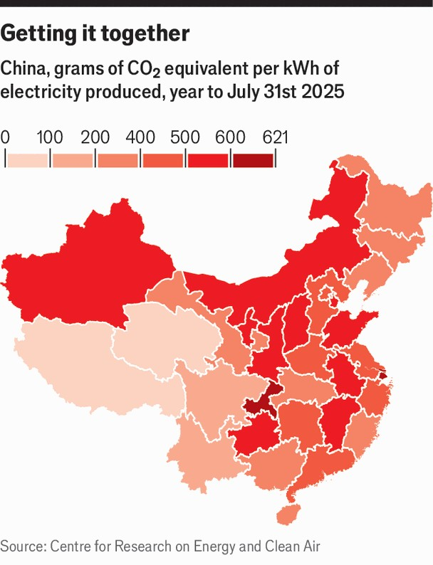

Special report | 1,500 Great Pyramids
Cleaning up a coal-fired mess
China’s green-industrial complex makes deep decarbonisation possible, but far from inevitable
November 6th 2025

Last year China burned 4.9bn tonnes of coal. Imagine a black and glistening Great Pyramid of Giza; then imagine, stretched behind it, a line of 1,500 more just the same. Three things combine to make the country’s appetite so gargantuan. First, it has a huge economy. Second, a lot more of its final energy demand is met with electricity than in most other places. Those first two factors explain why, in 2024, China generated almost a third of the world’s electricity. The third factor is that, in matters electric, China’s fossil fuel of choice is cheap and abundant domestic coal. Those 4.9bn tonnes of coal represented more than half the world’s total consumption. They also represented a record level of Chinese consumption.

If an economy is heavily electrified, economic growth needs a lot of electrical growth; China’s generation has been growing by about 6% a year since 2014. In the decade to 2024 the amount of electrical energy it generated in a year grew by 4,273 terawatt-hours; that is more than 90% of America’s 2024 total.

Growth in demand can be environmentally advantageous in itself, if it is coming from sectors that used to use other more polluting forms of energy. The classic example is electric vehicles (EVs). Because electric motors are more efficient than internal-combustion engines, an EV emits less carbon dioxide per kilometre than a petrol-driven car even if it is powered by today’s dirty Chinese electricity.

So more EVs mean higher electricity demand—but even if the electricity- generation mix stays as it is, EVs which replace petrol-burners mean lower emissions. Better still, those lower emissions come from burning less oil, which makes the transition a strategic win as well as an environmental one. Sinopec, a state-owned refiner, cites EVs as the reason it expects China’s oil demand to peak in 2027.

Despite the fact that electricity fulfils more energy demand in China than elsewhere (almost 30%, compared with a bit over 20% in the EU and America), that share of demand is still increasing fast (in those other economies it has plateaued). The electrically powered high-speed rail network, which handled some 4bn trips last year, is set for further expansion. Projections by the International Energy Agency based on China’s goal of reaching net zero by 2060 suggest a vast increase in the use of heat pumps (already standard in new buildings). This seems plausible, not least because the advantages China has in other forms of mass production will apply in this one, too. The country’s steel-industry association expects a third of China’s steel to be made with electric-arc furnaces, rather than using coking coal, by 2035, up from 15% at the moment.

The ever-growing demand is a large part of the reason why, despite having piled on renewables faster than it said it could, and despite looking as if it will peak emissions sooner than it said it would, China is not on track to fulfil the other key commitment it made at the Paris climate conference in 2015: its pledge on carbon intensity. The amount of carbon dioxide China

emits per unit of GDP has fallen a good bit since then. But the national target of a carbon intensity 65% or more below 2005 levels by 2030 currently looks unlikely to be met.

If the renewables boom is to turn into a decarbonisation success, those renewables need to be used to make deep cuts in the amount of coal-fired power on the grid, rather than just to supplement it. Despite the current solar stumble, few doubt China’s ability to build the kit necessary for such a displacement. The Centre for Research on Energy and Clean Air, a think- tank based in Finland, reckons that, if the only limiting factor were the supply of renewable capacity, China would be able to continue its record of soundly beating its own clean power goals. Instead of boasting just the pledged 3,600 gigawatts of installed wind and solar capacity by 2035 it could get up to 4,500GW—enough fossil-free plant to meet half of today’s electricity demand.

But not all watts of power are fungible. Where and when they can be delivered matters, too. A grid which can deal with renewable power on a Chinese scale has to be able to transmit it over very long distances, to store lots of energy and to deliver effective signals about what is wanted and what is available. The engineering challenges of transmission and storage are daunting, but play to China’s strengths. The country has far less experience in the careful design of markets necessary to match supply with demand.

At the moment China’s grid is optimised for coal. Coal-fired plants can be built almost anywhere, and provincial officials would rather build their own, to gin up growth, than rely on power produced elsewhere. Only one-fifth of electricity is traded across provincial boundaries. And prices are largely fixed. Power producers work on mid- or long-term contracts which guarantee them a fixed price for electricity provided when the grid wants it. Fulfilling such contracts is easy for coal-fired power because it can be ramped up and down fairly easily, as long as there is plenty of coal.

None of this suits renewable power. The windiest, sunniest provinces of China are in the west, far from the densely populated coastal provinces where demand for power is highest. And the intermittency of renewables means it is harder for a solar or wind farm to commit to the sort of contracts that suit coal.

This mismatch is causing increasing strain. In some regions coal contracts lock out cheaper renewables, forcing the renewable generators to dump useful energy as waste heat. In the first half of 2024 this “curtailment” rate for solar power was 3%. In the same period this year it was 5.7%. For wind, curtailment rose from 3.9% to 6.6%.

Better connections are comparatively easily made. China already has 42 ultra-high-voltage power lines linking the vast solar farms in the deserts and mountains of western China to the cities and factories on its coasts. It plans to triple the number of lines by 2050. But as well as making power available where it is needed, a grid which relies on renewables needs to be able to store energy for when it is needed.

To this end China added more batteries to its grid in 2024 than America and Europe put together. In September it announced plans to double its “new- energy-storage” capacity—mostly batteries, but also other technologies such as compressed-air storage and flywheels—by 2027. It is also investing in systems which pump water uphill when power is abundant and let it flow back down through turbines when power is scarce. A third of the pumped- storage under development worldwide is in China, which looks like breaking its own target of 130GW of such storage by 2030.

But hardware is not enough. If storage is to pay for itself you need a market in which prices can reflect the demand in specific regions at specific times. In European grids, buyers and sellers establish day-ahead spot-market prices on the basis of the costliest unit of supply needed to meet all the demand at any given time of day; further fluctuations are then dealt with through “intraday” trading which now works in 15-minute blocks. It is a very complex system that has evolved over three decades of deregulation. And it still needs further refinement.

Though several provinces are running pilot spot markets, China has nothing approaching this level of sophistication. To some extent, the generous feed- in tariffs for renewables which ended in June obviated the need for one; now they are gone, more experimentation seems likely. The central government says that a reformed national electricity market will not be ready until 2030. It will take a lot of tinkering before officials give up control to market forces, says Albert Cheung, of BloombergNEF, a research firm. They are terrified that prices might spike and disrupt factories.

The lack of flexible markets increases the role in decarbonisation for fossil- fuel-free generation which can be run non-stop. David Fishman, of the Lantau Group, a consultancy in Shanghai, points out that roughly half of the 60-odd nuclear-power stations under construction worldwide are in China. China builds such things considerably more quickly than America and Europe do. And the cost of building them seems to be dropping as the industry gains experience, something which has not been seen elsewhere.

By 2035 China aims to have the largest nuclear sector in the world producing 10% of its electricity—twice today’s share. Like many other countries, it also has plans for new types of reactor, including small, mass- produced ones. Unlike other countries, it can expect a significant increase in its nuclear capacity even if those ideas fail to pan out.

China’s other, and longest-established, fossil-free source is hydropower. As well as providing ever more pumped storage, the sector is still building dams. It has announced plans for a plant in Tibet with three times the power capacity of the world’s current champion (which is itself in China). Hydropower, though, has limits due to seasonality, and its dams have to

concern themselves with river management as well as electricity production. Altered rainfall patterns as a result of climate change are another concern.

Even if all these alternatives work out well, and even if the grid and its associated markets are radically reformed, something extra is needed. China requires not just the ability to do without coal. It needs to be sure that it wants to.

In 2021 and 2022 power cuts across 20 provinces made electricity an urgent concern for party leaders; the result was a renewed commitment to building coal-fired generators; in 2024 construction started on nearly 100GW of it. Evidence that the outages were not, in fact, caused by a lack of coal-fired capacity seems not to have overcome the belief, embedded deep in politicians’ minds and easily reinforced, that any scarcity of power is a case for more coal.

Decarbonisation optimists argue that to look at coal capacity is to miss the point; the real issue is how much of that capacity is being used. Most coal plants in China are producing only about 50% of the energy that they could. Local officials are experimenting with capacity payments which go to coal plants just for being there as insurance against blackouts.

There will probably be a role for such capacity payments. But the policy most likely to wean the country from coal for good is to make burning it more expensive. Markets which allow carbon-emission rights to be traded have seen coal driven out of electricity generation in Britain, and its share significantly reduced over much of Europe. China started its own carbon market in 2021. So far, though, there is no limit on the number of emission credits distributed (no “cap”, in the jargon), and the majority of the credits are free. The effect on emissions has thus been imperceptible. Officials have promised to fix these problems, even though to do so would create winners and losers, with the losers mostly coming from the world of coal.

When needs must, officials are willing to inflict that sort of pain; the government forced hundreds of inefficient steel plants to close in the 2010s. But this time round they seem to be dawdling. Only when there are thoroughgoing efforts to reduce the role of coal will deep decarbonisation be assured. ■

This article was downloaded by zlibrary from [https://www.economist.com//special-report/2025/11/03/cleaning-up-a-coal-fired-mess](https://www.economist.com//special-report/2025/11/03/cleaning-up-a-coal-fired-mess)