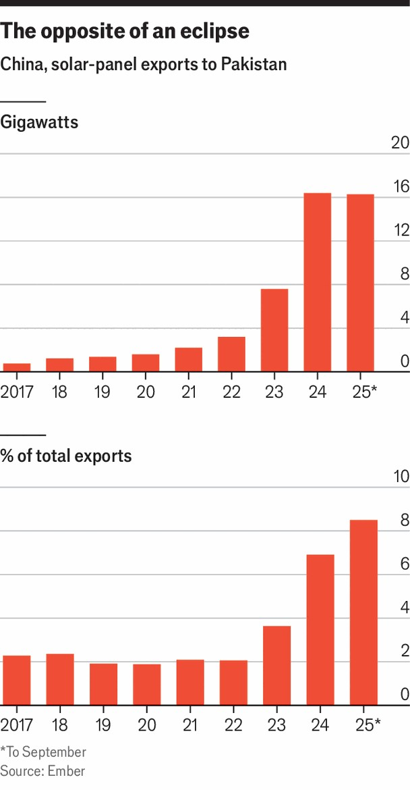
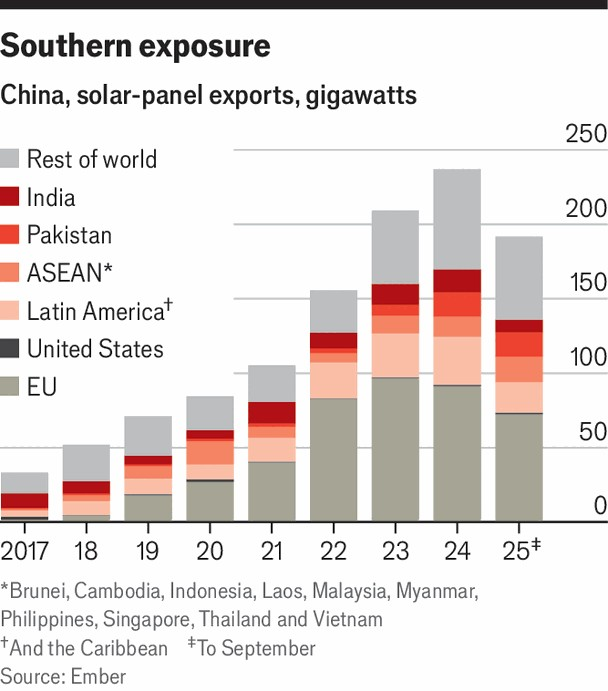

Special report | Solar eclipse
How China sparked a rooftop solar revolution in Pakistan
It is a test case for the green transition in the Global South
November 6th 2025

In the record-breaking heat of summer last year, Muhammed Munir decided he could bear it no longer. Despite electricity bills which ate up a quarter of his income, regular power cuts left his family without fans as temperatures soared above 50°C (122°F). Mr Munir, a retired railway worker who lives in Lahore, the largest city in the Pakistani province of Punjab, is by no means rich; but he has a pension, a small income from a job cleaning at a local factory and a house. So he joined the growing numbers of Pakistanis who have taken matters into their own hands, by installing rooftop solar panels imported from China.

China’s green technology is reshaping landscapes, markets and geopolitics across much of the world—but Pakistan is perhaps the most striking example. This year it became the world’s second largest importer of solar panels. It has become a laboratory for the green-energy transition in the global south. It is also a test of China’s willingness to lead that transition, rather than just provide the wherewithal for it.

Travel around Pakistan and you will see solar panels everywhere, from pukka bungalows to mosques, from farms to roadside shops. In rural areas, they are often mounted on trailers that can be towed from household to household. Increasingly, solar panels are included in marriage dowries.

Between 2022 and 2024 trade statistics show Pakistan’s annual imports of Chinese-made solar panels increasing almost fivefold to 16 gigawatts. In the first nine months of 2025 it imported another 16GW. By the end of this year, its cumulative solar imports are expected roughly to match the installed generation capacity of the national power system—capacity augmented quite recently by four spanking new coal-fired plants built and financed by China as part of its global Belt and Road infrastructure scheme.

Since 2022 the power providers responsible for that legacy capacity have seen their revenues plummet. Power consumption from the grid has dropped

by around 12%. With new solar users increasingly likely to install Chinese- made batteries that allow them to enjoy access to electricity after sunset, that fall looks likely to continue. Meanwhile the companies’ infrastructure costs are undiminished. And they are still burdened by the debt they took on, much of it from China, to meet the expected growth in demand which consumers have instead met with solar panels.

Revenues falling faster than costs pushes up bills for remaining users, prompting even more people to switch to solar in the sort of “utility death spiral” which is becoming an increasingly common worry in both developed countries (Germany in the mid 2010s, parts of America today) and developing ones (like South Africa). The fact that the generators now find themselves with surplus capacity adds insult to injury.

These concerns led Pakistan to impose a 10% sales tax on imported solar panels in June—to little effect. Demand for panels remains high; imports of Chinese batteries have spiked to get more out of existing panels. “As battery storage becomes cheaper, people will shift to that: it’s the writing on the wall,” Awais Leghari, Pakistan’s energy minister, tells The Economist.

Mr Leghari says he has started negotiations with China on restructuring the agreements which cover its coal-fired projects. And he is seeking expertise from China and elsewhere on how to modernise Pakistan’s grid and strengthen its power market. At the same time, his government is trying to encourage Chinese investment in local manufacturing of solar panels, batteries and other green technology. When asked for comment China’s foreign ministry referred The Economist to the “competent authorities”.

“Pakistan is essentially a test case,” says Lauri Myllyvirta of the Finland- based Centre for Research on Energy and Clean Air. “It shows that those technologies that can be installed by consumers and commercial users without requiring extensive permitting and bureaucracy can move a lot faster.”

How China responds to Mr Leghari’s overtures matters not just to Pakistan: it could provide lessons, and set the tone, for energy transitions across the global south. The more China helps countries make the most of what cheap solar offers, and the more it defrays some of the unavoidable downsides for

governments and state-owned generators, the better it will be for its future export markets—and the greater the amount of soft power it will earn in the process.

The global south is already outpacing the global north in the growth of solar and wind power’s share of electricity generation. The rate at which it is adding renewable capacity could do the same by 2030. Entirely uncoincidentally, China’s solar exports to the global south, which rose by 32%, to 126GW, exceeded its exports to the global north for the first time (116GW, 6% down on 2023). That probably owes a lot to trade barriers in rich countries. But the increase in exports to the south also comes from the fact solar is now by far the cheapest source of electricity for anyone who wants new capacity.

Between 2024 and 2030, green-energy capacity is expected to more than double in Asia, Latin America and sub-Saharan Africa and to triple in the Middle East and north Africa, according to the International Energy Agency, a forecaster. It expects additions in India alone to run at 350GW in 2024-30.

The disruption to incumbents which this represents means that other governments, like Pakistan’s, are erecting barriers. South Africa—also facing problems with grid stability after a sudden influx of Chinese solar

panels—imposed tariffs of 10% last year. Brazil, one of the top three importers of solar modules, increased its tariffs on them to 25% last November. Nigeria, Africa’s most populous country, has been considering a complete ban on imported solar modules.

One of China’s responses is to increase the manufacturing done outside China. According to a study published in September by researchers at Johns Hopkins, Chinese green-tech companies have promised to invest $200bn in other countries since 2022. Part of the motivation has been to circumvent tariff barriers put up by developed countries; roughly half the investment was in South-East Asia. But such investments also responded to developing countries raising tariffs. This is not all to do with solar; batteries, electric vehicles and green hydrogen are all part of the mix.

This flow of investment has now eased off—at least for a while. The solar industry’s problems with domestic oversupply are undoubtedly part of the reason for this. The risk that new American, and possibly other, tariffs will hit more imports from third countries, as well as from China itself, probably also plays a role.

The Chinese government’s efforts to speed the global transition have been less impressive. In 2021 the country’s leader, Xi Jinping, said China would not approve any new coal projects as part of its Belt and Road initiative, and would shift its focus towards renewables. China did not, in fact, abjure further coal investments, and it has continued many other fossil-fuel projects abroad. But in 2024 its green-energy-related Belt and Road investments, loans and construction contracts reached $11.8bn, according to scholars at Griffith University in Australia and Fudan University in Shanghai. That was 60% more than in 2023.

The modest size of such transfers understates the possibilities for government involvement. Over the next decade, China hopes to shape technical standards for energy infrastructure across the developing world. That will gradually entrench systems compatible with Chinese technology, increasing the cost of changing sources. It could also buy China political influence across the global south. So too could taking a bolder position in multilateral climate talks; many poorer countries are among the worst-

affected by global warming. What is more, China will be offering what America cannot or will not.

To make the most of this China will need to transfer more of the technology that could allow host countries to develop their own green-energy industries. And it will need to focus more on helping these countries with green finance, grid modernisation and policy making to manage their energy transitions.

In the case of Pakistan, Mr Myllyvirta suggests that China should help strengthen Pakistan’s grid and invest in battery storage. Waqas Moosa, who heads the Pakistan Solar Association, the country’s main industry lobby, wants China to share more of its experience with solar roll-outs in its own market and elsewhere in the world. “Right now, we have success stories which are far from each other and nobody’s connecting them,” he says. He also wants it to explore new funding models for large-scale battery projects, and to invest in battery production in Pakistan.

Others doubt that China will share useful policy advice, given its secretive political culture and its problems managing its own energy transition. And political instability in Pakistan has made China more wary of dealing with it. But since China’s Belt and Road projects in Pakistan fell well short of their goals, Chinese authorities now have a strong incentive to make Pakistan’s solar boom a showcase for the global south. “This will be an excellent story if grid modernisation is done in time,” says Muhammad Mustafa Amjad of Renewables First, a non-profit in Pakistan. “If not, this will be an example of what not to do.”■

This article was downloaded by zlibrary from https://www.economist.com//special-report/2025/11/03/how-china-sparked-a-rooftop- solar-revolution-in-pakistan