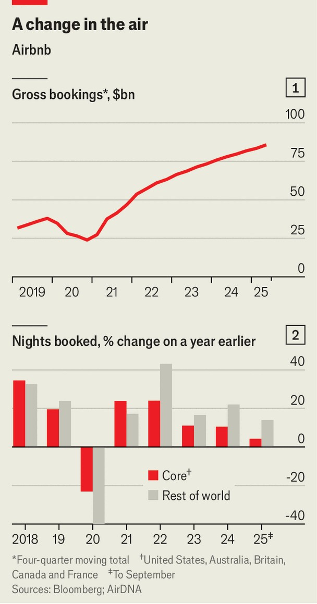

Business | Room to grow
Has Airbnb reached its peak?
Brian Chesky, its boss, wants to offer more than just a bed to sleep on
November 6th 2025

When he co-founded Airbnb in 2007, the 26-year-old Brian Chesky was a bright-eyed design-school graduate who wore blue jeans and nondescript t- shirts. The 44-year-old tech boss who greets The Economist dressed in head- to-toe black cuts a rather different figure. Like its chief executive, Airbnb has also changed with age. The booking platform, which boasts more than 8m listings across nearly every country, is “now a grown-up company”, insists Mr Chesky. Gone are the days of burning through cash in a rush to scale. Airbnb’s operating margin in the second quarter was a handsome 21%. In August it announced that it would repurchase $6bn-worth of shares. Its market value, at $78bn, exceeds that of Marriott, the world’s largest hotelier.

Yet investors worry that maturity has brought stagnation. Although the $86bn-worth of bookings made through the platform in the 12 months to June represented a 10% increase on the same period a year before, its rate of growth has been falling (see chart 1). Analysts expected more signs of a slowdown when the firm reported its quarterly earnings on November 6th, after The Economist went to press. Airbnb’s shares are down by 11% over the past year. To rekindle growth, it is looking to new markets, new product lines and new technology. Will the plan work?

Airbnb began with Mr Chesky and two friends renting out an airbed in their living room in San Francisco. The idea of a platform to help people open up their homes to paying guests proved a hit, and soon the trio were peddling properties on behalf of hosts across the world.

In a pre-pandemic growth frenzy, the company ventured well beyond accommodation. In 2016 it established a marketplace for “experiences”, such as walking tours, as well as a guidebook. In 2019 it set up a film studio. Costs ballooned by 45% that year, even as revenue growth began slowing.

“It became chaos,” reflects Mr Chesky. “I had no idea what I was doing.” The lessons he took from that period—including the need to keep control of decisions, be steeped in the details and have as few employees as possible—

have shaped Mr Chesky’s leadership style ever since. (Paul Graham, a renowned startup investor, would later use Mr Chesky’s approach to illustrate what he termed “founder mode”.)

Then came the covid-19 pandemic. As bookings ground to a halt, Mr Chesky saw an opportunity to rebuild the company. He fired a quarter of its staff, merged divisions, removed management layers and paused the expansion into experiences. Despite lockdowns, Airbnb’s stockmarket debut in December 2020 was a hit, with its shares more than doubling on the day. When travel resumed, the company roared back to growth as it set about fixing users’ various gripes, including a lack of transparency in fees, too many poor-quality listings and disappointing customer service.

Lately, however, Airbnb’s growth has cooled. The uncertainty wrought by President Donald Trump’s on-and-off tariffs has led consumers to delay booking trips. Policymakers in cities from Paris to New York have implemented restrictions on the platform, which they think contributes to surging house prices. Competition from travel sites such as Booking.com and Expedia is heating up for short-term lets. Web traffic to Airbnb is slowing.

In response, the company is looking for new growth opportunities. It is endeavouring to expand its accommodation business beyond its five core markets of America, Australia, Britain, Canada and France, which represent around half of nights booked through the platform, according to AirDNA, a data provider. Airbnb has boosted bookings in Brazil by investing in local marketing and adding payment options, and is trying something similar in other countries, including India, where tourism is booming. AirDNA estimates that the number of nights booked on the platform is growing more than three times as fast in its less-established markets as it is in its five core countries (see chart 2).

Airbnb is also moving into hotel bookings. Ellie Mertz, its finance chief, reckons that only one in ten nights Americans spend away from home is in an Airbnb. Adding hotels should help the platform attract business travellers in particular. Hotels appreciate Airbnb because, unlike other booking sites, it does not spend lavishly on Google ads, which push their own websites down the list of search results.

At the same time, Airbnb is branching out from accommodation once again. In May it launched an updated app that offers not just a refreshed set of experiences, including baking with a grandmother in Paris, but also services, such as personal training from a champion bodybuilder in Los Angeles. And in October it introduced social features that allow users who meet through an Airbnb experience to stay in touch. Analysts expect car rentals and a loyalty programme to follow.

There are reasons to be sceptical. Plenty of other sites help people book activities when they travel; research by Wells Fargo, a bank, suggests that Viator, a rival, offers ten times as many experiences in big cities such as London and New York. Many travellers looking for a hairdresser will search on Google or simply go to the nearest mall or high street. While visiting San Francisco, your correspondent paid $44 for a one-hour exercise class on Airbnb, only to find that the woman huffing and puffing beside her paid less than half that on ClassPass, a booking site for workouts.

Then there is artificial intelligence (AI), which could upend travel. According to a survey this year by McKinsey, a consultancy, 55% of Americans have used OpenAI’s ChatGPT or a similar tool when planning a trip, up from 38% in 2024. Some may start to book rooms directly through these services once it becomes easy to do so.

Airbnb, unlike some rivals, has so far held off on integrating with AI services like ChatGPT. Mr Chesky, who is pals with Sam Altman, OpenAI’s founder, says he opted not to do so when approached by the AI firm a few years ago because he felt that it would not be “a great user experience”. He has told Mr Altman that companies like Airbnb do not want to be “reduced to commodities” that simply provide data. Instead, Mr Chesky envisages using AI to turn Airbnb into a conversational app that will steadily gain a deeper understanding of what its users want.

Airbnb’s boss also sees the technology benefiting the platform in another way. As people spend ever more time on their screens interacting with bots, they may come to yearn for experiences in the real world, including travelling to new places. “From the very beginning we saw this as a movement,” he says, speaking in full “founder mode”. “We did not see it as a website. We did not see it as an app. We did not see it as a commercial

idea.” The question is: are users looking for a movement, or just somewhere to rest their heads? ■

To stay on top of the biggest stories in business and technology, sign up to the Bottom Line, our weekly subscriber-only newsletter.

This article was downloaded by zlibrary from [https://www.economist.com//business/2025/11/02/has-airbnb-reached-its-peak](https://www.economist.com//business/2025/11/02/has-airbnb-reached-its-peak)