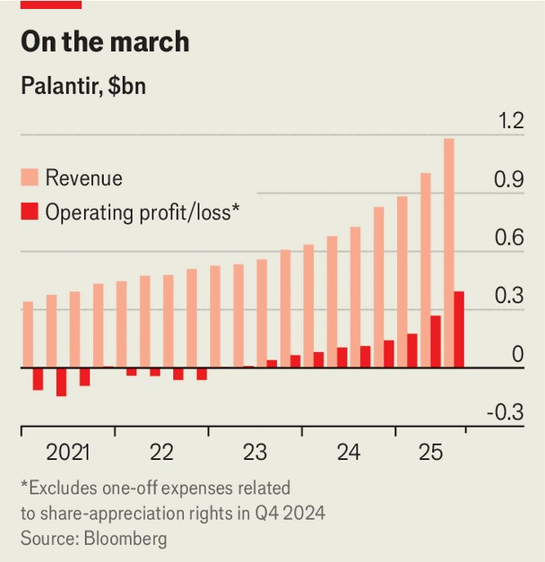

Business | To the moon and back
Why Palantir’s success will outlast AI exuberance
Its valuation looks bonkers. Its business isn’t
November 6th 2025

Despite what Alex Karp, the boss of Palantir, says, investors are hardly “batshit crazy” to bet against his company. The seller of whizzy analytics tools has a market value of nearly $450bn, equivalent to 137 times its sales over the past 12 months and 624 times its net profit. Nvidia, the most valuable company in the world and a fellow beneficiary of the artificial- intelligence (AI) boom, is worth a comparatively meagre 28 times its sales and 54 times its net profit. Palantir, whose customers range from America’s Central Intelligence Agency to Wendy’s, a fast-food-chain, bears many of the hallmarks of an overinflated meme stock. It is beloved of retail investors, some of whom wear “Palantir to the moon” T-shirts. The company, which loudly celebrates

America’s military might, is also gleefully polarising. This week Mr Karp, who previously sat on the board of The Economist’s parent company, berated “the chattering class” for failing to grasp Palantir’s potential. In a letter accompanying its latest quarterly results, published on November 3rd, he wrote that Palantir’s doubters were in a “kind of deranged and self- destructive befuddlement”.

And yet the ranks of the befuddled seem to be swelling. The day after Palantir unveiled results its shares plunged by 8% as it was revealed that Michael Burry, an investor famed for his bet against subprime mortgages during the global financial crisis of 2007-09, had taken out a big position against the company. If the hype surrounding AI fades, Palantir’s stock will have a lot further to fall.

Even if that happens, however, Palantir’s business will survive. It is going from strength to strength. Revenue in the quarter from July to September was up by 63% year on year. Operating profit was up by 248% (see chart). Morgan Stanley, an investment bank, commented after the results that it was “hard to find a better fundamental story in software”.

Palantir’s growth partly reflects the surging popularity of AIP, its suite of AI software. It has helped the firm land a flurry of big contracts: Palantir closed

53 deals worth more than $10m in its most recent quarter, up from just 16 a year before. Even if customers’ enthusiasm for AI tools were to cool, many may find it difficult to disentangle their operations from Palantir’s software.

Moreover, after years of losses, Palantir’s unique business model has now reached a profitable scale that should create a momentum of its own. Founded in 2003, the company did not generate its first annual profit until 2023, at which point its model of helping its clients implement its software by embedding so-called “forward-deployed engineers” (FDEs) in their organisations began to pay off.

Palantir is not your typical software-as-a-service company, but its operating margin—at 33% in the most recent quarter—is just as juicy. Business is booming, but headcount isn’t. As they customise Palantir’s products, FDEs use that knowledge to make the software more useful, meaning the work they do for one client is valuable for others. The trickier the challenge, the bigger the reward for Palantir.

The company’s model has proved so successful that it has spawned imitators across Silicon Valley. OpenAI, the maker of ChatGPT, and Anthropic, a rival, are among the many tech firms that have lately been hiring FDEs. Palantirians, however, tend to dismiss these imitators as copying the form but not the function of the role, arguing that they will inevitably be lured into creating out-of-the-box software that is easy to replicate across customers.

Another wind at Palantir’s back is the growth in government spending on defence and security. Since Donald Trump returned to the White House in January, the company has won numerous government contracts in America, including for defence and immigration enforcement. Palantir’s work for governments accounts for more than half its revenue. Although most of that is in America, the company is also expanding its business with other governments, such as Britain’s.

The secrecy that surrounds Palantir’s government work adds to the difficulty of valuing the company. Its executives make matters worse by using obscure terms like “ontology” to explain what the firm does. But behind the self- aggrandising mystique is a business built to last. ■

Correction (November 6th): An earlier version of this article understated the growth in Palantir’s operating profit.

To stay on top of the biggest stories in business and technology, sign up to the Bottom Line, our weekly subscriber-only newsletter.

This article was downloaded by zlibrary from https://www.economist.com//business/2025/11/05/why-palantirs-success-will-outlast- ai-exuberance