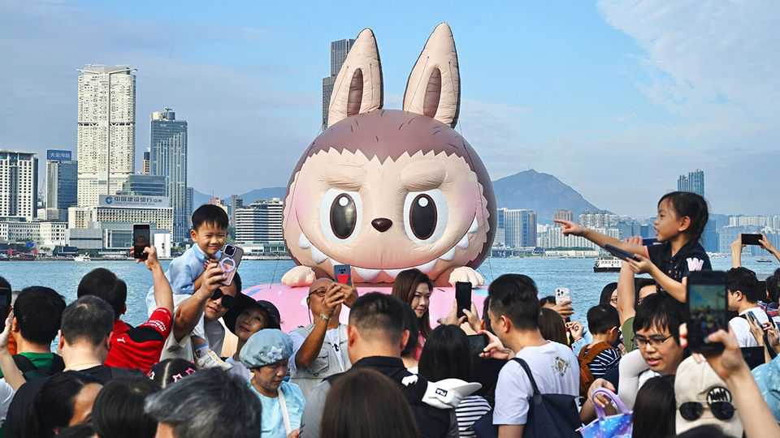

Business | Unboxed
First, grinning Labubu dolls. Now, a TV show and theme parks
Pop Mart, maker of the wildly popular toys, wants to be China’s Disney
November 6th 2025

Before the craze for Labubus, few had heard of Pop Mart, the Chinese toymaker behind the mischievously grinning dolls. With customers across the world now lining up to get their hands on one, the company, which saw its sales rocket by 245% year on year in the quarter from July to September, has investors rapt. Seemingly overnight, Pop Mart has become the world’s most valuable listed toymaker; its market capitalisation, at $38bn, is more than three times that of Sanrio, the Japanese company behind Hello Kitty, and nearly seven times that of Mattel, the American maker of Barbie dolls. Its stores have popped up in nearly 40 countries. Around two-fifths of its sales are made overseas,

mainly in rich countries, where Chinese consumer brands have previously struggled to gain traction. How much bigger can the company get?

A growing number of investors worry that Pop Mart’s extraordinary ascent will soon come to an end. Shares in the company, which is listed in Hong Kong, are down by a third from their peak in August. One reason for pessimism is the sagging resale price of Labubus, which could be seen as a sign of flagging demand. New dolls are sold in “blind boxes”; buyers do not know which character they will get until they open up the package. Collectors seeking out rare versions have been willing to pay eye-watering prices to get their hands on them. The second-hand price of Chestnut Cocoa, a scarce creature with fluffy brown fur, hit 1,500 yuan ($210) in June—but has more recently tumbled to 780 yuan.

This is mainly owing to surging supply rather than shrinking demand, however. For months Pop Mart stores have not had enough dolls to go around. Shoppers have been asked to scan QR codes and join a digital queue that could last weeks. While this has added to the hype around the toys, it was primarily the result of manufacturing shortfalls that constrained the firm’s ability to cash in on the surging popularity of Labubus. Entrepreneurial types began stocking up on the figurines and selling them at wildly inflated prices. A thriving market for fake Labubus—called “Lafufus”—has also sprung up.

In response, the company has been boosting production. By the end of the year it will have grown its manufacturing capacity ten-fold compared with January, reckons HSBC, a bank. Increased supply is already hitting the secondary market, pushing down prices for older generations of Labubus. Yet new releases are said to sell out almost instantly, suggesting that demand remains feverish.

The bigger question surrounding Pop Mart is whether it can expand beyond the dolls. Labubus, which were created by a Hong Kong artist in 2015, began to soar in popularity when a K-pop star was seen with one in April last year. The company is busily trying to create its next hit toy. As of mid- September it had launched 29 new products in 2025, only a fifth of which were Labubus. Newcomers include Skullpanda, a distinctly cuter line of characters.

Pop Mart also has its sights set on becoming more than just a toymaker. Disney, America’s entertainment juggernaut, has demonstrated the power of franchises that span merchandise, films and in-person experiences. Others, including Mattel, which turned Barbie into a box-office hit in 2023, have proved that popular toys can be used as the starting point for such franchises.

Pop Mart is experimenting with this. Pop Land, a theme park it opened in Beijing in 2023, lets visitors interact with characters including Labubus. It may open more. The company also has plans to launch a Labubu animated series, and in June it established its own film studio. So far, Pop Mart’s ability to make money from more than just selling toys has been limited. Less than a tenth of its revenue comes from licensing, reckons Jeff Zhang of Morningstar, a research firm. But that share will probably rise as the company invests in developing its franchises.

With great success, however, often comes political scrutiny—especially in China. The Communist Party, which has focused more on supporting advanced manufacturing than fostering consumer brands, has lately become fascinated with the Labubu phenomenon. Its propaganda department has met Pop Mart executives and asked why its toys are not more Chinese in nature. The company has been forced to explain that overtly Chinese products do not sell well abroad, according to a person privy to the discussions. As Pop Mart grows bigger still, China’s government may be unable to resist the urge to meddle. ■

To stay on top of the biggest stories in business and technology, sign up to the Bottom Line, our weekly subscriber-only newsletter.

This article was downloaded by zlibrary from https://www.economist.com//business/2025/11/04/first-grinning-labubu-dolls-now-a- tv-show-and-theme-parks