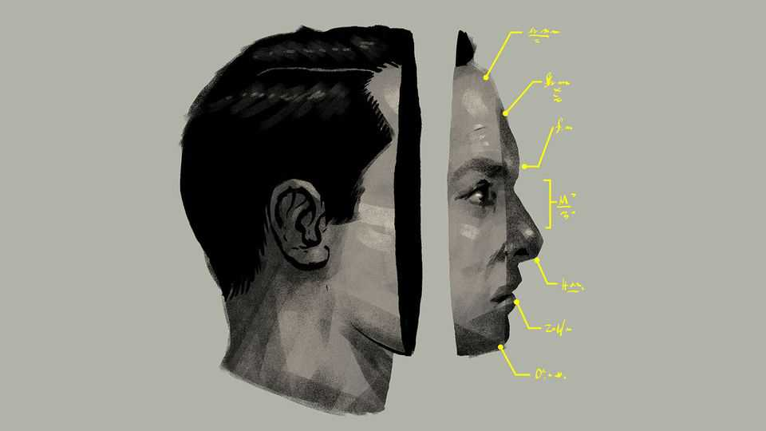

Business | Bartleby
Should facial analysis help determine whom companies hire?
A new paper suggests a photo can tell a recruiter much about an applicant’s personality
November 6th 2025

Imagine appearing for a job interview and, without saying a single word, being told that you are not getting the role because your face didn’t fit. You would assume discrimination, and might even contemplate litigation. But what if bias was not the reason? What if your face gave genuinely useful clues about your probable performance at work? That question is at the heart of a recent research paper from Marius Guenzel of the University of Pennsylvania and his co-authors. The possibility that it does raises larger questions about algorithmic decision-making and how humans perceive fairness.

Personality assessments are an accepted part of recruitment processes. They normally involve candidates taking surveys and guessing what counts as a good answer. Yet previous research suggests that personality types can be encoded in facial features, and that artificial intelligence (AI) can spot them. So Mr Guenzel and his co-authors used an algorithm to analyse the pictures of 96,000 MBA graduates, and extract what they call the “Photo Big Five”—as they rename the Big Five personality traits of agreeableness, conscientiousness, extraversion, neuroticism and openness. (Before you head to the mirror, it’s not obvious what the AI is seeing.)

They then used data on these individuals’ labour-market outcomes to see whether the Photo Big Five had any predictive power. The answer, they conclude, is yes: facial analysis has useful things to say about a person’s post-MBA earnings and propensity to move jobs, among other things.

There are plenty of caveats. The predictive power of the Photo Big Five shouldn’t be exaggerated; the authors say it is only an incremental source of information on candidates. The field of AI facial analysis is young, and has been at the centre of methodological firestorms in the past. And even if techniques were flawless, adoption is likely to be slow. Anti-discrimination laws mean that there are obvious legal risks associated with making any decisions based on facial characteristics. Manish Raghavan of the MIT Sloan School of Management notes that companies are wary of using AI for facial analysis (though he worries more about bias infecting chatbot summaries of candidates’ cvs or LinkedIn profiles.)

But suppose that all these objections were surmountable. If your face could tell a prospective employer something useful, without discriminating on grounds of protected characteristics, then firms would have a strong incentive to analyse it. There would still be questions, though. The authors give an example: “Among white male job candidates, is it ethical to screen out individuals whose faces predict less desirable personalities?”

You could make the case that this would be fine. After all, plenty of decisions are already being taken on the basis of physical appearance. There is a height premium in hiring, for example, which makes it more likely that a taller person will get chosen than a shorter one. Some might argue that face- based analysis is more meritocratic than processes which reward, say,

educational attainment. Kelly Shue of the Yale School of Management, one of the new paper’s authors, says they are now looking at whether AI facial analysis can give lenders useful clues about a person’s propensity to repay loans. For people without access to credit, that could be a blessing.

Even setting aside the risk of bias, though, there are other big concerns. Some are obvious: aggregate patterns do not tell you how an individual will perform. Others are more insidious. An industry of coaches and self-help gurus is built on the idea that it is possible to control and modulate your behaviour. What’s the point in self-improvement if your face is still going to give off the same signal that you’re a dilettante?

How you react to this prospect also tells you something about AI and perceptions of fairness. It matters whether people retain a sense of agency. However good the algorithms get, a chance for a candidate to win over a human interviewer in a hiring process—and for an interviewer to decide for themselves if they want to work with someone—is likely to always be valued.

Mr Raghavan argues that people are more prepared to accept decisions based on immutable characteristics if there is clear causal logic. There are reasonable statistical grounds for younger drivers to pay higher car- insurance premiums, for example, or for older people to pay more for health care. For many, facial analysis will raise eyebrows. ■

Subscribers to The Economist can sign up to our Opinion newsletter, which brings together the best of our leaders, columns, guest essays and reader correspondence.

This article was downloaded by zlibrary from https://www.economist.com//business/2025/11/06/should-facial-analysis-help- determine-whom-companies-hire