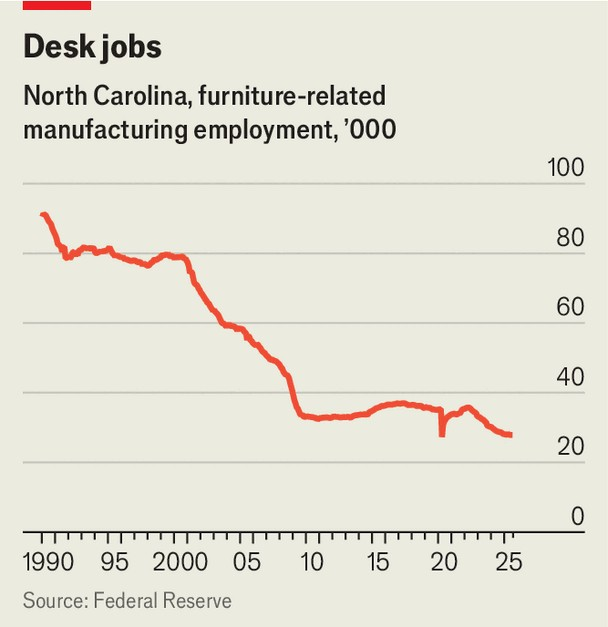

Business | When you only have a hammer
America’s furniture-makers exemplify the folly of tariffs
Donald Trump is pushing up costs to rescue an industry that has already adapted to globalisation
November 6th 2025

TWICE A YEAR the curtain rises on High Point, North Carolina. Each April and October some 2,000 exhibitors and hundreds of greeters, baristas, policemen and coat-checkers assume their places. When the audience— 75,000 wholesalers, retailers and designers—step off their shuttle buses, the show begins. High Point’s biannual “market”, as it is known, is one of the furniture industry’s biggest trade fairs. North Carolina, however, is no longer the furniture-making powerhouse it once was. In 1990 the industry employed

90,000 people in the state. Now, after decades of cheap Chinese imports flooding the American market, it provides jobs to just 28,000 (see chart).

The Trump administration is betting that its favourite tool can return American furniture-making to its better days. Last month, as High Point readied itself for its big event, America imposed a tariff of 25% on upholstered wooden furniture, vanities and kitchen cabinets. In January the rate will rise further, to 30% for furniture and 50% for cabinets. Yet many in the industry are unenthused.

The levies come at a challenging time, says Stuart Stump Mullens of Stump & Company, an advisory firm focused on the industry. Demand has fallen from the covid-era “go-go days”, she says, when many consumers splashed out on new sofas and the like. Furniture is a cyclical business, and is closely tied to housebuilding and family formation. In August, the latest data available, housing starts were at a two-year low amid high interest rates. Rising furniture prices—up by almost 4% in the 12 months to September— are already putting off would-be customers.

The new tariffs will push those prices higher still, weighing on demand. In theory, the levies give American manufacturers a leg up. Gat Caperton, whose company in West Virginia harvests Appalachian wood and builds

furniture to order, is pleased. But many of his peers grumble about the rising cost of imported materials, whether lumber (also tariffed, at 10%), sofa legs (“no smart businessperson would make their own”) or yarn. Meanwhile, the fact that Mr Trump’s duties are ever-changing makes it hard for the industry to function. During the High Point market, some buyers said they were being quoted prices that would hold only for a matter of days.

Many in the furniture industry also question whether America will be able to find the workers needed to bring production back home. “I don’t think you can find the people,” says Simon Lichtenberg, whose products sell at Costco, an American retailer, and on Wayfair, an e-commerce site. He has moved his America-bound production from China to Vietnam, but remains committed to importing.

Stuart Kent, who runs a woodworking school a few hours’ drive from High Point, agrees there is a problem finding workers for the industry, but believes the “narrative” around furniture-making needs to change. He trains his students in computer-assisted design. “I think it’s completely naive to say that it’s going to go back to the way it was,” he says. Mr Kent reckons that the future of the industry is in “smaller, more efficient” factories filled with highly skilled workers. That, more than tariffs, may keep High Point’s market alive. ■

To stay on top of the biggest stories in business and technology, sign up to the Bottom Line, our weekly subscriber-only newsletter.

This article was downloaded by zlibrary from https://www.economist.com//business/2025/11/06/americas-furniture-makers-exemplify- the-folly-of-tariffs