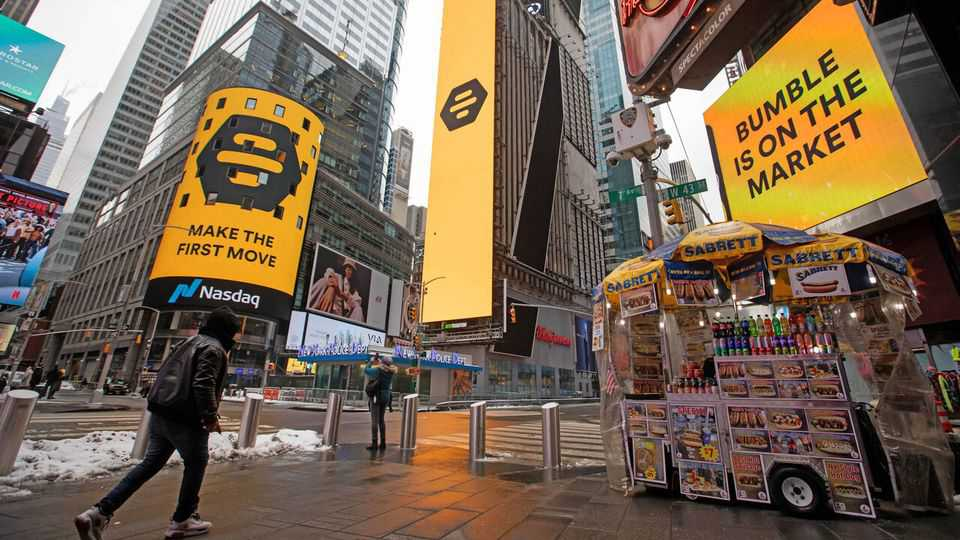

Business | Cupid’s new helper
Will AI make dating apps better—or even worse?
Tinder, Hinge and Bumble are betting big on the technology
November 6th 2025

“It’s very difficult to find love,” Aleksandr Zhadan, a 20-something software developer from Moscow, lamented on social media last year. To speed things up, Mr Zhadan programmed an artificial-intelligence (AI) bot to trawl through endless profiles on Tinder, a dating app, and interact with more than 5,000 lucky girls on his behalf. After some 100 real-life dates, Mr Zhadan proudly announced to the world that he had proposed to his algorithmically ordained other half. Mr Zhadan is not alone. According to a study published in June by Match Group, Tinder’s owner, and the Kinsey Institute, a research centre at Indiana University, a quarter of American singles now use AI to enhance their dating profiles and write messages.

Dating apps—which have fallen out of favour as users have grown tired of endless swiping—are hoping that the technology will get them back in the game. Bumble, a Tinder competitor, has lost more than 90% of its market value since it went public in February 2021. In March its founder, Whitney Wolfe Herd, returned as chief executive, having stepped back from the role in 2023. Match Group, which also owns Hinge, has lost around 80% of its value over the past four years. The two companies’ latest quarterly results, published this week, showed a continued decline in the number of users paying for their services.

Dating apps see various ways to improve their allure by harnessing AI. Tinder has launched a tool that uses the technology to curate a “daily drop” of possible partners, while Hinge has rolled out a new AI-powered matching algorithm and begun testing personalised prompts to nudge users into more stimulating conversations. In August Match Group’s boss said that Hinge’s new algorithm had increased matches by 15% since launching in March. Ms Wolfe Herd has said that Bumble is developing a new AI-based app that, after getting to know a user, will craft a profile for them and seek out compatible users. Grindr, an app for gay men, plans to launch an AI “wingman” by 2027 that will help to write messages, find matches and plan dates. “We really envision it becoming users’ sidekick,” says AJ Balance, the app’s product chief.

The intrusion of AI into dating, however, could also give users the ick. Some have already complained of being “ChatGPT-ed into bed” by a match’s computer-generated charm. Luke Brunning, who runs a research centre focused on modern relationships at the University of Leeds, reckons that the technology will “create more suspicion” in dating. Mr Zhadan has said his fiancée was “shocked” to discover his use of AI for their courtship—though it appears not to have been a deal-breaker. Love can be hard to predict.■

To stay on top of the biggest stories in business and technology, sign up to the Bottom Line, our weekly subscriber-only newsletter.

This article was downloaded by zlibrary from https://www.economist.com//business/2025/11/03/will-ai-make-dating-apps-better-or- even-worse