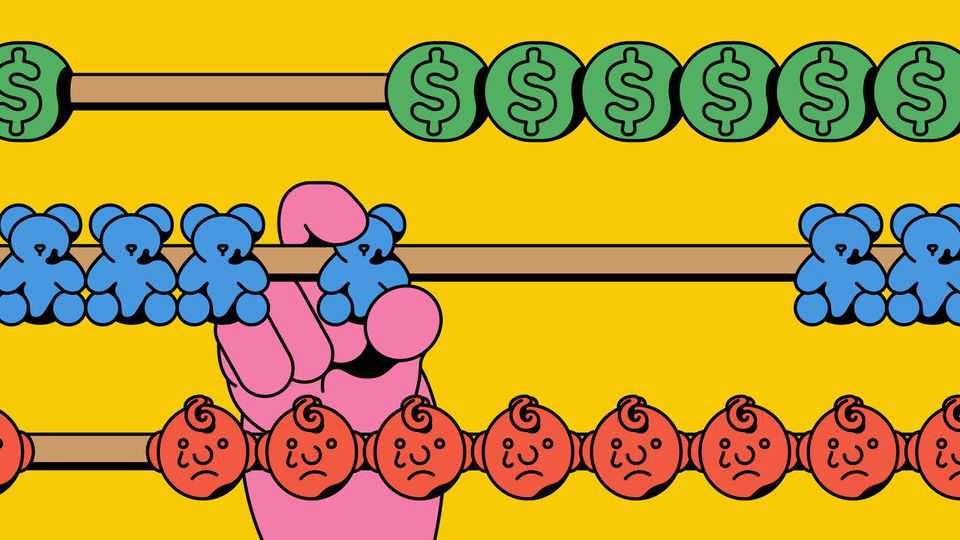
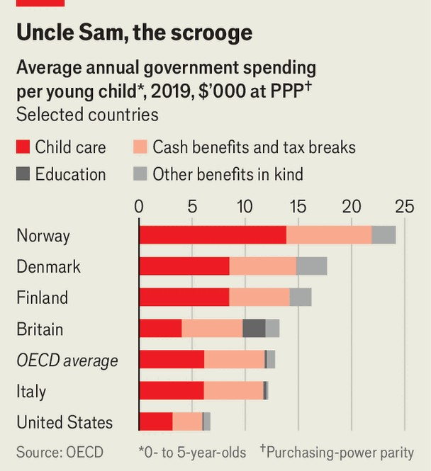
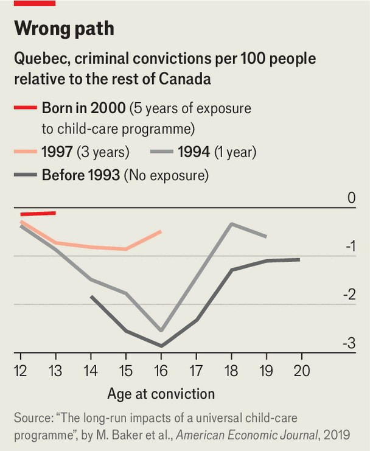

Finance & economics | Don’t rock the cradle
Universal child care can hurt children
Its growing popularity in America is a concern
November 6th 2025

Across the rich world, parents of young children face a problem. In America, one of many countries with few subsidies, a household with two working parents and two young children can spend as much on child care as on housing. This pushes families to space out or have fewer children to avoid financial ruin. High costs also keep women out of the labour force, as it can be uneconomical to return. Politicians are scrambling to respond. In America, the right is full of talk— J.D. Vance, the vice-president, has argued in favour of lower tax rates or cash handouts for families to help mothers stay at home—but, so far, little action. Instead, it is Democratic lawmakers making moves. On November 1st New Mexico’s governor, Michelle Lujan Grisham, expanded free child

care to all families with children, starting from six weeks of age (it had previously been available only to poor and middle-class ones). Zohran Mamdani, who will be sworn in as mayor of New York at the start of next year, plans to follow in Ms Grisham’s footsteps. States including Vermont and Washington have recently made child-care subsidies much more generous.

American legislators are not alone in their enthusiasm. In Australia access to subsidised day care will be broadened next year. During the school term, Britain now offers 30 hours of free child care a week to parents who bring in less than £100,000 ($130,000) after tax. Since July middle- and low-income parents in New Zealand have been able to claim rebates for 40% of child- care fees, up from 25% before. The likes of Ms Grisham and Mr Mamdani are unusual, however, in believing that the state should bear the entire cost of care for families of all income levels, starting near birth.

The idea of liberating parents is an attractive one. And the idea of all children, regardless of parental income, playing and learning together from just after birth is a pleasant one. Yet there is a problem. The best evidence on the impact of free (or almost free) universal from-birth child care indicates that it can harm children.

How can this be? There is, after all, lots of evidence—in the form of small, randomised controlled trials—in support of similar schemes. The most influential trial began in 1962 when a group of three-year-old children in Ypsilanti, a small city near Detroit, were enrolled in a programme at Perry Elementary School. The organisers found children who lived in poor households and struggled in tests, and then either enrolled them or put them in a control group. For the next two years, those enrolled attended a daily two-and-a-half-hour pre-school programme, where they “planned”, “did” and “reviewed” play activities in groups of five or six. A teacher also visited them at home once a week.

These “Perry pre-school kids” may be the most influential three-year-olds ever to have existed. Researchers followed them throughout their lives, surveying them at 15-, 19-, 27- and 40-years-old, and collected records on them. The scheme had an unambiguous and overwhelmingly positive impact: the kids were more likely to graduate from school and less likely to be arrested or convicted of crime. In 2010 James Heckman, a Nobel- prizewinning economist, and co-authors calculated that, on conservative assumptions, the investment made in the children returned 7-10% a year to society—comparable to the historical rate of return on equity.

Such results have been the foundation of calls for more early-childhood education across the world. The example set by Perry and similar early- childhood experiments was used as justification for Tony Blair’s Sure Start scheme in Britain. Mr Heckman’s study was the basis of President Barack Obama’s claim, in his 2013 State of the Union address, that society saves $7 for “every dollar we invest in high-quality early-childhood education”. And then there is Quebec.

Having been inspired by the Perry experiment, in 1997 the province set up a publicly funded scheme offering full-time child care for just $5 a day. It was extremely popular. The share of children up to the age of four in care rose by 14 percentage points relative to the rest of Canada, which had immediate labour-market consequences. The share of women in the labour force rose by eight percentage points. Today, the maternal employment rate in Quebec remains, at 87%, one of the world’s highest.

This shift in Quebec, but not in the rest of Canada, is about as good an experiment in how such a policy affects children as it is possible to find. To work out its impact, Jonathan Gruber of the Massachusetts Institute of Technology, Michael Baker of the University of Toronto and Kevin Milligan of the University of British Columbia tapped into a wealth of data on children in Quebec collected by the National Longitudinal Study of Children and Youth, which gathers details on child care, teacher evaluations, test scores and behaviour reports.

The trio published their first study in 2005, and the results were damning. Shifting to universal child care appeared to lead to a rise in aggression, anxiety and hyperactivity among Quebecer children, as well as a fall in motor and social skills. The effects were large: anxiety rates doubled; roughly a third more kids were reported to be hyperactive. Indeed, the difference in hyperactivity rates was larger than is typically reported between boys and girls.

A decade later, once the children were in high school, the authors followed up. The best that can be said is that the scheme did not have any impact on test scores or cognitive skills. But the children reported their life satisfaction to be worse. And a rise in juvenile crime in Quebec, compared with the rest

of Canada, implies that they were convicted of a fifth more drug and property crimes.

Quebec had tried, while keeping costs down, to imitate a small pilot on a grand scale. Standards inevitably slipped. When Mr Heckman was asked by the New York Times about the province’s experience, he noted how different it was from the trials he had studied. “These were warehouses,” he said. “They were fairly impersonal, there wasn’t any real quality. Quality has to be a sine qua non of the whole enterprise.”

Think of the Perry and Quebec experiments—two of the most widely cited in the early-education literature—as poles at either end of a spectrum. There are a number of differences between them: targeted versus universal; high quality versus low quality; enrolment from birth versus enrolment from the age of three; a few hours in care versus the whole day. This makes it hard to tease out the impact of any one.

But the literature on early education is large enough that it is possible to isolate some. For instance, the Abecedarian project in North Carolina starting in 1972 offered high-quality, all-day care from birth for poor children—and was associated with even greater benefits than the Perry project. Studies based on lotteries for pre-K systems in Boston and Tulsa have also found a positive impact on high-school-graduation and college- enrolment rates. The trouble is what, if anything, governments should do for middle- and high-income kids under three. “Universal pre-school seems like kind of a no-brainer,” says Mr Gruber. “Universal child care is a lot more controversial.”

There is one big issue with expanding schemes from pre-school (aged three or so) all the way down to infancy. In their early years, children’s development seems to depend more on the intensity of adult interaction than being around other kids. That is why, even in places such as France, where centre-based care is well regarded and up to 85% of the cost is subsidised, research by Lawrence Berger of the University of Wisconsin-Madison and Lidia Panico and Anne Solaz of France’s national demographics institute has echoed some of what was found in Quebec. If enrolled in a crèche at the age of one then, by the age of two, children’s behaviour was reported to be much worse than if cared for by an assistante maternelle or their parents.

A need for lots of adult interaction implies there are few economies of scale to be found in the care of babies and infants. By school age, an adult can oversee 20 to 30 children. At pre-school, they watch 12 or 15. In the best nurseries a carer looks after two or three. Subsidised centre-based care is of high enough quality in Finland that when a stipend was introduced to pay Finnish mothers to stay home after ten months, child development and female incomes suffered. But to reach such standards the government spends much more than the OECD average. Although New Mexico is funding its generous programme with levies on oil and gas extraction, fiscal room is more limited in New York and other states, which spells trouble.

Ultimately, child care is expensive. It is expensive for parents in America, it is expensive for the Finnish government and it is expensive—in the long run —in places that try to do it on the cheap. These costs are paid either via exorbitant sums handed over to day-care centres, forgone career progression, high taxes or by undermining children’s development. None is palatable. Yet the worst are the extremes: that mothers should forgo work for years or that families might be incentivised to place babies into an underfunded mode of care ill-suited to their needs. What a pity that those are the solutions American politicians seem most determined to seek. ■

For more expert analysis of the biggest stories in economics, finance and markets, sign up to Money Talks, our weekly subscriber-only newsletter.

This article was downloaded by zlibrary from https://www.economist.com//finance-and-economics/2025/11/05/universal-child-care- can-hurt-children