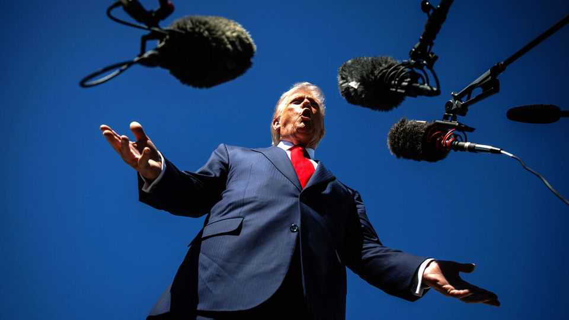
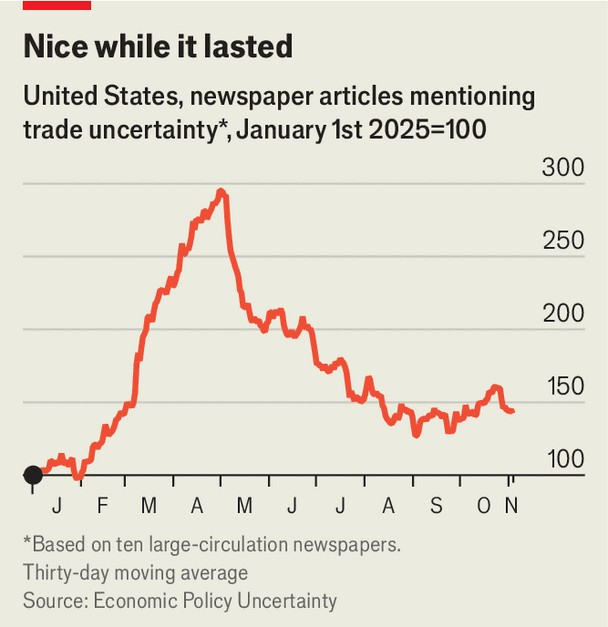

Finance & economics | Whack-a-levy
How Donald Trump can dodge a Supreme Court tariff block
No matter its ruling, the president has back-up powers
November 6th 2025

If trade deficits are a national emergency, they are an emergency of a peculiar sort. America began to run them consistently in the mid-1970s. Only five decades later did Donald Trump declare the situation “an unusual and extraordinary threat to the national security and economy of the United States”. During those crisis decades, America’s inflation-adjusted GDP per head more than doubled. Mr Trump’s proclamation came in April as justification for invoking the International Emergency Economic Powers Act (IEEPA), a law passed in 1977 that he has used to institute worldwide tariffs. He has also issued IEEPA levies in response to China’s fentanyl trade and threatened Venezuela

with them. Lower courts have found IEEPA does not grant the president the blanket powers he has asserted. On November 5th the Supreme Court heard arguments on the issue; a ruling is expected to arrive either later in the year or early 2026.

What would happen if the court struck down the tariffs? Devastation, according to Mr Trump: “If we don’t win that case, we will be a weakened, troubled, financial mess for many, many years to come.” A sizeable share of his tariffs have been issued through IEEPA. Eliminating them would knock the overall effective rate from 17% to 9%, reckons the Yale Budget Lab.

In private, though, the administration is a little more relaxed, for Mr Trump has other paths even if he continues to avoid seeking congressional approval. Although losing IEEPA authority might change the shape of his tariff regime, it would not change its scale. His officials’ first port of call would probably be Section 122, a provision allowing the president to impose tariffs of up to 15% for up to 150 days. That stopgap could be invoked instantly.

Next would probably come investigations by the United States Trade Representative and the Department of Commerce. Two authorities, Section 301 and Section 232, grant the president the ability to place tariffs on targeted countries and industries, respectively, following an inquiry. Section 301 was the basis for Mr Trump’s tariffs on China during his first term; recent levies on cars, steel and other sectors have been issued through Section 232.

Such an effort would be cumbersome and create legal vulnerabilities. But, brick by brick, it would enable Mr Trump to rebuild his tariff wall. Another option, if he is feeling braver, would be Section 338, which dates back to the 1930s and has never been invoked to raise tariffs. It allows retaliatory levies of up to 50% on countries with “unreasonable” trade practices, and does not require lengthy investigations.

If the IEEPA tariffs are struck down, the federal government might also owe refunds to the firms that paid them. The sums involved would be substantial —about $140bn (or 0.5% of GDP), estimates Piper Sandler, an investment bank. One theory discussed by investors, only half tongue-in-cheek, is that the administration might not mind losing all that much. Tariff refunds would

represent a form of backdoor stimulus, juicing the economy just in time for the midterm elections.

Yet losing would deny the president the freedom of manoeuvre he has enjoyed so far. As Howard Lutnick, his commerce secretary, has noted in previous testimony, “other tools...are procedurally time-consuming and do not allow for immediate action.” IEEPA’s flexibility makes it a uniquely potent option. Perhaps, then, Mr Trump might stop using levies as a catch-all weapon, making policy less volatile.

That would, however, require a change of presidential temperament— suggesting another outcome may be more likely. Over the summer, tariff policy had at last seemed to be settling down despite spats with Canada and China (see chart). A Supreme Court ruling against IEEPA use would force a complex, protracted and confusing rejig, meaning another burst of uncertainty. Many businesses, particularly manufacturers, have held off on hiring and investment, patiently waiting for trade policy to become more predictable. Even if the Supreme Court curbs the president’s whims, extending the period that firms are in limbo would do little economic good. ■

For more expert analysis of the biggest stories in economics, finance and markets, sign up to Money Talks, our weekly subscriber-only newsletter.

This article was downloaded by zlibrary from https://www.economist.com//finance-and-economics/2025/11/04/how-donald-trump-can- dodge-a-supreme-court-tariff-block