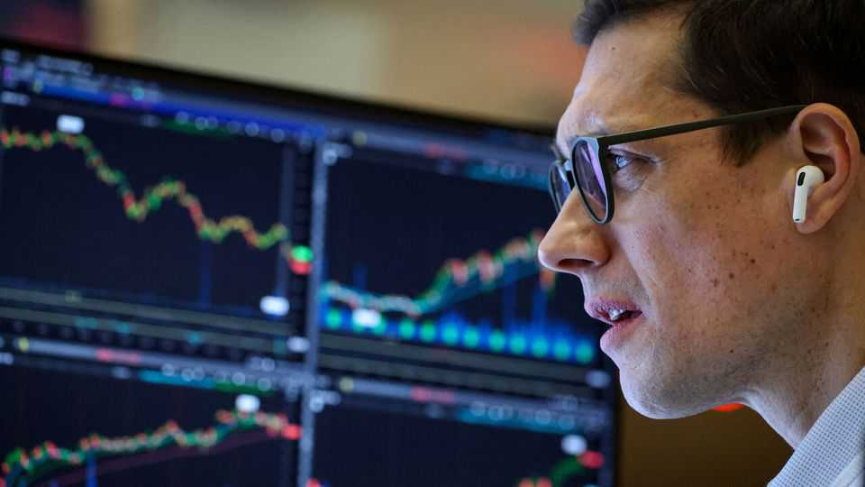
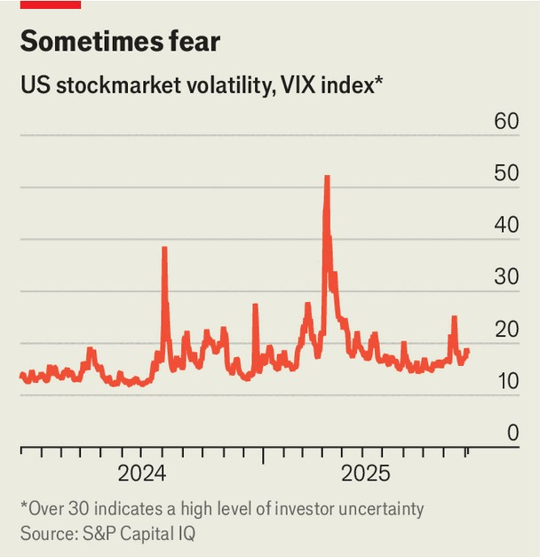

Finance & economics | Before the fall
Why Wall Street won’t see the next crash coming
Even the best traders struggle to predict sudden jumps in volatility
November 6th 2025

A lot of assets, warned Jamie Dimon in mid-October, “look like they’re entering bubble territory”. His voice carries because he runs America’s biggest bank, JPMorgan Chase, but also because it is part of a growing chorus. David Solomon, Mr Dimon’s opposite number at Goldman Sachs, talks of “investor exuberance”; Jane Fraser, Citigroup’s boss, of “valuation frothiness”. The Bank of England recently cautioned that “the risk of a sharp market correction has increased.” The IMF worries about a “disorderly” one, since “risk asset prices are well above fundamentals”. They are all right about one thing: valuations of many assets are dizzyingly high. To buy the basket of stocks in America’s S&P 500 share index, investors now pay 40 times their underlying, cyclically adjusted earnings—a

multiple exceeded only during the dotcom bubble, and then not by much. Investment-grade corporate bonds, on average, yield only 0.8 percentage points more than equivalent Treasuries. The last time this credit spread was so low was in 2005, during the run-up to the global financial crisis. Even gold, normally a haven, seems vulnerable to traders’ whims. After soaring to a record high on October 20th its price dropped by 7% in just two days, and is now 9% below its peak.

Perhaps, then, one correction has already begun. When might others follow? For anyone who is hoping to beat the market—including the quant shops and other hedge funds that promise returns whatever the weather—there are few more pressing questions. “The nirvana of macro trading is forecasting these turning-points,” says James White of Elm Wealth, an investment firm. The snag is that achieving nirvana is just about impossible.

Forecasting a correction comes down to forecasting volatility (or “vol”): the propensity of asset prices to jump around. The traders and quants who attempt this with stocks rely on a set of stylised facts, which become apparent if you stare at a chart of a share-price index for long enough. One is that volatility is “bimodal”, meaning prices spend long periods moving by relatively small amounts each day, interspersed with much shorter ones during which they move a lot (see chart). Volatility, in other words, has a

tendency to jump itself: there are low-vol regimes and high-vol regimes, with not much in between. These regimes are correlated with the broad direction asset prices are moving in. During low-vol periods, prices tend to be stable or rising; during high-vol regimes, they tend to fall.

The fact that volatility mostly stays in one regime or another means that, most of the time, the best way to predict tomorrow’s vol is from today’s. This is the basis for the “autoregressive” models used by traders at banks and investment firms to gauge risk. Such models are also used to price options—contracts that allow traders to profit from big swings in prices— since this requires an estimate of expected volatility. Yet though useful from day to day, these models are ill-equipped to predict the sudden vol jumps that accompany corrections, when the regime changes.

As a result, many traders build other models to complement their autoregressive ones, based on outside factors that might cause volatility to leap. The state-of-the-art approach is to use machine learning to analyse the impact of every economic variable under the sun. Corporate earnings, GDP, inflation, jobs data—any or all might contribute to a sudden dip in sentiment. Machine learning, meanwhile, is an ideal tool for spotting combinations that might indicate vulnerabilities which are not intuitively obvious. Bridgewater, one of the world’s biggest hedge funds, is famous for trading strategies based on intricate combinations of economic variables.

Unfortunately, few such strategies actually seem to work well enough to beat the market. “I know of no other firm than Bridgewater that has been successful with these macro models,” says a former trader at a rival hedge fund. And even the best of them cannot be expected to predict a “pure shock”, like a pandemic or a run on a bank. The very unpredictability of such shocks means they have the greatest potential to trigger a correction. Macro models can pinpoint situations in which one might have an outsize impact on markets, yet not when it will occur.

Traders do have other tools that they can use to spot a reversal. Since volatility tends to jump at times when prices change direction, momentum traders often dump their positions immediately after the first big move down snaps a winning streak. Correlations between different asset classes also sometimes provide an early warning that a correction is afoot. The classic

sign that investors have switched to “risk-off” mode, for instance, is that share prices fall at the same time as those of havens such as gold and Treasuries rise.

A good way of improving on the predictions of flawed models, says the head of quantitative strategies at another big hedge fund, is to combine many independent ones. Even then, the best a trader who lacks divine inspiration can really hope for is to identify a correction early and cut their losses. Wall Street’s finest might warn of a crash—do not expect them to say when it will arrive. ■

For more expert analysis of the biggest stories in economics, finance and markets, sign up to Money Talks, our weekly subscriber-only newsletter.

This article was downloaded by zlibrary from https://www.economist.com//finance-and-economics/2025/11/02/why-wall-street-wont- see-the-next-crash-coming