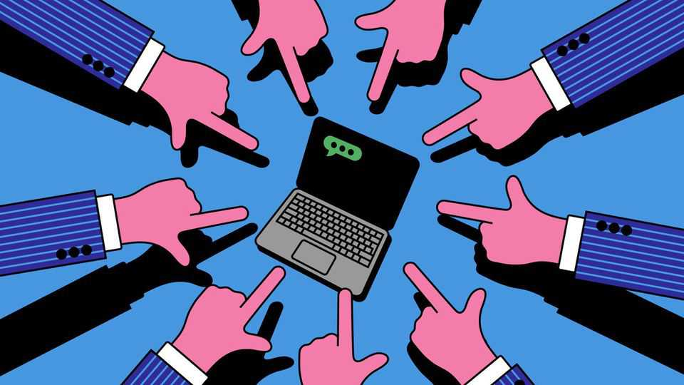
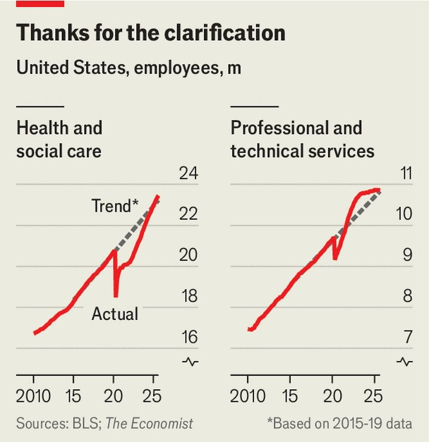

Finance & economics | Let’s break it down
Don’t blame AI for your job woes
The white-collar chill has more to do with the economy than with tech
November 6th 2025

Tech bosses are rarely restrained when discussing artificial intelligence. Over the past year they have filled conference halls and social-media feeds with visions of an AI job apocalypse. Sam Altman, OpenAI’s boss, has warned that “entire classes of jobs will go away”. Dario Amodei, chief executive of Anthropic, predicts that AI could wipe out half of all entry- level white-collar jobs and drive unemployment into the double digits. Elon Musk, never to be outdone, recently proclaimed that “AI and robots will replace all jobs.” Now the reckoning seems to have arrived. Corporate giants including Amazon, Target and UPS have together announced plans to shed more than 30,000 white-collar jobs. Amazon said that it needs to operate “more leanly”

as it pours money into AI; UPS has slashed managerial ranks in order to cut costs. Meta, too, has trimmed its “bloated” AI unit. The cuts have mostly landed on office-based staff—the precise workers that Silicon Valley has long predicted would suffer as AI spread.

Across the American economy, firms have announced nearly 1m job cuts this year, some 50% more than at the same point last year. Over the past three months the hiring rate has fallen to its lowest in a decade (apart from the covid-19 pandemic). More than a quarter of the unemployed have been without a job for at least six months, a level rarely seen except following recessions. Young graduates in particular are feeling the squeeze. The jobless rate among 22- to 27-year-olds with a bachelor’s degree has risen by more than two percentage points since 2023. To many, the timing feels telling: as firms trumpet their AI investments, the pain is felt by those whose work seems most automatable. Even Jerome Powell, chair of the Federal Reserve, has mused that companies which are “able to use AI more than they had in the past” may be hiring fewer graduates.

Some studies appear to back his view. Research by Erik Brynjolfsson of Stanford University and co-authors finds that in jobs most exposed to AI, such as software development, employment among workers aged 22 to 25 fell by 13% from late 2022 to early 2025 compared with older colleagues. Among the least exposed jobs, young and older workers saw comparable gains. Guy Lichtinger and Seyed Hosseini, both of Harvard University, reach a similar conclusion. Drawing on LinkedIn profiles and job-posting data from Revelio Labs, a workforce-intelligence company, they find that companies hiring for generative-AI roles have cut recruitment at junior levels more sharply than their peers.

Yet broader evidence points in the other direction. The Economic Innovation Group, a think-tank, calculates that from 2022 to mid-2025 the unemployment rate for the most AI-exposed fifth of workers rose by only 0.3 percentage points, against nearly one percentage point for the least exposed. They find a similarly muted effect for young graduates in the most AI-exposed jobs. Researchers at the Yale Budget Lab also find little sign of technological disruption. Examining changes in the mix of occupations since ChatGPT’s debut, they discover no discernible shift in America’s labour market. Analysts have been sceptical that recent job cuts by the likes of

Amazon were really driven by AI, rather than by standard business imperatives.

If AI is not to blame, what is? The simplest explanation is that the white- collar economy is coming down from a post-pandemic high. Sectors employing lots of graduates such as information services (including media and data services) and professional and business services (accountancy and consultancy) grew very fast in 2021 and 2022. Their recent pull-back looks less like AI upheaval than a return to normal. Even software development, among the most AI-exposed work, shows a similar boom-and-bust pattern. Developer job openings more than doubled after the pandemic, then slumped. Martin Casado of Andreessen Horowitz, a venture-capital firm, says the frenzy that sent software startup valuations soaring led firms to “over-hire like crazy”—a binge still being undone today. In-person industries such as health care and social assistance, which grew steadily, have only now caught up to the trend (see chart).

Another explanation is cyclical. ChatGPT’s release coincided with America’s tightest labour market in decades: in the summer of 2022 there were a record two job openings for every unemployed worker. Conditions have eased since, and young people are hit hardest when the economy slows. Our analysis finds that youth unemployment typically rises about one-and-a-

half to two times as fast as the overall unemployment rate when a business cycle turns. This episode fits the pattern.

Deeper problems nevertheless loom for young graduates. The rewards of higher education have been shrinking. America’s college wage premium has stagnated for two decades; graduates now account for a third of those who have been unemployed for at least six months, up from a fifth a generation ago. AI may soon add another obstacle. The technology is not yet taking young professionals’ jobs. But it is possible that, when the economy begins to perk up, there will be fewer left to take. ■

For more expert analysis of the biggest stories in economics, finance and markets, sign up to Money Talks, our weekly subscriber-only newsletter.

This article was downloaded by zlibrary from https://www.economist.com//finance-and-economics/2025/11/06/dont-blame-ai-for-your- job-woes