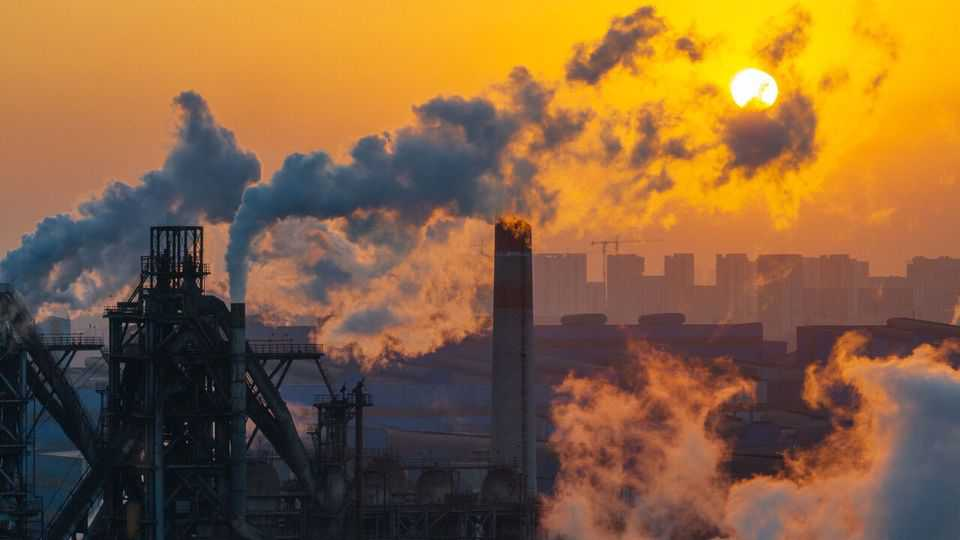
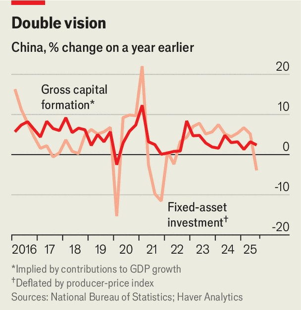

Finance & economics | Flip the script
The mystery of China’s slumping investment
Its leaders don’t seem concerned. Should they be?
November 6th 2025

Critics of China’s economy moan that its investment is excessive and its official statistics flatter its performance. Is that still correct? In recent months investment in infrastructure, manufacturing and construction has been alarmingly weak—so weak, in fact, that some analysts think the numbers are too bad to be true. Each month China reports data on investment in “fixed” assets (ie, things other than inventories). It reports how much has been spent since the beginning of the year and how that compares with the same period in the previous year. In the first nine months of 2025, China spent 37.2trn yuan ($5.2trn). Although that sounds like a lot, it was 0.5% less than a year

earlier. It was also the first time outside of the covid-19 pandemic that China had reported a negative figure going back more than 30 years.

The fall was not evenly spread over the year. Nothing was amiss until the summer. Then spending fell off a cliff. Official figures imply investment shrank by 6.6% in the third quarter compared with a year earlier. On the face of it, this is the kind of collapse that China bears have long predicted and the world economy has long feared—China at last reaching the destination on its “treadmill to hell”, as one critic put it.

Although investment in property has been declining for years, up until the summer it was offset by growing investment in other parts of the economy, such as manufacturing, infrastructure and services. Optimists could point to this resilience as evidence that China’s economic woes stemmed largely from the housing slump rather than a broader loss of faith in the country’s prospects or policymaking. But in the third quarter, investment even outside of property faltered, falling by 3.5% compared with a year earlier.

One potential explanation is the government’s campaign against “involution”, the label Chinese officials have given to disorderly competition. Price wars and other aggressive bids for market share are often the fruit of past overinvestment, building more production capacity than the market can comfortably bear. This overinvestment is itself often the result of arms races between provincial or city governments, keen to cultivate local champions in fashionable industries.

China’s leaders have been worried about this trend for over a year. But their alarm has intensified recently. In July a meeting of the 24-man Politburo, which includes the most powerful people in China’s Communist Party, stressed the need to squash “disorderly competition”. In trying to cultivate “new productive forces”, local governments must avoid “rushing headlong into new initiatives”, Xi Jinping said on October 20th.

There is, however, one problem with this explanation. The investment weakness has not been concentrated in industries that have been targeted by the anti-involution campaign, points out Adam Wolfe of Absolute Strategy Research, a consultancy. For instance, although carmakers have been rapped

on the knuckles for cutting prices too steeply, their investment spending grew by 19% from January to September, compared with the previous year.

Local governments may have interpreted the campaign as an invitation to tighten their belts. The finance ministry has arranged for them to issue bonds this year to replace other “hidden” obligations, including off-balance-sheet debts owed by the infrastructure firms they sponsor. Yet local governments have gone further than the finance ministry envisaged, repaying debt with money that might otherwise have financed investment. Zhao Wei of Shenwan Hongyuan, a Chinese securities firm, reckons the shortfall amounts to about 400bn yuan—enough to account for about half the investment slowdown, he argues.

But is that the whole explanation? The investment collapse is not showing up consistently in other, related figures, points out Andrew Batson of Gavekal Dragonomics, a research firm. Most glaringly, China’s National Bureau of Statistics says that capital spending contributed almost a fifth of GDP growth in the third quarter. If that is true, then investment would have needed to increase by more than 2% year on year, adjusted for inflation (see chart).

There are some technical reasons why the two sets of figures might not line up exactly. The monthly investment figures include purchases of land, for example, which do not enter into the calculation of GDP. They also leave out inventories, which do. But these technical differences do not seem sufficient to explain such a large statistical mismatch.

Mr Batson’s alternative explanation is that the monthly figures are for once understating China’s performance. Local governments, keen to be seen to be doing their bit in the fight against involution, are underreporting their investment spending. If they have, in the past, exaggerated that spending, the involution campaign gives them an alibi to bring their statistics back into line. The Chinese call it “squeezing the water” out of the numbers.

Perhaps the best evidence the investment collapse is less grave than it appears is that the government itself is not panicking. So far, its policy response has been restrained, falling short of last year’s splashy stimulus push. China’s planning agency has allowed the country’s three policy banks to buy equity stakes worth a combined 500bn yuan in 2,300 investment projects. The finance ministry has also eased the quota of bonds local governments can issue this year.

That leaves two possibilities. Either China’s local governments are telling the truth about the investment collapse and the central government is underreacting to the problem. Or China’s local governments are “rectifying” involution by falsifying the data. Neither is entirely reassuring. ■

For more expert analysis of the biggest stories in economics, finance and markets, sign up to Money Talks, our weekly subscriber-only newsletter.

This article was downloaded by zlibrary from https://www.economist.com//finance-and-economics/2025/11/03/the-mystery-of-chinas- slumping-investment