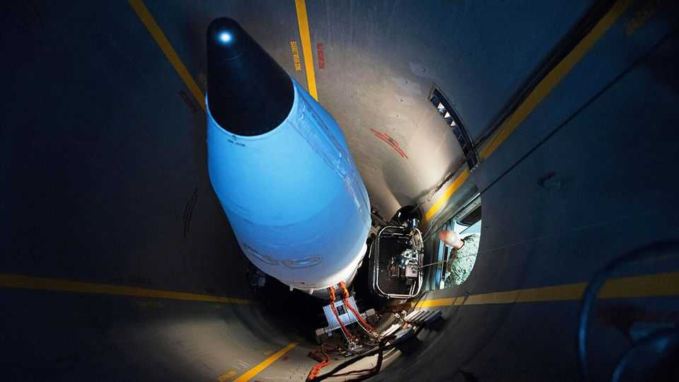
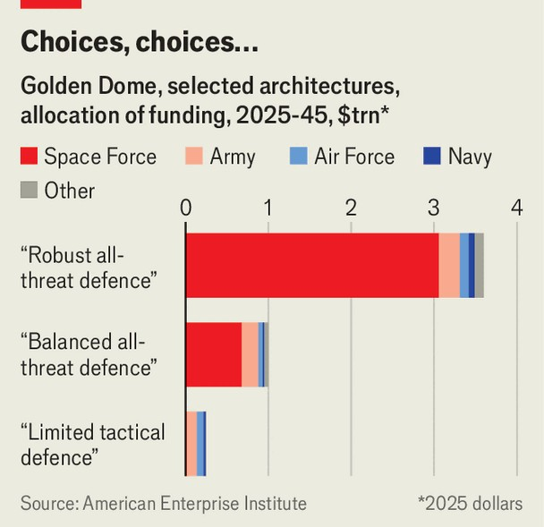

Science & technology | A sequel to Star Wars
Golden Dome is one of the most ambitious military projects ever
Even a modest missile shield could upset the balance between nuclear powers
November 6th 2025

DONALD TRUMP, America’s president, is fond of grand schemes. He has a weakness for precious metals. And he wants America’s armed forces to pull back from adventures in faraway countries. With his “Golden Dome” project —a plan for a high-tech defensive shield to protect America against all sorts of aerial attack, from drones to nuclear-tipped ballistic missiles—Mr Trump has found something that ticks all three boxes. If it is actually built, Golden Dome will be one of the most ambitious and expensive military projects ever undertaken. It could lead to big changes in American military strategy, and perhaps even disrupt the uneasy stability

that has existed for decades between the world’s nuclear-armed countries. Critics say the scheme is a vainglorious folly. Its proponents—who include many non-MAGA types in the military world—argue that it, or something like it, is long overdue.

Golden Dome evokes two big missile-defence schemes of the past and present. One is Ronald Reagan’s abortive Strategic Defence Initiative (SDI) in the 1980s. Nicknamed Star Wars, the idea was to use all sorts of exotic weaponry, from nuclear-powered X-ray lasers to orbiting missile batteries, to protect America against a Soviet nuclear strike. The other is Israel’s Iron Dome system, which since it was switched on in 2011 has used conventional missiles to shoot down thousands of rockets fired at Israel by the likes of Hamas and Palestinian Islamic Jihad.

Mr Trump’s system, though, is not really like either. It is far grander in scale than Iron Dome, which aims to protect small areas of a small country against small missiles. Mr Trump would like Golden Dome to protect a country the size of a continent. At the same time, it is intended to shoot down a far broader range of threats than SDI. Reagan’s system focused on intercontinental ballistic missiles (ICBMs), which arc up into space on fixed trajectories and can reach speeds of tens of thousands of kilometres per hour. Golden Dome is intended to counter those. But it is also expected to deal with newer threats, which pose their own challenges. Big drones and cruise missiles fly low and slow, but are nimble and can be hard to detect. Hypersonic missiles are a sort of halfway house: faster than cruise missiles, but more manoeuvrable than ICBMs.

How exactly this is to be done is still unclear. America’s Department of Defence says it has a rough idea, but has not released any details. Golden Dome will not be a single thing, but rather a collection of things. It will need sensors to track incoming threats. It will need a variety of interceptors— missiles launched from land, sea or space, and perhaps even some Star Wars-style lasers—to shoot them down. And it will require software to connect those things together, and perhaps make decisions about what to do without first checking with its human masters.

Some of what is required already exists. AEGIS, a missile-defence system fitted to some American warships, can shoot down aircraft and some short-

ranged ballistic missiles. The Ground-based Midcourse Defence (GMD) missiles based in Alaska and California are designed to tackle small numbers of ICBMs fired from countries like Iran or North Korea. Mobile batteries like Patriot and THAAD, which have been active in Ukraine and Israel, do well against aircraft and cruise missiles, and have some ability against ballistic missiles as well. “We’re not going to reinvent…tonnes and tonnes of new systems,” observes Tom Karako of the Centre for Strategic and International Studies (CSIS), a think-tank.

Even so, some new things will be needed. One is a way to deal with swarms of cheap drones, a problem plaguing both Russia and Ukraine. Another is the command-and-control software that will allow a sensor in space to pass data to computers on the ground that can decide whether the sensor is looking at a missile or just an unusual bit of weather.

Yet another will almost certainly be new kinds of anti-ICBM missiles stored in orbit. Existing systems like GMD aim to attack the warheads released by an ICBM during the middle of its flight, when they are easy to see against the cold background of space. Golden Dome is planned to use other sorts of interceptors that can attack missiles as they take off instead. At that point they are moving relatively slowly, cannot deploy any countermeasures, and are also easy to see, thanks to the bright exhaust plume from their engines.

Space-borne interceptor missiles designed to do just that were a feature of the original SDI proposal, under the name “Brilliant Pebbles”. Improvements in computers and sensors, and the plummeting cost of putting things into orbit, have made such missiles more plausible now than they were then. Lockheed Martin, a big weapons firm, plans to test a space-based interceptor (SBI) in orbit by 2028.

The specific mix of new technologies will depend on exactly what Golden Dome’s masters want it to do. Cost estimates come with a large dollop of guesswork. But Todd Harrison of the American Enterprise Institute, another think-tank, has come up with rough estimates for several different levels of performance.

The cheapest option focuses on drones, cruise missiles and planes. Defending the entire United States from those would still cost around $250bn over 20 years, he calculates—far more than Mr Trump’s target of $175bn, and about the same, adjusted for inflation, as the Apollo Moon programme in the 1960s. The ritziest version is designed to block threats of most kinds, including the sort of ICBM arsenal possessed by North Korea, though not one the size of Russia’s. That might set America’s taxpayers back by $3.6trn over 20 years.

The space-based bits of the system drive much of the cost (see chart). Even a basic system would need to keep a lot of interceptor missiles in orbit, and the required numbers rise steeply with the system’s capability. Earth is a big place. Orbital mechanics mean Golden Dome’s orbiting interceptors would spend most of their time flying over bits of it from which no enemy missiles are ever likely to be fired. The only way to ensure that at least some interceptors are always where they need to be is to have lots of them.

The Brilliant Pebbles concept aimed to shoot down missiles fired from Soviet territory. SDI’s designers assumed America might need 7,000 space- based interceptor missiles. If Mr Trump’s orders are read literally, then Golden Dome will have global coverage. In Mr Harrison’s top-tier version that needs around 85,000 missile-carrying satellites. That is about ten times the size of SpaceX’s Starlink system, by far the biggest satellite constellation ever built.

This number would need to be regularly topped up, too. A ballistic missile’s launch phase lasts only a few minutes. To hit one within that window, SBIs would have to orbit so low that they would suffer drag from the remnants of the atmosphere. Like Starlink satellites, each interceptor would have a relatively short lifetime before it fell back to Earth and burned up. Replacing each satellite three times over 20 years accounts for about $1.2trn of the total cost, reckons Mr Harrison.

The trade-off between automation and human oversight also affects costs. Letting the SBIs fire automatically when a launch is detected would allow them to react instantly. Political leaders might balk at delegating such decisions to robots in space. Buying time for humans to think, though, means yet more interceptors. The American Physical Society, an academic body, estimates that to defend automatically against a salvo of just ten North

Korean ICBMs would require 16,000 SBIs. Adding 30 seconds of decision time more than doubles that to 36,000.

Talk of hundreds of billions or trillions of dollars may give government accountants palpitations. For businesses it represents an irresistible opportunity. In September the Missile Defence Agency (MDA), a branch of the Department of Defence, requested proposals from firms keen to help build Golden Dome. The agency had so much interest that it had to push the deadline back a week to work through the pile of applications.

The competition is shaping up to pit America’s defence “primes”— established firms such as Lockheed Martin or L3 Harris, which have dominated weapons making for decades—against a group of newer arms- makers run more like Silicon Valley tech firms. The incumbents have a simple pitch: only they boast the hardware, experience and know-how to run such a gargantuan programme. Lockheed Martin, for instance, already makes much of the needed kit, from radars and missiles to software. The firm’s “next-generation interceptor” is intended to replace the older missiles currently in Alaska and California. But it could be tweaked to be fired from space instead, says Robert Lightfoot, the president of the company’s space division.

But newer, hungrier firms are also muscling in. Three are reportedly in discussions with the Pentagon: SpaceX, Elon Musk’s space behemoth, and Anduril and Palantir, a pair of startups. The insurgents promise sophisticated kit at a fraction of the price charged by the established firms, which have a long and inglorious record of cost overruns. Palantir and Anduril are offering clever software to track and analyse incoming missiles. In an echo of the original SDI, Anduril is even said to be mulling installing lasers in space to zap them. And it is hard to see how Golden Dome’s spacefaring bits could be built without SpaceX, which flies more stuff into orbit than every other company and country in the world put together.

The most likely outcome is a compromise. Golden Dome will be “a mix of both primes and upstarts”, reckons John Holly, a former deputy director of the MDA and now president of Davidson Technologies, another defence company. The primes may be asked to build the larger bits of the system, such as radars, interceptor missiles and launchers, while the newer

companies focus on the software that ensures the different elements can work together.

Even if something like Golden Dome is technologically feasible, two questions remain: would it actually work in practice, and would it be worth the enormous price tag? Critics take two lines of attack. The first is the argument that missile defence, particularly against ballistic missiles, is simply ineffective. The second is that the economics of missile defence strongly favour the attacker over the defender.

Take the second argument first. Each interceptor missile used in Israel’s Iron Dome system is thought to cost tens of thousands of dollars. They have been mostly fired against rockets made from bits of steel pipe welded together in garages. ICBMs are far more sophisticated than Hamas’s Qassam rockets, but the same disparity exists: a missile is often a simpler piece of technology than the kind of weapon needed to shoot it down.

When it comes to ICBMs, a defender might need to spend four to 15 times as much as an attacker, reckons Laura Grego of the Union of Concerned Scientists, an advocacy group. The attacker can tilt the balance even further by mixing cheaper decoys among the genuine missiles. If an attacker threw in ten realistic-looking decoys alongside every real missile or warhead, notes Dr Grego, then the defender might have to spend 40 to 150 times as much. This “discrimination” problem is an arms race: an attacker tries to build realistic decoys, which mimic the radar reflectance and heat signature of a real warhead, while the defender has to invest in expensive sensors to try to spot the fakes.

As for the first argument, whether Golden Dome could work depends on what you mean by “work”. Intercepting ballistic missiles in particular, which can reach speeds of 30,000kph, is fiendishly difficult. Detractors point out that, of 21 live-fire tests conducted against ballistic missiles by the GMD missile system since 1999, nine have failed (a fact that is central to the plot of “House of Dynamite”, a recent Netflix film). Advocates retort that GMD has improved over time. The most recent test, conducted in 2023, marked the fourth success in a row, though there is dispute over how realistic those tests were.

A completely impenetrable shield is almost certainly impossible. But suppose a missile-defence system could manage a (very impressive) 90% success rate. Against conventionally armed missiles of the sort that Russia fires at Ukraine, and which an opponent could plausibly fire at America in wartime, such a system would limit the damage drastically. On the other hand, if one in every ten nuclear-armed missiles gets through, that would count as a catastrophic failure.

Or would it? “There is a difference between losing two American cities and 20 American cities,” notes Vipin Narang, a political scientist at the Massachussetts Institute of Technology who led nuclear-weapons policy at the Pentagon during the Biden administration. American nuclear planners tend to embrace the idea of damage limitation: that America can deter a nuclear war by ensuring that an adversary cannot hurt it as much as it hurts others. The message to adversaries, says Dr Narang, is: “Even though it’s going to be a bad day and maybe I have a broken leg, you will cease to exist.”

The main way planners hope to accomplish that is via “counterforce”: military jargon for getting your retaliations in first by attacking an enemy’s nuclear weapons before they can launch. If many can be wiped out in a pre- emptive strike, a missile-defence shield would have to deal only with the relatively smaller number of surviving missiles. “The theory of Golden Dome that makes the most sense is a limited system that is greater than and more flexible than what we have now,” argues Dr Narang, alluding to the GMD system in Alaska and California, “but still [enough] to account for a residual Chinese or Russian force.”

Damage limitation through counterforce has long been American policy. Nonetheless, the idea that Golden Dome might help make a nuclear war winnable—or at least survivable—is at odds with the “mutually assured destruction” that dominates popular thinking about nuclear strategy. Those who favour more restrained tactics think that Russia and China will try to restore that balance by building more nukes, to ensure enough would be left to get through. It “could well generate an arms race”, argues James Acton of the Carnegie Endowment, “in which the United States would waste enormous sums of money failing to achieve its objective”.

Similar arguments were made in Reagan’s day about the wisdom of trying to build SDI. In the end, though, it was a mix of immature technology, political opposition, arms-control worries and scarce funding—rather than worries about destabilisation—that sank the original Star Wars. Mr Trump’s sequel could end up being nothing more than an airy fantasy, or an ineffective money-pit. But 40 years of technological progress mean it could also throw the strategic dice into the air in a way that has not been seen since the end of the second world war. ■

This article was downloaded by zlibrary from https://www.economist.com//interactive/science-and-technology/2025/11/05/golden- dome-is-one-of-the-most-ambitious-military-projects-ever