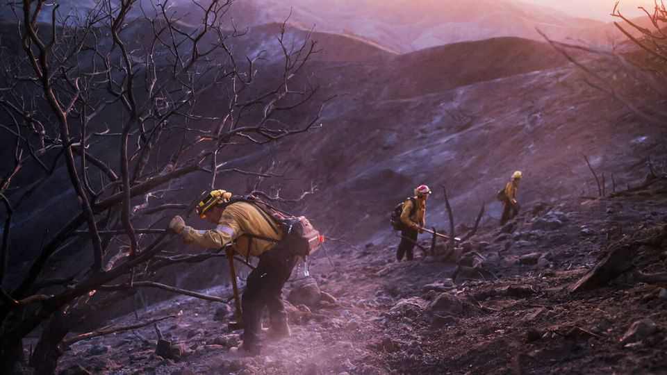

Science & technology | Pyroecology
Was the Pacific Palisades blaze a “zombie fire”?
Fires can linger underground in the Arctic. Might they do the same in California?
November 6th 2025

IN OCTOBER an Uber driver called Jonathan Rinderknecht was arrested on suspicion of starting what would eventually become the Pacific Palisades fire. One of several big fires that broke out in California in January this year, the Palisades fire killed 12 people and incinerated nearly 7,000 houses and buildings in the western outskirts of Los Angeles. Mr Rinderknecht is accused of deliberately starting a much smaller blaze, known at the time as the Lachman fire. It burned around three hectares of land before firefighters managed to put it out. But investigators now think that the Lachman fire had not been extinguished at all. Instead, they think it

simply disappeared underground, smouldering away before breaking out during a spell of high winds and growing into the Palisades inferno.

Fires that seem to have been extinguished, but which actually linger underground, are known as zombie fires. That they exist is well-known. But they are not well understood. The best-studied examples happen in the Arctic, where summer fires that seem to have been quenched by autumn rain can re-emerge the following spring. If the Los Angeles Fire Department is right about the Palisades fire, that suggests that something similar can happen in very different environments, too.

Zombie fires in the Arctic are thought to owe their unlives to the thick layers of peat often found in the soil. Peat is the starting point of the geological process that turns wet, dead organic matter into coal. It is flammable enough that in countries like Ireland it was the main fuel source for thousands of years. Wildfire researchers think that buried peat can keep Arctic fires smouldering even when the land above is covered in snow and oxygen is scarce, ready to break out again when the surface dries out in spring.

But peat needs soggy soils to form, which means there is none to be found in the arid hills of California. Instead those hills are dominated by so-called chaparral ecosystems, named for the Spanish word for a variety of oak that grows there. Such ecosystems are dominated by shrubs that grow rapidly during California’s brief winter wet season, before turning tinder-dry as the heat builds during the spring. Interspersed between these shrubs is a mix of trees such as manzanita, chamise and the scrub oaks from which the ecosystem derives its name.

Those trees can survive long dry periods thanks to their deep roots. These can extend up to eight metres down, allowing trees to find groundwater even when the surface is parched. The roots are protected against insect attack by being tough, woody—and loaded with flammable resin. So although California does not have peat in its soil, it does have fuel. Los Angeles officials theorise that the small Lachman fire burned its way down those tree roots and remained there smouldering even when firefighters on the surface believed that it had been extinguished.

If that theory is right, the most immediate question is how to spot such zombie fires in the future. Thermal-imaging devices struggle to see far into the soil. The mineral-rich nature of California’s soil, and the layers of ash from previous fires, act as insulators that further damp the transmission of heat. Add in the fact that the state’s chaparral ecosystems are often found in inaccessible canyons and along steep slopes, and things become even harder.

For now the best option seems to be simple elbow grease: more closely monitoring fires that seem to have burned out, whether with drones, satellite imaging or good old-fashioned boots on the ground. The thing about zombies is they are hard to put down for good. ■

Curious about the world? To enjoy our mind-expanding science coverage, sign up to Simply Science, our weekly subscriber-only newsletter.

This article was downloaded by zlibrary from https://www.economist.com//science-and-technology/2025/11/05/was-the-pacific- palisades-blaze-a-zombie-fire