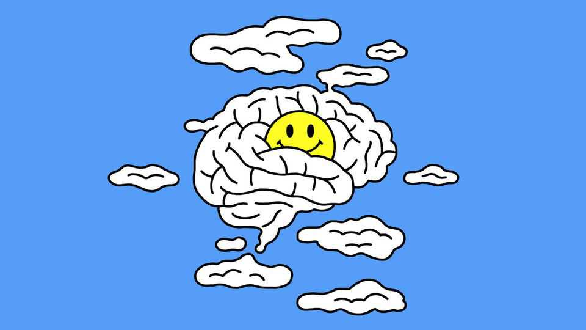

Science & technology | Well informed
Can a dopamine detox reset your brain?
Taken literally, the idea makes no sense. But it might still be good for you
November 6th 2025

NO SOCIAL MEDIA. No gambling, alcohol or junk food. Certainly no masturbation, pornography or sex. Sounds dull? Welcome to your dopamine detox. Popular among Silicon Valley types, the idea is to abstain from quick- hit rewards in the hope of rediscovering simpler pleasures. The claim is that all these vices overstimulate the brain’s dopamine system, causing it to become “less responsive” and leaving people disillusioned and burnt out. A few weeks of abstinence, enthusiasts claim, can “reset” the brain. Taking a purifying break from bad habits is not a new concept—think of Lent sacrifices or Dry January. A dopamine detox is the same idea

repackaged with a (pseudo-)scientific twist. Where it goes wrong is the biochemistry. Proponents imagine that dopamine is the “pleasure molecule”; a finite resource that can be exhausted by overuse.

That is not how dopamine works. It is involved not just in reward, but also in learning and movement. Fully “detoxing” from it would be disastrous. Parkinson’s disease, for example, is caused by the loss of dopamine- producing neurons. Even the chemical’s role in the brain’s reward circuitry is widely misunderstood. “Dopamine is clearly not the pleasure molecule,” says Christian Lüscher, a neuroscientist at the University of Geneva.

Instead, bursts of it signal surprise—what scientists call a reward-prediction error. When something turns out better than expected, dopamine-producing neurons fire more often than usual (when it turns out worse, they fire less). These spikes are teaching signals, strengthening connections between neurons and helping the brain learn which actions are worth repeating. A similar process, known as reinforcement learning, is used to train many modern artificial-intelligence models.

Eventually behaviour that used to be deliberate, such as selecting an app to message a friend, can become automatic: opening it absent-mindedly every time your phone lights up. Habits can be useful. They save the brain from having to think things through from first principles every time. But they can also be traps. Once a behaviour has become habitual, it can persist even when the outcome itself provides no pleasure.

Although taking a break from any harmful habit is a good idea, the idea of “dopamine hits” is most associated with social media. In many ways, apps are designed to be habit-forming, says Georgia Turner, a neuroscientist at Cambridge University, with algorithmic feeds providing a steady flow of low-effort, unpredictable rewards. The dopamine-fasters are right that pausing your use can interrupt this loop—though that happens through normal brain plasticity, not by replenishing dopamine.

Several studies have tested what happens when people take time away from social media. Most find that brief breaks do little for well-being, perhaps because there are short-term costs to being disconnected from social networks. When entire social groups ditch the apps for longer, results seem

better. In one school-wide experiment in Britain, conducted by researchers from the University of York, students avoided social media for three weeks and, afterwards, reported better sleep and mood.

If bad habits can be broken, people have more time for things they truly enjoy. A dopamine detox, in other words, may well be worth trying—even if the mechanism by which it supposedly works is muddled.■

Curious about the world? To enjoy our mind-expanding science coverage, sign up to Simply Science, our weekly subscriber-only newsletter.

This article was downloaded by zlibrary from https://www.economist.com//science-and-technology/2025/10/31/can-a-dopamine-detox- reset-your-brain

Culture

What a hit memoir reveals about work in China Why Anglophones use the alphabet so oddly An enthusiast wanders through the world’s graveyards A new film about the Nuremberg trials is gripping but bloodless Looking for a chic wedding venue? Try a town hall Salman Rushdie: stabbed 15 times but still laughing