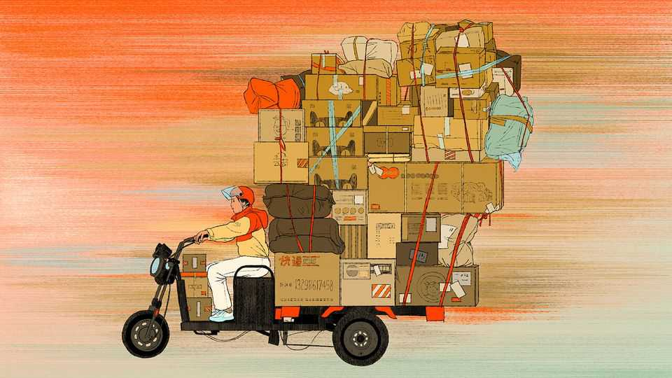

Culture | Boxing days
What a hit memoir reveals about work in China
And about the millions of itinerant workers who powered the country’s rise
November 6th 2025

NO COUNTRY ON Earth is as mad for online shopping as China. In 2024 consumers there bought 15.5trn yuan ($2.2trn)-worth of goods online—more than anywhere else in the world. Chinese e-commerce is ubiquitous, quick and easy. But that convenience comes at an onerous cost, as Hu Anyan details in his memoir “I Deliver Parcels in Beijing”, a bestseller in China recently translated into English. To make his desired salary of 7,000 yuan for one month’s work—which in this job meant 26 days—Mr Hu had to make 270 yuan in each 11-hour shift. Organising parcels and navigating his trike across his delivery fief eats up two hours. Mr Hu received around two yuan per parcel, which meant he had

to make one delivery every four minutes for nine hours. He began to see every minute as a potential half-yuan. Going to the toilet: one yuan. Buying and eating lunch: 25 yuan. He learned to drink less water and skip lunch.

He also learned to plan his delivery routes ruthlessly—an arrangement that slow customers could easily ruin. When a woman who filled in the wrong address asked him to make a 30-minute detour to an unfamiliar area where he could easily get lost, he thinks: “None of this should have been particularly difficult for her to imagine, if only she had been willing to put herself in my position.”

Willingly or not, many Chinese workers are. Around 40% of China’s urban labour relies on some kind of flexible work, including an estimated 84m working for online platforms such as ride-hailing and delivery apps. Last year China’s parcel bearers delivered 175bn packages—an astounding average of 124 for each of the country’s 1.4bn people.

As firms have slashed headcount and wages, many workers have gone gig. For some, the descent has been dizzying: your correspondent, after choosing the cheapest ride-hailing option, has been picked up by a laid-off marketing manager driving a Tesla and a struggling high-end clothing salesman in a Mercedes.

That is one reason why Mr Hu’s book struck a chord across China, selling nearly 2m copies since its release in 2023, and winning him “Author of the Year” from Douban, the country’s leading book-review platform. Though some critics have dismissed his book as liushuizhang—a “running account” that reads like an artless retelling of daily life—even state-run media have praised its “unvarnished” descriptions of “the urgency of algorithms, the trickiness and kindness of customers, the physical and mental exhaustion”.

Mr Hu’s straightforward prose and keen eye for detail capture the drudgery of gruelling low-wage work, and the personal toll it takes. Between punishing night shifts at one of his old jobs at a logistics warehouse in southern China, Mr Hu would return to his cramped room to battle insomnia with dark chocolate and cheap baijiu, the country’s liquor of choice, before reporting for duty again just hours later. He watched the unravelling of a relationship between two colleagues, a young gambling addict and his

pregnant girlfriend. He and others did little to help. “No one had anything left over to give,” he writes. “A work environment like that squeezes all life from a person.”

Yet he is forgiving of the many characters he encountered, including a crane operator who loves online shopping. With his customer often far above ground, it took several trips to get his signature. It was only in his final days delivering parcels that Mr Hu enjoyed “the luxury of squandering time, as if it was a form of revenge. I had felt crushed by the constant need to exploit every second for so long, my time as tightly strung as my nerves.”

These days, there is more of a spring in his step. In a mall near his home in the south-western city of Chengdu, he walks with your correspondent to one of his favourite spots: a lounge outside a cinema. It is surprisingly quiet, and offers free wifi and air conditioning—ideal for writing—and a nearby buffet that lowers its price after 1.30pm.

Though Mr Hu no longer needs to count every yuan, he wants to stretch his earnings to give him more time to write. Some workers have to robotically screw nails into iPhones, churning out identical products regardless of whose hands they pass through. Writing, Mr Hu insists, is an opposite pursuit, allowing him to express his individuality and depict that of other people. He has gone from shengchan, producing, to shenghuo, living.

Though Mr Hu, born in 1979, is older than the country’s youngest workers, his book appealed to them. He says the initial wave of curiosity about delivery workers’ lives has given way to more probing questions from young Chinese who are questioning the meaning of work as they ponder their futures. They find comfort in reading about Mr Hu’s setbacks as they, too, figure out how to navigate a changing and slowing economy. Mr Hu’s generation saw work as a path to riches, and the generation before saw it as a selfless, collective effort to build a new China.

Today’s new graduates are entering a comparatively wealthy society and want more leisure time. Many of their parents have savings and property. Nearly 18% of those aged 16 to 24 (excluding students) were unemployed in September, but not all of them are worried. Many have opted to tangping, or “lie flat”, leading lives with less pressure and fewer material cravings.

Mr Hu recalls how his chef colleagues at a bakery guarded their skills for fear that “teaching the disciple might starve the master”. That mindset stems from scarcity, he says, born from a society with limited resources spread thinly across a huge population. Modern China is different, and may afford future generations the chance to define work on their own terms. ■

For more on the latest books, films, TV shows, albums and controversies, sign up to Plot Twist, our weekly subscriber-only newsletter

This article was downloaded by zlibrary from https://www.economist.com//culture/2025/11/06/what-a-hit-memoir-reveals-about-work- in-china