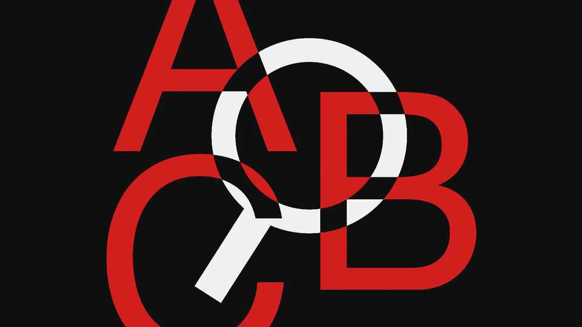

Culture | The ABCs of the ABCs
Why Anglophones use the alphabet so oddly
A delightful history of a mongrel language
November 6th 2025

THE ALPHABET is easy to take for granted. Children memorise it before they know why it matters. Then it’s off to reading, and learning the sounds of the letters and how they combine. After that, many people will never again wonder: why is the alphabet in that particular order? Why do C and G have “hard” and “soft” versions? Why is H called aitch, lacking the very sound it represents in its name? Even fewer will know enough to ask why a former slave invented G. Who made J out of I? Why is K the comeback hero of the alphabet? But all these questions are answered in “Why Q needs U”, a new book by Danny Bate, a linguist. In 26 brisk chapters he squeezes in a vivid portrait of each letter— but also much more than that. The book is a history of writing, a biography

of the English language and an introduction to linguistic science, all smuggled into short, lively and entertaining stories.

The Egyptians invented a complex writing system in which symbols stood for whole words. The Phoenicians then stripped this down both conceptually (one symbol per sound) and graphically (turning an ox’s head, for instance, into a simple drawing that looks like a sideways A). The Greeks modified these symbols and added vowels; the Etruscans nabbed the Greek invention for their own language in northern Italy. Their southern neighbours, who were clustered around the mouth of the Tiber, subsequently pilfered and adapted it so successfully that many millennia later, those squiggles, used to write hundreds of languages, are still called the Roman or Latin alphabet.

If the Phoenicians worked out the sensible principle of one sound per letter, how and why did English deviate from it? Mr Bate tells the story, letter by letter. Scribes inserted a B that had never been pronounced in English into debt and doubt to reflect their Latin origins. The “great vowel shift”, which roughly spanned the eras of Chaucer to Shakespeare, changed the long vowels until the letters represented different sounds than their continental equivalents. Soft C and G were the result of sounds such as eh and ee bringing the tongue high and forward, “palatalising” or gradually weakening the preceding consonant. To Anglophones, the name “Cicero” has two s sounds, but his friends would have called him “Kickero”.

And why does Q need U? The Romans got the QU habit from the Greeks, who used an archaic letter, qoppa, only before o- and u-sounds, because it was pronounced with the tongue far back by the Phoenicians, just as such vowels are. And conquest by Saxons, then Vikings, then Normans made English the mongrel language that it is; this last group brought Latin’s habit of joining Q to U to Britain, turning Saxon cwen into queen.

Mr Bate starts each chapter with an epigraph, such as “‘Queue’ is just one letter followed by four silent letters. They must be waiting for their turn.” For those maddened, baffled or even, for some odd reason, enchanted by the eccentricities of the English language, this charming book will give some idea of how those letters got in the queue, if not exactly in line. ■

For more on the latest books, films, TV shows, albums and controversies, sign up to Plot Twist, our weekly subscriber-only newsletter

This article was downloaded by zlibrary from https://www.economist.com//culture/2025/11/06/why-anglophones-use-the-alphabet-so- oddly