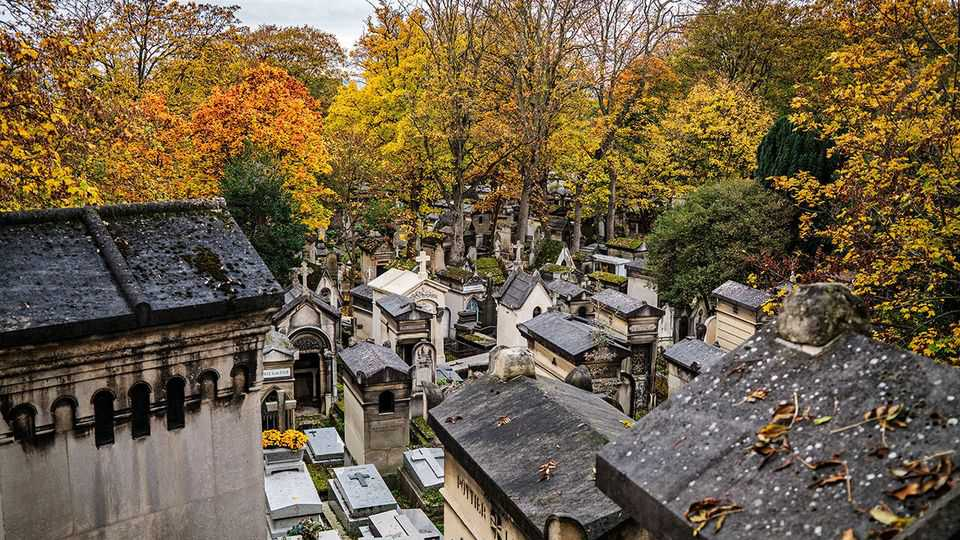
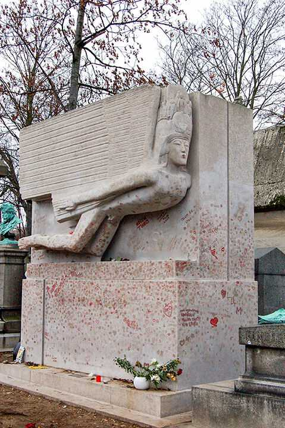

Culture | Dead centre
An enthusiast wanders through the world’s graveyards
And learns what the dead can tell the living
November 6th 2025

VISITORS TO GRAVEYARDS fall into three broad categories. Some come to visit or pay their respects to a departed relative, spouse or friend. Others make pilgrimages to see the final resting place of their idol. (Consider the thousands of lipstick marks left on Oscar Wilde’s tomb in Père Lachaise Cemetery in Paris, pictured below.) Finally, there are “cemetery connoisseurs”: people who have a special interest in gravesites, whether their reasons are historical, architectural, artistic or morbid. Mariana Enríquez is a proud connoisseur. An Argentine writer of gothic and horror fiction, she has often imagined death in her novels and story collections—including “The Dangers of Smoking in Bed”, which was

shortlisted for the International Booker prize in 2021. Her first work of non- fiction translated into English (expertly by Megan McDowell, her long- standing translator) suggests that her obsession will not soon fade.

In “Somebody Is Walking on Your Grave” Ms Enríquez visits 21 of the world’s most interesting cemeteries. She starts at the Monumental Cemetery of Staglieno in Genoa, Italy, where she had a tryst with a charming local in 1997, aged 25. After the lust and intensity of the encounter, among the statue galleries, colonnades and ornate tombs, she “fell in love with cemeteries”.

Each subsequent chapter takes readers to a different graveyard. Her wandering leads her from Cuba to Chile to the Czech Republic. She goes to the grand tombs of Highgate Cemetery in London and to Rottnest Island in Australia, where one of the country’s largest indigenous burial sites is unmarked, as if to “avoid ruining someone’s vacation”.

Ms Enríquez’s interest in graves is not just morbid. She uses cemeteries as a lens through which to examine history and culture. New Orleans, where bodies are laid to rest above the ground because of flood risks, boasts 42 historically significant cemeteries, many with tombs neatly laid out in rows, like tidy little cities of the dead. It is no surprise, then, that the city has inspired so many vampire and ghost stories. The Paris Catacombs, where

bones are “lovingly arranged” into decorative patterns, have encouraged theatrical celebrations of death. In 1897, for instance, a group of rich revellers held a secret concert to listen to funeral marches.

The author visits the graves of many prominent figures, including Karl Marx and Franz Kafka, but some of her most interesting stories are of corpses that have become contested political property. After a military coup overthrew Juan Perón, insurgents stole and desecrated the body of his wife Eva. Her corpse was moved to Italy and its location concealed for more than a decade before she was buried in Buenos Aires—eight metres underground and beneath thick concrete. Her husband is buried elsewhere, and Ms Enríquez notes, “A mausoleum there is awaiting Eva’s body, but I think that move would be difficult.”

Attitudes towards cemeteries have changed. In Europe graveyards were once kept within a city’s walls, near churches to protect them from evil. But in the 18th century corpses started to be linked to disease and “living with the dead came to be seen as repugnant”. As buried and entombed bodies “began to inspire horror”, burial grounds were moved farther away from where people lived.

For Ms Enríquez, cemeteries inspire not dread but delight. In “Somebody is Walking on Your Grave”, her enthusiasm for the macabre is rendered in effervescent prose. She finds Mexico’s Day of the Dead, celebrated on November 1st and 2nd, “unbearably joyful”. Her husband observes that the rituals, which involve visiting cemeteries and decorating graves, provide her with a “lost paradise”. After finishing her book, readers will have a new appreciation for tombs and the wealth of fascinating stories that lie six feet under. ■

For more on the latest books, films, TV shows, albums and controversies, sign up to Plot Twist, our weekly subscriber-only newsletter

This article was downloaded by zlibrary from https://www.economist.com//culture/2025/10/31/an-enthusiast-wanders-through-the- worlds-graveyards