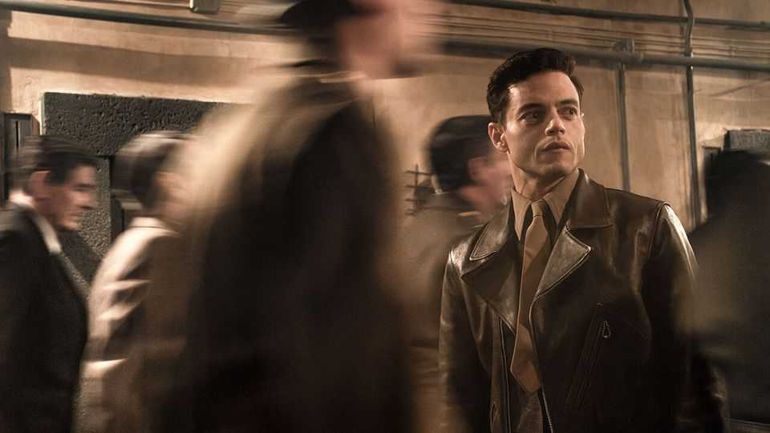

Culture | Trial by fury
A new film about the Nuremberg trials is gripping but bloodless
And it has an unsettling contemporary message
November 6th 2025

THE TRIAL of Nazi war criminals at Nuremberg, which began 80 years ago this month, might never have happened. There was little precedent for prosecuting members of a foreign government, no international court and no prior definition of “crimes against humanity”. After Adolf Hitler committed suicide in April 1945, heralding the end of war in Europe, Winston Churchill, Britain’s prime minister, considered shooting the surviving members of the Nazi high command. Other high-ranking German officers were to be imprisoned without trial. “Nuremberg”, a new film directed by James Vanderbilt, is a timely reminder of the stakes of holding villainy to account. The accused had to be given a

fair trial. Though the regime’s crimes were clear, the prosecutors had to establish incontrovertible evidence of their personal culpability. Based on “The Nazi and the Psychiatrist”, a book by Jack El-Hai, published in 2013, the film explores the relationship between Hermann Göring, Hitler’s second- in-command and the most senior German officer to stand trial, and his psychiatrist, Douglas Kelley. Though Kelley assessed all the Nazis present, he became obsessed with Göring. Perfectly played by Rami Malek, he asks, “What if we could dissect evil?”—before gleaning information in private consultations with Göring about his defence strategy, then passing it on, somewhat reluctantly, to prosecutors.

This sort of film could easily have portrayed everyone on one side as evil and the other as virtuous, but this one does well at depicting the nuanced motives of its American characters. Even as plans for the trial advanced, the alliances it relied on were breaking apart, as mistrust festered between the Soviets and Americans. Kelley himself is egotistical, manipulative and, crucially, allows himself to be manipulated by Göring. From the start, he was thinking at least as much about his legacy as his professional duties, and was obviously driven by his ambition to be the “great scholar of the Nazis”.

Those “20-odd broken men”, as Justice Robert Jackson referred to the accused in the trial’s opening statement, are similarly portrayed as humans, not devils. They weep. They sweat with fear. Faced with their fate, they flinch. Göring, played by Russell Crowe, is a man of contradictions: he committed ghastly atrocities while cherishing the love of his wife and young daughter. As the trial dawns and the legal system creaks into action, Kelley delivers his own psychological verdict on one of the grand questions of history: “What sets them apart from us?” he asks. “Nothing.”

It is an achievement to fit an engaging history of international criminal justice and slippery post-war alliances into a Hollywood blockbuster. But the film’s flaw is that it is written and acted too obviously with distance: it fails to capture the appropriate shock as the nature and scale of Nazi crimes became apparent. Before 1945 few had heard of Auschwitz, Bergen-Belsen or other concentration camps. Though many people awaited news of family members in occupied Europe, the millions murdered had not yet been counted. But when the details of the atrocities are laid out during the trial, the characters’ responses do not quite ring true.

The film shows footage from recently liberated camps—images that most trial observers were seeing for the first time. Even 80 years later, with full knowledge of what happened, it remains agonising to see starved, skeletal bodies, corpses stretching into the distance and ovens designed for murder. Those clips evoke emotions that those on screen, actors representing people so much closer to the horror both in time and proximity than viewers today, struggle to exude. Though the film successfully resists the temptation to make its characters heroes or monsters, the result is strangely bloodless.

Historical fiction tends to reflect the moment of its creation as well as the period it depicts. So it is with “Nuremberg”. As the film closes, a tormented Kelley urges everyone to pay attention because, even in America such monstrous acts could happen: one group could turn against another. It is a sober reckoning. ■

For more on the latest books, films, TV shows, albums and controversies, sign up to Plot Twist, our weekly subscriber-only newsletter

This article was downloaded by zlibrary from https://www.economist.com//culture/2025/11/06/a-new-film-about-the-nuremberg- trials-is-gripping-but-bloodless