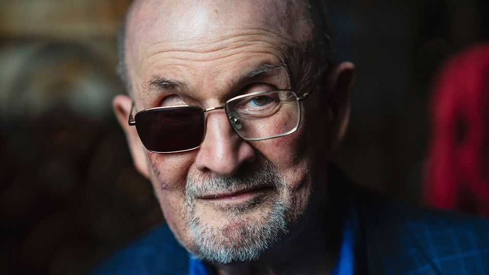

Culture | Mightier than the knife
Salman Rushdie: stabbed 15 times but still laughing
A long-persecuted author on humour, charlatans and death
November 6th 2025

A fading scar punctuates his cheek. A darkened lens obscures where his right eye once was. Yet for a 78-year-old man who has been stabbed 15 times by a frenzied zealot, he is surprisingly chirpy. For nearly half his life Sir Salman Rushdie has lived under sentence of death, after a joyless ayatollah told Muslims it was their duty to murder him for writing a novel that allegedly insulted the Prophet. Despite an almost- successful assassination attempt in 2022, he has survived long enough to write a luminous new collection of short stories, “The Eleventh Hour”.

One of the (less obvious) things that annoys Sir Salman about being famous for the fatwa is that people overlook the comedy of his writing. Sitting in a side room at Cliveden, a British country house that hosts a literary festival, with bodyguards hovering seriously in the background, the writer enlarges on this theme to The Economist. “Because the attack against [’The Satanic Verses’] was not funny, it was assumed that the book couldn’t be funny. And people stopped writing about me as if my writing had humour in it,” he says.

This matters, because humour does. Besides bringing joy, it is a weapon in the struggle against oppression. “Humourlessness is a characteristic of narrow-mindedness; there are very few humorous dictators. Also, humour gets up people’s noses further than anything else, as we see from recent behaviour in America towards comedians.”

His new book slyly mocks a wide range of targets: religious bigots, political charlatans, death itself. In a deliciously satirical tale about piano-playing and revenge called “The Musician of Kahani”, a secular Indian woman starts to feel a “scrap of doubt” about her husband’s atheism, “a doubt that would surge to the forefront of her thinking when [he] walked out of their marriage to follow a religious fraud.” The guru in question preaches that money is “more than okay”; and “money, happy to be given the spiritual thumbs-up, flooded into his accounts.”

The satire is personal. Sir Salman’s life has been blighted by anti- Enlightenment thinking, by the notion that words should be answered with steel. He says he never saw the knife that half-blinded him until his would- be assassin’s trial this year, when it was produced as evidence. (“At the time of the attack, I was busy getting attacked by it.”) What struck him in court about the knifeman, a Lebanese-American called Hadi Matar, was “how okay with everything he was”. At the age of 24, with no prior criminal record, he had tried to kill a stranger in front of hundreds of witnesses. He was never going to get away with it. (He was sentenced to 25 years imprisonment in May.) Yet he was prepared to ruin his own life to snuff out another. “It’s a mystery,” shrugs Sir Salman.

The answer to that mystery may lie in the power of polarisation. For many people today, tribal loyalty trumps morality. It was to “defend” his fellow Muslims (from a book they didn’t have to read) that Mr Matar attempted

murder. Then, “every day, coming into the courtroom, he would shout Palestinian slogans…you know, ‘river to the sea’ kind of stuff.” This seemed irrelevant to the man’s crime, which predated the war in Gaza by a year. Privately, a cop suggested to Sir Salman that “when you go to jail in America, you need a tribe, otherwise you’re in bad shape. [So] maybe he’s trying to construct for himself a tribe who would be on his side in jail.”

Sir Salman fears that free speech is in “bad shape”. He cites the atmosphere of fear in India and absurd book bans in some American schools, of works such as “Huckleberry Finn”. Attacks from what he calls “traditional” sources—conservatives and authoritarians—are continuing “vigorously”. He is especially exasperated by the censoriousness of progressives, however, which “weakens your case when you’re trying to argue against the oppression coming from the other side”. He throws up his hands at the assassination of Charlie Kirk, a right-wing speaker, which some on the left condemned only half-heartedly. “People shouldn’t be killed. Murder: a bad thing.”

He sees similarities between religious cults and MAGA. In both cases, followers compete to show their devotion to the leader and hatred of his enemies. In a story called “Oklahoma”, he describes a “felonious king” who surrounds himself with courtiers who flatter him and accuse his opponents of the crimes that he is guilty of. This king also changes the meanings of words, so when he marries two nieces the word “incest” is struck from the dictionary, and over time he redefines “rape as love, horror as patriotism, bullying as good governance.”

Writers are “the custodians of language”, Sir Salman avers. When the powerful twist words to conceal the truth or change the rules, writers have a duty to point this out. (Think of how Mr Trump pretends the figurative “war on drugs” is a real war, as an excuse to grab extraordinary powers.)

Writers also have a role in what Sir Salman has called “a [figurative] world war of stories—a war between incompatible versions of reality”. He sees this in Vladimir Putin’s rewriting of history to try to justify his invasion of Ukraine; also in the Middle East (“two incompatible narratives about the history of this very small patch of land”); and in India, where Hindu nationalists insist they are victimised by Muslims (“it’s very strange that the

85% majority should feel it’s the injured party.”) “Each side feels that their story is being engulfed and crushed by the other story. So, yeah, stories can be the death of you.”

Nearly being murdered naturally makes him reflect on mortality. Asked about ageing, he laughs: “I’m against it.” In “Oklahoma”, he asks how people should face their last days of life: serenely, or with rage? One character says that some fools are “moronically serene [and] grateful for ‘beauty’ and ‘love’”. But Sir Salman offers a subtler answer. “It doesn’t have to be either/or. It could be both. You could be peaceful on Tuesday and angry on Wednesday.”

In “Late”, a ghost story set in an old college, the protagonist wakes up dead in the first sentence. Over the next 70-odd pages—a perfect length for a short story—the reader learns about his life and realises that he is a fictional mixture of E.M. Forster and Alan Turing, two of the most illustrious fellows of King’s College, Cambridge. (Sir Salman, an alumnus, recalls playing croquet with the ageing novelist in the college garden; he never met the great mathematician and code-cracker.)

The gradual revelation of how brutally society has treated the protagonist for being gay is both shocking and moving. Yet the story offers hope. Bigotry can be overcome. And literature can help, by forcing people to imagine what injustice feels like. Art, argues Sir Salman, “can re-read the world”. ■

For more on the latest books, films, TV shows, albums and controversies, sign up to Plot Twist, our weekly subscriber-only newsletter

This article was downloaded by zlibrary from https://www.economist.com//culture/2025/11/04/salman-rushdie-stabbed-15-times-but- still-laughing

Economic & financial indicators

Economic data, commodities and markets