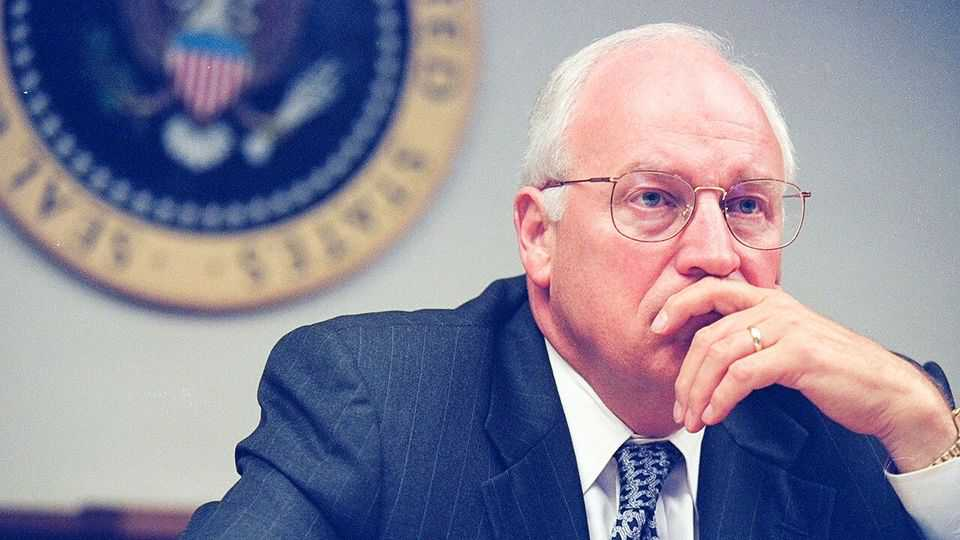
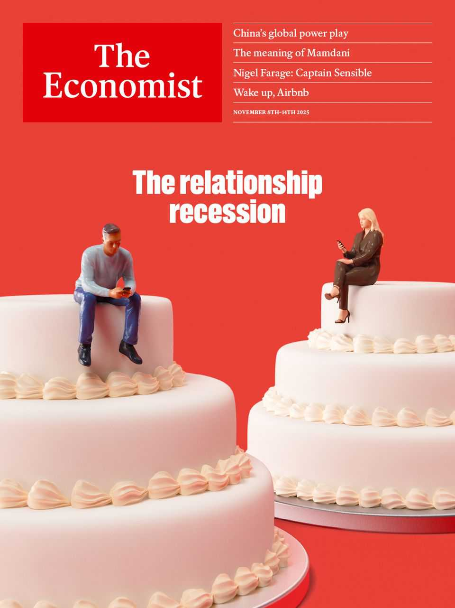

Obituary | Architect of the war on terror
Dick Cheney divided Americans
The most powerful vice-president in American history died on November 3rd, aged 84
November 6th 2025

Should they shoot it down? That was the question. It was 10.15am on September 11th 2001. Two passenger planes had already hit the Twin Towers. A third had hit the Pentagon. A fourth was still out there. And they did not know where. What they did know was that President George W. Bush was not available—he had been in a primary school, listening to some children read “The Pet Goat”. In the White House bunker, a uniformed aide approached the vice-president. They had, said the aide, found that plane. It was 80 miles out and heading towards Washington, DC. Did they have authorisation to engage?

Later people would ask him: how did he feel? How did it feel to be asked if American troops should shoot down an American plane? What he felt was: this was not about his feelings. He had a job to do. You could wring your hands and get emotional about it. But there was a hijacked plane 80 miles from Washington. It could arrive in a matter of minutes. The aide spoke up once more: the plane was now 60 miles away. The people in the bunker looked at the vice-president. He gave the order: shoot it down. The room fell silent. At the order. And at his reaction: he had not even hesitated.

Richard Bruce Cheney was not a hesitant man. Some saw that as a fault. But he did not spend a lot of time thinking about his faults; that did not help him do his job. Quite what his job actually was, many muttered, was not very clear. Before him it had been far clearer. The job of vice-president, one predecessor had said, was “not worth a bucket of warm piss”. After Mr Cheney—after 9/11 and Iraq and Guantánamo—it was worth a lot more. He would become known as “the most powerful vice-president in US history”.

After 9/11 they called him other things, too—many of them unflattering. He was called the architect of the war on terror and of the invasion of Iraq. The left called him “sinister” and “Satan” and “Darth Vader”. Even moderates, said Sir Tony Blair, Britain’s former prime minister, tended “to reach for the garlic and crucifixes” at the mere mention of his name. All sides said he was “Machiavellian”. He shrugged: if you wanna be loved, go be a movie star. If you wanna get stuff done, you will have critics. Although when the Washington Post called him a “moderate” he requested a correction. He was a conservative.

Through and through. From his teens he had been brought up in Wyoming, where he had learned to love those big American skies and fishing in those big American rivers. Eventually he would leave Wyoming, first for Yale (though he dropped out), then for Washington, where, under Gerald Ford, he became the youngest White House chief of staff in American history. But he would always keep his home state’s homely habits. A day on the river with a fly-rod: that, to the end of his days, would be his idea of happiness. His autobiography, “In My Time”, contained three mentions of the phrase “Geneva Conventions”; ten of “human rights”—and 53 of the word “fish”. The code name given to him by the secret service was “Angler”.

Angling, his critics felt, was not just a pastime but his persona. In office, just as on the river, he was watchful, still, patient. He was, others felt, a cold fish: he had a chill, one-sided smile; he gave away little; he found out a lot. Staffers used to call his office the “Star Chamber” after a secretive English Tudor court. For, as one put it, “If you have to go see him, you must have been bad.”

He, by contrast, was very good at what he did. By 2001 he had been sworn in as vice-president to Mr Bush. Then came 9/11. Later that day, after his order to shoot the plane had come to nothing (the passengers had downed their own plane), he had taken off in a helicopter from the south lawn of the White House. He would always remember that flight: the sight of the Pentagon, with a still-smoking hole in its side. The image spoke volumes. Americans remembered that flight, too—presidents take off from the south lawn, not vice-presidents. That image spoke volumes as well.

That day changed him, and America. From now on, he said, America would have to work with the dark side. To critics, America became the dark side. The 1949 Geneva Conventions said prisoners of war must be “humanely treated”. He felt terrorists did not deserve to be treated as prisoners of war. He listed how they could, now, be treated: a face slap. Push ’em up against a wall. You could—and here he mimed pouring—waterboard them. People asked him: isn’t that torture? He asked in return: are you gonna allow terrorist attacks because you don’t want to be a mean and nasty fella? Or are you gonna do your job?

He knew what his job was: to do whatever it took, whatever the cost, to defend America. And that cost, said his critics, was high. With Iraq, he had involved America in a war that cost thousands of lives and lowered its international reputation. Far from making America safer, Iraq would came be seen as its biggest foreign-policy disaster in a generation.

It cost him, too. He suffered eight cardiac events in eight years. He came to be seen as a cartoon villain, a role that he, in part, embraced: Darth Vader was, he said, one of the nicer things he had been called. When he accidentally shot a hunting partner in the face, the event—a near-tragedy— was treated by the nation as slapstick comedy. “We can’t get bin Laden,” observed David Letterman. “But we nailed a 78-year-old attorney.”

He was unmoved. History would see: in his work he had done what he thought was right. He had tried to protect America. He would keep trying to, too. Even when he was out of office and out of favour. In 2024 he announced that he was going to vote for Kamala Harris: in his nation’s 248- year history there had, he said, never been anyone who was a greater threat to it than Donald Trump. Some criticised him for this. Some praised him for it. But he had not done it for the praise. He was, as always, just doing his job. Trying to protect America. ■

This article was downloaded by zlibrary from [https://www.economist.com//obituary/2025/11/06/dick-cheney-divided-americans](https://www.economist.com//obituary/2025/11/06/dick-cheney-divided-americans)

Table of Contents

The world this week Politics Business The weekly cartoon Leaders The rise of singlehood is reshaping the world China’s clean-energy revolution will reshape markets and politics Democrats risk drawing the wrong lessons from one good day America should not push other countries to adopt the dollar Nigel Farage’s newfound fiscal prudence is welcome, if unproven America’s plans for a Golden Dome are dangerously obscure Letters Can charity sustain conservation at scale? By Invitation The climate action that matters is in the global south, argues an architect of the Paris agreement Briefing All over the rich world, fewer people are hooking up and shacking up United States A night of big wins for the Democrats The Supreme Court seems sceptical of Donald Trump’s tariffs How the sheriff of St Louis ended up in jail The rise and fall of America’s model mobile crisis service America’s health-care costs are shooting up Donald Trump’s alarming muddle about nuclear-weapons testing Gerrymandering is now the wind beneath Gavin Newsom’s wings The Americas War looms in Venezuela as Trump tests an “Americas First” doctrine An EU-Mercosur trade deal looks close to ratification Asia South Asia’s water wars India’s women win the cricket World Cup America and China circle each other in the South China Sea Indonesia raids its rainy-day pot

Queen Sirikit’s death shows changing Thai views of the monarchy China China’s Belt and Road Initiative is booming again What a leaked transcript reveals about China’s muscular statecraft Hong Kongers support gay marriage. Their leaders, not so much How a little Chinese island rose to global chemical dominance Middle East & Africa Will anything—or anyone—stop the slaughter in Sudan? Tanzania has its Tiananmen moment Donald Trump says he may strike Nigeria to save Christians. Really? Iraq’s election may ensure stability but leave militias in control Israel’s politicians are taking on its lawyers once again Europe Jordan Bardella starts to lay out his plans Ukraine’s valiant defence of Pokrovsk is nearing its end War is blasting Ukraine’s border city of Kharkiv but boosting Lviv A Czech shift to the right is worrying news for Ukraine Pope Leo XIV is infuriating MAGA Catholics Why moderates are reclaiming Europe’s national flags Britain Brand Britain has bounced back Giorgia Meloni and Nigel Farage compared Nigel Farage bows to the bond market A British legal ruling about AI delights nobody Boom times in a British manufacturing town If Labour cranks up income taxes, the left will boo loudest International A new industry of AI companions is emerging China places a Hong Kong-sized bet on Western decline Special report The world’s renewable-energy superpower Solar in China has become too big to fail Cleaning up a coal-fired mess China’s air-quality improvements have hastened global warming How China sparked a rooftop solar revolution in Pakistan Why climate change now threatens China’s future 1843

Make America procreate again: among the MAGA fertility fanatics Business Has Airbnb reached its peak? Why Palantir’s success will outlast AI exuberance First, grinning Labubu dolls. Now, a TV show and theme parks Should facial analysis help determine whom companies hire? America’s furniture-makers exemplify the folly of tariffs Will AI make dating apps better—or even worse? China’s life-sciences industry is turning American Finance & economics Universal child care can hurt children How Donald Trump can dodge a Supreme Court tariff block Why Wall Street won’t see the next crash coming Don’t blame AI for your job woes The mystery of China’s slumping investment Investors are telling Britain to cheer up a bit What explains India’s peculiar stability? Science & technology Golden Dome is one of the most ambitious military projects ever Was the Pacific Palisades blaze a “zombie fire”? Can a dopamine detox reset your brain? Culture What a hit memoir reveals about work in China Why Anglophones use the alphabet so oddly An enthusiast wanders through the world’s graveyards A new film about the Nuremberg trials is gripping but bloodless Looking for a chic wedding venue? Try a town hall Salman Rushdie: stabbed 15 times but still laughing Economic & financial indicators Economic data, commodities and markets Obituary Dick Cheney divided Americans