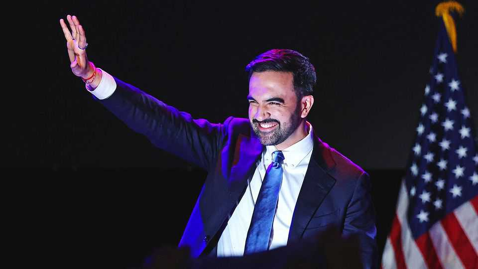
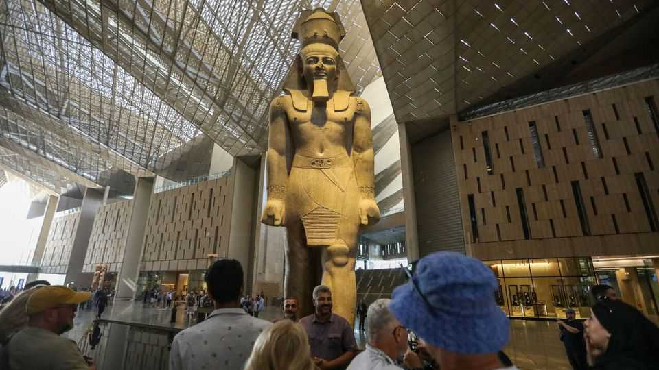

本周世界 | 政治
政治动态速览
2025年11月6日

摘要：民主党在本周零散选举中捷报频传，纽约出现首位穆斯林市长，维吉尼亚与新泽西州也归蓝；各地政局同时上演戏剧性转折。美国政府停摆拖累航空、尼日利亚局势遭特朗普威胁介入、以色列军方爆丑闻、苏丹达尔富尔再现屠杀，全球政治的连锁反应一波接一波。

纽约迎来历史性一刻。自称民主社会主义者的佐兰·马姆达尼拿下市长选举，将成为第一位领导这座城市的穆斯林。虽然民调显示选情紧绷，他仍以50%的得票率领先主要对手前州长安德鲁·科莫的42%。他主打替工薪阶层压低生活成本的政见，像是冻涨房租、提供免费普惠托育。投票率明显上升，他也成为1969年约翰·林赛以来首位拿到百万票的市长候选人。同一晚，美国其他零星选举中民主党也稳住气势，阿比盖尔·斯潘伯格夺回维吉尼亚州州长宝座，成为该州首位女州长；密基·谢里尔也高票赢得新泽西州州长。

【一｜选区重划攻防】
加州选民以压倒性票数通过50号提案，准备重新划分州联邦众议院选区，可能让民主党多拿五席。州长加文·纽森挺这个赤裸裸的党派版本，拿来反击共和党在其他州的同款操作。缅因州则否决了要求选民出示证件、限制提前投票的公投案。

【二｜停摆拖累航空】
特朗普政府示警，因联邦政府停摆导致空管人力紧缺，40座最繁忙机场的航班得砍一成。这场停摆已经撑过35天，刷新近七年前的纪录，写下最长停摆史。

【三｜重量级人物辞世】
美国前副总统迪克·切尼以84岁辞世，被认为是史上权力最大的副总统。9/11之后，他主导小布希政府的国安政策，力挺入侵伊拉克；1990年海珊入侵科威特时他担任国防部长。外界常把他形容成马基雅维利式人物，他也坦然接受“达斯·维达”的形象。

【四｜全球灾变与冲突】
卡玛基台风肆虐菲律宾，至少142人丧命，多数死于宿务中部洪水。以军首席律师汤默-耶路沙米少将在承担泄露虐囚影片责任后请辞，随即被捕，总理纳坦雅胡的盟友借此再攻击司法系统。特朗普放话要在尼日利亚动武阻止伊斯兰武装“大屠杀”基督徒，吓坏当地，但实际动作未明；尼日利亚武装团体常同时攻击基督徒与穆斯林，没有证据显示基督徒遭种族灭绝。

苏丹达尔富尔的法希尔再传集体处决，源自由阿拉伯民兵演变而来的快速支援部队。世界卫生组织谴责一间医院就有460人遭杀害，另有报导指男性被强行与妇女分开后带走枪决。

【五｜非洲、拉美与欧洲政局】
坦桑尼亚总统萨米娅·苏胡·哈桑在反对派几乎被取消资格的情况下宣誓连任，反对派拒认选举结果。初步估计选后暴力已造成数百人丧生，政府则称夸大。

欧盟发布扩盟进度报告，称阿尔巴尼亚、黑山“步上正轨”，摩尔多瓦改革“可达成”，也赞乌克兰进展，但提醒若想在2028年底完成谈判，反贪改革得加速。波斯尼亚、科索沃、北马其顿、塞尔维亚还需在司法与政治稳定上下功夫；乔治亚则被评为“名义候选国”。

俄罗斯宣称即将攻下乌东枢纽波克罗夫斯克。泽连斯基承认守军压力巨大，但否认被全面占领；若沦陷将是俄军自2024年2月的阿夫迪夫卡后最大战果。德国总理弗里德里希·梅尔茨主张叙利亚战争已结束，叙利亚人不该再申请庇护，要启动遣返，意在压制极右德国另类选择党。

【六｜美洲焦点】
秘鲁与墨西哥断交，前总理贝齐·查韦斯逃入墨国驻利马大使馆求庇护，她因支持时任总统卡斯蒂略解散国会被控犯罪。加拿大少数自由党政府发布马克·卡尼上任总理后首份预算案，大幅加码基建投资以对冲美国关税冲击，国防支出今年升至GDP的2%，2035年追上北约5%目标，赤字势必爆表。

【七｜文化里程碑】
耗时20年、烧掉10亿美元的埃及大博物馆在吉萨开幕，被称为全球最大考古收藏馆，展出10万件文物，包括图坦卡门陵墓完整陪葬品。■

