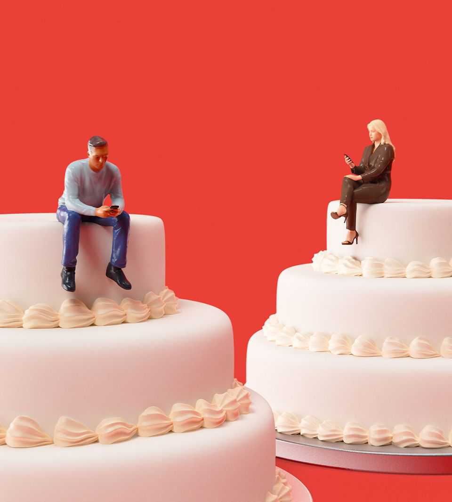

Leaders | The great relationship recession
The rise of singlehood is reshaping the world
In good ways and bad
November 6th 2025 
 

For most of human history, coupling up was not merely a norm; it was a necessity. Before reliable contraception, women could not control their fertility, and most were far too poor to raise children alone. Hence the centuries-old convention that, whereas a tragic play or saga ends in death, a happy one ends in marriage. So the speed with which the norm of marriage—indeed, of relationships of any sort—is being abandoned is startling. Throughout the rich world, singlehood is on the rise. Among Americans aged 25-34, the proportion living without a spouse or partner has doubled in five decades, to 50% for men and 41% for women. Since 2010, the share of people living alone has risen in 26 out of 30 rich countries. By The Economist's calculation, the world has at least 100m more single people today than if coupling rates were still as high as in 2017. A great relationship recession is under way. 

备注

- <strong><em>coupling up</em></strong>："配对、结合"；文中用来表达建立恋爱或婚姻关系，强调在历史上这不仅是社会规范（norm），更是生存必需（necessity）。 
- <strong><em>contraception</em></strong>：[ˌkɒntrəˈsepʃən]/ "避孕"；文中用来表达可靠的避孕方法，说明这是女性能够控制生育的前提条件，是历史转折的关键因素；由contra-（反）和conception（受孕）构成。 
- <strong><em>fertility</em></strong>：[fəˈtɪlɪti]/ "生育能力"；文中用来表达女性无法控制自己是否怀孕的能力，强调历史条件下女性缺乏生育自主权，必须依赖婚姻；形容词形式是fertile（肥沃的、能生育的）。 
- <strong><em>saga</em></strong>：[ˈsɑːɡə]/ "传奇故事"；文中用来表达传统故事类型，与tragic play（悲剧）形成对比，说明传统叙事中婚姻是幸福结局的标志，体现历史惯例；源自北欧传说，现泛指长篇故事。 
- <strong><em>startling</em></strong>：[ˈstɑːtlɪŋ]/ "令人震惊的"；文中用来表达婚姻被抛弃的速度之快，强调这一社会变化的突然性和显著性。 
- <strong><em>singlehood</em></strong>：[ˈsɪŋɡəlhʊd]/ "单身状态"；文中用来表达不处于恋爱或婚姻关系的状态，强调单身作为一种社会现象正在上升；由single（单身）加后缀-hood（状态）构成，类似childhood（童年）。 
- <strong><em>spouse</em></strong>：[spaʊs]/ "配偶"；文中用来表达丈夫或妻子，正式用语，强调统计中无配偶或伴侣生活的比例。 
- <strong><em>recession</em></strong>：[rɪˈseʃən]/ "衰退"；文中用来比喻恋爱和婚姻关系的减少，类似经济衰退的概念，强调关系市场的萎缩。 
 
For some, this is evidence of social and moral decay. As we report, many in the "pro-natalist" movement believe that the failure of the young to settle down and procreate threatens to end Western civilisation. For others, it is evidence of admirable self-reliance. Vogue, a fashion magazine, recently suggested that for cool, ambitious young women, having a boyfriend is not merely unnecessary but "embarrassing". 

备注

- <strong><em>decay</em></strong>：[dɪˈkeɪ]/ "衰败、腐朽"；文中用来表达道德或社会秩序的恶化，强调一些人认为单身潮是文明退步的证据。 
- <strong><em>pro-natalist</em></strong>：[prəʊˈneɪtəlɪst]/ "支持生育的"；文中用来表达支持提高生育率的政策或观点，指认为年轻人应该结婚生子的运动；由pro-（支持）和natal（出生的）构成。 
- <strong><em>procreate</em></strong>：[ˈprəʊkrɪeɪt]/ "生育、繁殖"；文中用来表达生儿育女，正式用语，强调支持生育者认为年轻人应该繁衍后代。 
- <strong><em>self-reliance</em></strong>：自力更生"；文中用来表达不依赖他人、独立自主的能力，强调另一些人认为单身是值得赞赏的自立表现。 
 
In fact, the rise of singlehood is neither straightforwardly good nor bad. Among heterosexuals (about whom there is the most research) it is largely a consequence of something clearly benign: as barriers to women in the workplace have fallen, their choices have expanded. They are far more able than in the past to live alone if they choose, and face less social stigma for doing so. The more they can support themselves financially, the less likely they are to put up with an inadequate or abusive partner. This shift has saved countless women from awful relationships, and forced many men to treat their mates better if they want to stay together. 

备注

- <strong><em>straightforwardly</em></strong>：[streɪtˈfɔːwədli]/ "直接地、坦率地"；文中用来表达不是简单的好坏二分，强调单身潮的复杂性，不能简单判断为好事或坏事。 
- <strong><em>heterosexuals</em></strong>：[ˌhetərəˈsekʃuəlz]/ "异性恋者"；文中用来表达对异性产生性吸引的人，说明研究主要关注这一群体；由hetero-（不同的）和sexual（性的）构成。 
- <strong><em>benign</em></strong>：[bɪˈnaɪn]/ "良性的、有益的"；文中用来表达不会造成伤害的变化，强调女性职场障碍减少是积极的发展。 
- <strong><em>stigma</em></strong>：[ˈstɪɡmə]/ "污名、耻辱"；文中用来表达社会对某些行为或状态的负面看法，强调女性独居面临的社会污名在减少。 
- <strong><em>inadequate</em></strong>：[ɪnˈædɪkwɪt]/ "不充分的、不合格的"；文中用来表达不够好或不够格的伴侣，强调女性不再需要忍受不合格的伴侣。 
- <strong><em>abusive</em></strong>：[əˈbjuːsɪv]/ "虐待的、辱骂的"；文中用来表达对他人进行身体或精神伤害的，强调女性可以拒绝虐待性的伴侣。 
 
However, it has also had unhappy knock-on effects. Flying solo can be liberating, but it can also be lonely. Plenty of singletons say they are content to remain so, especially women. But surveys in various countries suggest that 60-73% would rather be in a relationship. A poll in America in 2019 found that, although 50% of singles were not actively looking for a partner, only 27% said this was because they enjoyed being single. Many have given up, either because they despair of finding a mate, or because they don't rate the mates on offer. 

备注

- <strong><em>knock-on effects</em></strong>：连锁效应、间接影响"；文中用来表达一个事件引发的后续影响，强调单身潮带来的不愉快副作用；类似多米诺骨牌效应。 
- <strong><em>singletons</em></strong>：[ˈsɪŋɡəltənz]/ "单身者"；文中用来表达单身的人，比single更正式，强调这一群体的存在。 
- <strong><em>despair</em></strong>：[dɪˈspeə]/ "绝望"；文中用来表达失去希望的状态，强调许多人因为找不到伴侣而放弃。 
- <strong><em>rate</em></strong>：[reɪt]/ "评价、认为"；文中用来表达对潜在伴侣的评价，强调许多人不看好市场上的潜在伴侣。 
 
If lots of people want to couple up but don't, something is amiss in the relationship "market". One problem—widespread sex-selective abortion that has led to a shortage of women and a surplus of bachelors in parts of Asia— is fortunately diminishing fast. But experts see many other obstacles. 

备注

- <strong><em>amiss</em></strong>：[əˈmɪs]/ "有问题的、不对的"；文中用来表达关系市场出了问题，强调很多人想配对但做不到的情况。 
- <strong><em>sex-selective abortion</em></strong>：性别选择性堕胎"；文中用来表达基于胎儿性别选择终止妊娠的行为，说明这是导致亚洲部分地区男女比例失衡的原因。 
- <strong><em>surplus</em></strong>：[ˈsɜːplʌs]/ "过剩、多余"；文中用来表达超过需要的数量，强调亚洲部分地区单身汉过剩的问题。 
- <strong><em>bachelors</em></strong>：[ˈbætʃələz]/ "单身汉"；文中用来表达未婚男性，强调亚洲部分地区男性过剩的情况。 
 
Some think social media and dating apps have fostered unrealistic expectations (other people's relationships look fabulous on Instagram) and excessive pickiness (most women on Bumble reportedly insist that a male must be six feet tall, thus filtering out 85% of potential matches). Another problem is the growing political gulf between young men and women, with the former leaning right and the latter leaning more to the left. Many singles insist that any partner must tick the same partisan boxes, which makes matching trickier. 

备注

- <strong><em>fostered</em></strong>：[ˈfɒstəd]/ "培养、助长"；文中用来表达社交媒体和约会应用助长了不切实际的期望，强调这些平台对择偶观念的影响。 
- <strong><em>fabulous</em></strong>：[ˈfæbjʊləs]/ "极好的、绝妙的"；文中用来表达非常好，口语中常用，强调Instagram上别人的关系看起来很棒。 
- <strong><em>pickiness</em></strong>：[ˈpɪkɪnɪs]/ "挑剔"；文中用来表达过分挑剔、难以满足，强调约会应用上过度的择偶标准；由picky（挑剔的）加名词后缀-ness构成。 
- <strong><em>gulf</em></strong>：[ɡʌlf]/ "鸿沟、差距"；文中用来比喻巨大的差异，强调年轻男女之间日益扩大的政治鸿沟。 
- <strong><em>partisan</em></strong>：[ˈpɑːtɪzən]/ "党派的、偏袒的"；文中用来表达支持特定政党或立场的，强调许多单身者要求伴侣政治立场一致。 
- <strong><em>tick</em></strong>：[tɪk]/ "打勾、符合"；文中用来表达满足条件或要求，强调伴侣必须符合相同的党派立场。 
 
Other experts point to a decline in social skills as people spend more of their lives gawping at screens. Americans of all ages socialise less in person than they did two decades ago, but the decline is especially steep among the young. Social media spread fears that women will be assaulted if they go out; and that men will be digitally shamed if a date goes badly. 

备注

- <strong><em>gawping</em></strong>：[ɡɔːpɪŋ]/ "呆看、瞪视"；文中用来表达长时间盯着看，带有贬义，强调人们花太多时间看屏幕导致社交技能下降。 
- <strong><em>assaulted</em></strong>：[əˈsɔːltɪd]/ "袭击、攻击"；文中用来表达受到身体攻击，强调社交媒体传播的恐惧，女性担心外出会被袭击。 
- <strong><em>shamed</em></strong>：[ʃeɪmd]/ "羞辱、使丢脸"；文中用来表达在网络上被公开羞辱，强调男性担心约会失败会在网络上被羞辱。 
 
Perhaps the most important factor is that, as living alone has become easier, women's standards have grown more exacting. For many, a mediocre partner no longer seems a better bet than remaining single. Women are more likely than men to say that they want their mate to be well educated and financially solid. More men are failing to clear this moving bar, as they fall behind women educationally and the less bookish ones flounder in the job market. Men with no college degree and low earnings struggle to attract a partner; doubly so if they do not share domestic chores, or if after frequent rejection they start to dislike women, a common vice in the online "manosphere". 

备注

- <strong><em>exacting</em></strong>：[ɪɡˈzæktɪŋ]/ "严格的、苛刻的"；文中用来表达要求很高的，强调女性的择偶标准变得更加严格。 
- <strong><em>mediocre</em></strong>：[ˌmiːdiˈəʊkə(r)]/ "平庸的、普通的"；文中用来表达不够优秀的，强调平庸的伴侣不再比保持单身更好。 
- <strong><em>bookish</em></strong>：[ˈbʊkɪʃ]/ "书呆子气的、爱读书的"；文中用来表达喜欢学习和阅读的，强调不那么爱读书的男性在就业市场上挣扎。 
- <strong><em>flounder</em></strong>：[ˈflaʊndə]/ "挣扎、失败"；文中用来表达在困难中努力但效果不佳，强调不爱读书的男性在就业市场上的困境。 
- <strong><em>chores</em></strong>：[tʃɔːz]/ "家务、杂务"；文中用来表达日常的家务劳动，强调男性如果不分担家务就更难吸引伴侣。 
- <strong><em>manosphere</em></strong>：[ˈmænəsfɪə]/ "男性圈"；文中用来表达网络上关注男性议题的社区，有时带有负面含义，强调这是厌女情绪的常见来源。 
 
Some of these problems may be self-correcting. One obvious idea is for men to grow up, do a little more housework, behave more responsibly and so turn themselves into more desirable partners. Cultural norms may impede this shift. But the prospect of avoiding lifelong loneliness and celibacy will surely serve as a powerful incentive for men to change. Many countries have been moving in this direction for years, with cleaning, cooking and child- minding more evenly split between men and women. 

备注

- <strong><em>impede</em></strong>：[ɪmˈpiːd]/ "阻碍、妨碍"；文中用来表达文化规范可能会阻碍这种转变，强调改变面临的阻力。 
- <strong><em>celibacy</em></strong>：[ˈselɪbəsi]/ "独身、禁欲"；文中用来表达不结婚或不发生性关系的生活状态，强调避免终身孤独和独身是男性改变的强大激励。 
- <strong><em>incentive</em></strong>：[ɪnˈsentɪv]/ "激励、动机"；文中用来表达促使行动的因素，强调避免孤独的前景会成为男性改变的动机。 
 
And yet, even in such enlightened spots as the Nordic countries, the trend towards singlehood shows no signs of abating. In Finland and Sweden roughly a third of adults live alone. At the very least, the shift is likely to exacerbate the already dramatic fall in global fertility, since single-parenting is hard and cultural taboos against it remain strong in many regions. Since young, single men commit more violent crimes, a less-coupled world could be more dangerous. 

备注

- <strong><em>enlightened</em></strong>：[ɪnˈlaɪtənd]/ "开明的、进步的"；文中用来表达思想开放、先进的，强调即使是在北欧这样开明的地方，单身趋势也没有减弱。 
- <strong><em>abating</em></strong>：[əˈbeɪtɪŋ]/ "减弱、减轻"；文中用来表达强度或程度的降低，强调单身趋势没有减弱的迹象。 
- <strong><em>exacerbate</em></strong>：[ɪɡˈzæsəbeɪt]/ "加剧、恶化"；文中用来表达使情况变得更糟，强调单身化会加剧全球生育率已经急剧下降的情况。 
- <strong><em>taboos</em></strong>：[təˈbuːz]/ "禁忌"；文中用来表达社会禁止或忌讳的行为或话题，强调反对单亲的文化禁忌仍然很强。 
 
It is also possible that the relationship recession will not correct itself. A striking 7% of young singles say they would consider a robo-romance with an AI companion, and these lovebots will only get more sophisticated. AI, after all, is patient; AI is kind; it does not ask you to clean the bathroom or get a better job. 

备注

- <strong><em>robo-romance</em></strong>：机器人浪漫"；文中用来表达与AI伴侣的恋爱关系，强调年轻单身者可能转向AI伴侣。 
- <strong><em>lovebots</em></strong>：爱情机器人"；文中用来表达设计用于提供情感陪伴的AI程序，强调这些程序会变得更加复杂。 
- <strong><em>sophisticated</em></strong>：[səˈfɪstɪkeɪtɪd]/ "复杂的、精密的"；文中用来表达技术先进、功能完善的，强调AI伴侣会变得越来越智能。 
 
Many may worry that a world with fewer couples and children will be sadder and more atomised. Yet bemoaning the prospect will not avert it. And it is not the place of governments to overrule ordinary people's preferences —though they should certainly try to tackle male underperformance in school. A future with far more singletons is coming. Everyone, from construction firms to the taxman, had better prepare. ■ 

备注

- <strong><em>atomised</em></strong>：[ˈætəmaɪzd]/ "原子化的、孤立的"；文中用来表达社会关系变得分散、缺乏联系，强调一个伴侣和儿童更少的世界会更加孤立。 
- <strong><em>bemoaning</em></strong>：[bɪˈməʊnɪŋ]/ "哀叹、抱怨"；文中用来表达对某事表示遗憾或不满，强调哀叹这个前景不会避免它。 
- <strong><em>avert</em></strong>：[əˈvɜːt]/ "避免、防止"；文中用来表达阻止某事发生，强调抱怨无法避免单身未来的到来。 
- <strong><em>overrule</em></strong>：[ˌəʊvəˈruːl]/ "否决、推翻"；文中用来表达权威机构否定或改变决定，强调政府不应该推翻普通人的偏好。 
