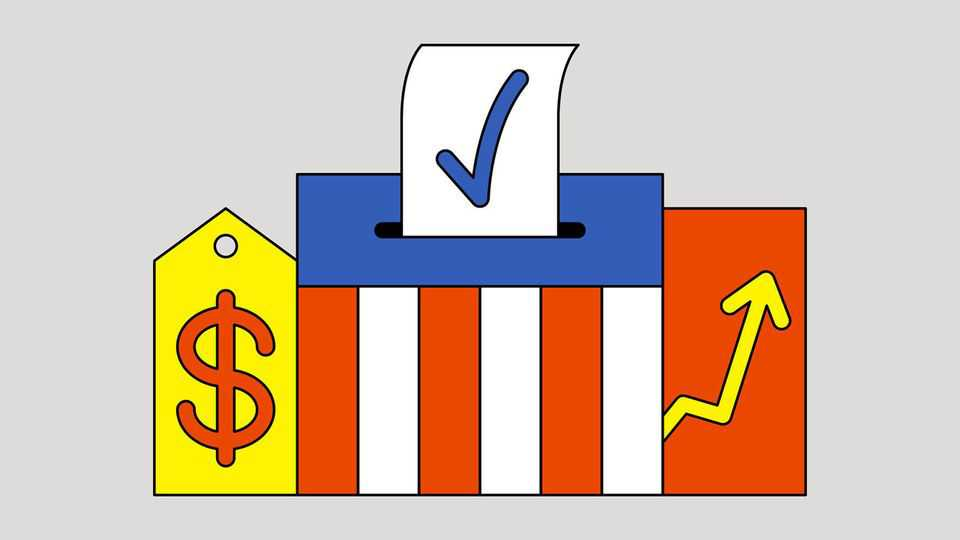

领袖 | 马姆达尼的意义
民主党别从一夜大捷得出错误结论
温和州长比纽约的魅力社会主义者更值得复制
2025年11月6日

摘要：11月4日的选举让民主党欲罢不能：纽约出现年轻社会主义市长、维吉尼亚与新泽西州长高票入袋，多州公投与法院席次也开花。气势再起固然令人舒口气，但真正能教训特朗普与夺回全国政权的，并不是纽约那套左派经济民粹，而是踏实谈民生、符合地方调性的温和派。

这轮零散选举影响明尼阿波利斯、新泽西、纽约市、维吉尼亚的治理，牵动乔治亚电价与宾州最高法院，也成了检验选民是否满意特朗普二任的首场期中考。结果超过民主党预期，但一个美好夜晚不能掩盖长年难题。

【一｜纽约的迷思】
34岁政坛新手佐兰·马姆达尼明年将接手1,170亿美元预算，高投票率显示选民对他与其社会主义品牌的热情。这让党内斗富豪派喜出望外，认为对抗特朗普就该靠左派经济民粹。问题在于，民主党总统候选人不管怎样都会赢纽约市，自1924年起就没输过。因此马姆达尼并没有回答“如何击败特朗普、如何重夺全国政权”这个问题。

【二｜真正值得学的案例】
维吉尼亚与新泽西的州长选举更值得借镜。阿比盖尔·斯潘伯格在维州胜出并不意外——共和党人上一次在共和党入主白宫时拿下州长是1973年，但她赢15个百分点，远超预期。新泽西也类似，民调原本预测密基·谢里尔仅以个位数击败实力派共和党人夏塔瑞利，最后却轻松过关，打破1961年以来“同党连任两届后无法续任”的魔咒。

【三｜别误判讯号】
若有人因此认定：纽约选举证明选民热爱极左政策、民主党比评论员说的健康、明年期中选举稳了，那就是错误解读。

【四｜正确三堂课】
第一课：聚焦经济与生活成本——马姆达尼、谢里尔、斯潘伯格都是这么做。第二课：挑选符合地方风格的候选人。斯潘伯格曾任CIA，谢里尔当过海军直升机飞行员，这股爱国形象能化解共和党贴的“仇美民主党”标签。第三课：在动荡年代别自诩体制守门员。纽约人其实未必想要社会主义，马姆达尼也会被市法、州法与预算现实掣肘；这场选举比较像对现状的不满，而非为某套政策背书。

【五｜气势之外的现实】
在一年检讨后敲打总统让民主党稍稍舒压，但激情退去仍得面对老问题：党内在移民、气候、种族上的立场与赢得全国选票所需的选民距离甚远。如今又扶起一位民主社会主义者做代表，等于加重包袱。马姆达尼旋风让纽约人觉得振奋，却可能让共和党策士更开心。■

《经济学人》订户可免费订阅 Opinion 电子报，收录每周最佳社论、专栏、来稿与读者来信。

