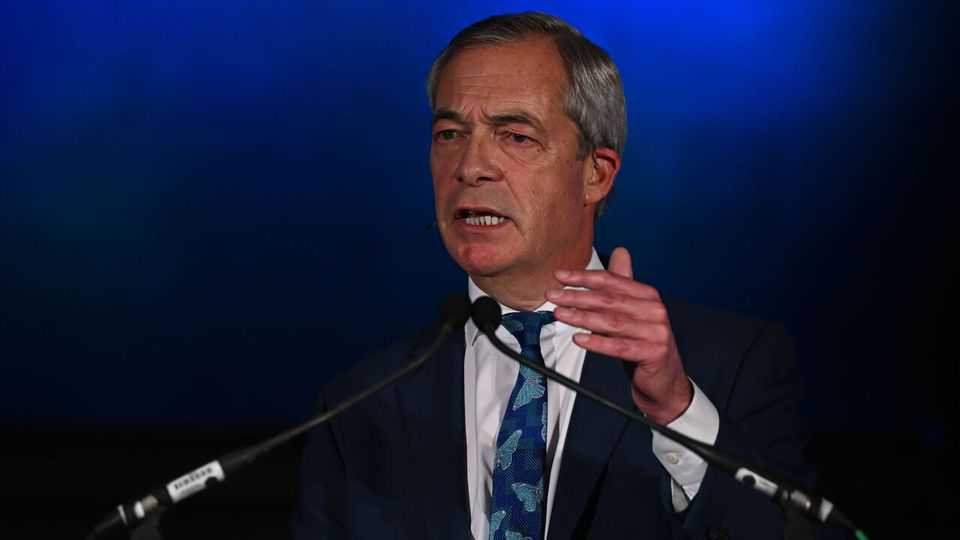

领袖 | 法拉奇的财政转弯
奈杰尔·法拉奇突然爱惜财政，值得欢迎但仍待验证
英国头号民粹人士说，暂时先别大砍税
2025年11月6日

摘要：本周两位政治人物抢着自称解药：右派民粹政党改革英国领袖奈杰尔·法拉奇，与信誓旦旦要恢复理性但还没做到的工党财相瑞秋·李夫斯。前者大转弯，说经济太差所以不再承诺大幅减税；后者则暗示将加税，违背选举承诺。若民粹右派终究要执政，至少要能让债市放心。问题是，法拉奇过往朝令夕改，要真当上“理性队长”，还得丢掉其他脱序点子。

本周两场记者会各自端出“解救英国经济”方案。改革英国党的法拉奇过去开出的减税支票荒唐到《经济学人》计算后发现，比2022年崩盘的特拉斯迷你预算还贵。工党财相李夫斯则是那位向选民保证带来理性与能力、却迟迟交不出成绩的人。结果是：法拉奇宣布经济太惨，不能再砍税；李夫斯暗示11月26日的预算案会调高所得税。

【一｜法拉奇的180度转身】
对一位过去承诺每年砍税1,000亿英镑（我们算过，高则达1,900亿，相当于GDP 5%）的人而言，这几乎是完全翻车。他说，“我们要成熟、要理性，不再乱开支票。”税还是想降，但得等经济恢复。问答时间，他甚至不排除打破国民年金“三重保障”（Triple Lock）这个昂贵保证。他知道选民受够政客毁诺，所以干脆宣誓“不再做更多承诺”。

【二｜李夫斯的困境】
相较之下，李夫斯因没在野时就说清楚难题而付出代价。工党眼看快执政，就对选民承诺不可能的事：几乎人人有甜头，“普通劳工”不会痛。这套财政幻术已深植全党。除非经济突然暴冲或利率崩跌，她才可能撑得过去。现在她喊“人人要尽一份力”，却没说自己要怎么动真格，比如打破昂贵的三重保障，替代提高工作族群税负。

【三｜对债市的讯号】
法拉奇语调转变是个好兆头。改革英国若真走上执政之路，至少他不打算像特拉斯那样挑衅债市。但别忘了他长年投机，一旦想让选民相信“理性队长”人设，就得同步砍掉其他蠢点子，包括副手威胁撕毁再生能源合约、扬言削弱英格兰银行与预算责任办公室独立性——特朗普对联准会的那套。

【四｜选民记性很好】
这周带来的教训是：法拉奇誓在夺权。面对“财政可信度”与“财政民粹”两条路，他选了前者，因为这是通往唐宁街10号最稳的捷径。这也透露出选民心声：英国人还记得特拉斯与她的灾难。任何想执政的领袖都得先证明不会重蹈覆辙，这是选民的功劳。以现在的经济状况来说，值得心存感激。■

《经济学人》订户可免费订阅 Opinion 电子报，收录每周最佳社论、专栏、来稿与读者来信。

