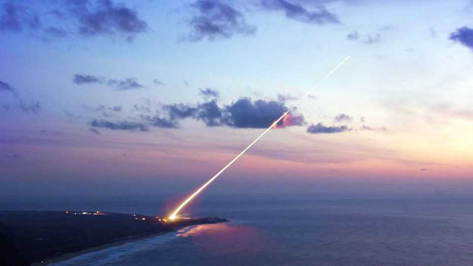

领袖 | 星际大战续集
美国的“金色穹顶”计划模糊又危险
若没厘清定位，导弹防盾恐成昂贵又破坏稳定的白象
2025年11月6日

摘要：特朗普去年签署行政命令，要替美国建一套“铁穹”式防护网，如今换上更浮夸的名字“金色穹顶”。导弹威胁确实增加，近年乌克兰、以色列、印度都证明强韧防御的重要性，但计划范围至今模糊不清，若不赶紧定调，很可能沦为耗资巨额、还让对手扩军的白象工程。

金色穹顶包含不少既有或已在研发的技术：位于阿拉斯加与加州的反导弹拦截器、类似保护乌克兰的爱国者系统、追踪导弹的感测器、拦毁投射物的拦截器，以及串接这些资讯的软件。新元素则是承诺发展太空基拦截器（SBI），把小型导弹装上低轨卫星，在敌方导弹升空、尾焰最容易被捕捉时直接拦掉。雷根与老布希在1980年代玩过这个主意，最后胎死腹中。

【一｜核心疑问】
计划最大问题是：金色穹顶究竟要做什么？是稍微增强本土抵御中国飞向美国本土基地的无人机与少量巡弋导弹？是要挡住像北韩这种二线核武国的小规模核打击？还是要拦截数百枚俄、中核弹头，彻底无效化对方对美国的生存威胁？答案差很大。

【二｜成本与稳定性】
专家估算，小规模版本聚焦于拦截少量来袭导弹，20年成本略高于2,500亿美元，放在美国年度国防预算里算小钱。但若走完整版——在轨SBI达数万枚，成本将飙到3.6兆美元，不只吃掉美军资源，还可能逼敌人疯狂扩军。核震慑的稳定本就建立在一定程度的互相脆弱，一旦美国要筑成“密不透风”防盾，对手的合理反应就是加倍造弹。

【三｜应有的方向】
特朗普需要说清楚想达到的目标，而不是空口承诺“便宜又全面”。我们建议：先在阿拉斯加、加州的地面拦截器上做温和扩充，前提是系统更能辨识真弹头与诱饵；同时投资太空感测器，加强追踪巡弋导弹与高超音速滑翔体。这两步跨党派支持度都高。至于太空基拦截器，就先等等。

【四｜拿捏分寸】
导弹防御永远是平衡艺术：太少，国家暴露在危险之中，尤其如今连也门的胡塞武装都能操作长程弹道导弹；太多，则引发军备竞赛，而且攻方往往成本较低。特朗普加固美国防线的方向是对的，但应避免把金色穹顶镀到24K。■

《经济学人》订户可免费订阅 Opinion 电子报，收录每周最佳社论、专栏、来稿与读者来信。

