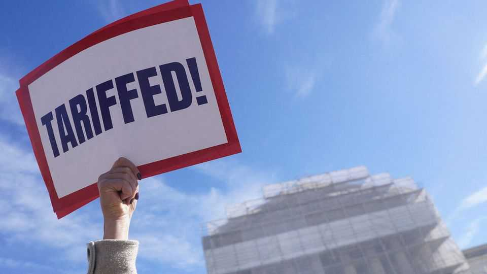

美国 | 职责召唤
最高法院似乎对特朗普的关税持怀疑态度
他的一些关税可能很快就要完蛋
2025年11月6日

摘要：没有在任总统曾出席最高法院的口头辩论，特朗普也选择不打破这个先例。11月5日审理挑战其关税合法性的案件时，他派商务和财政部长观看。副检察长约翰·索尔在法官面前辩称，1977年通过的《国际紧急经济权力法》"明确包含"特朗普的"贩运"关税和"互惠"关税。但特朗普的立场在近三小时的听证会上遭遇困难，所有三位自由派大法官都表示怀疑，三位保守派也表达了疑虑。AI工具SCOTUSbot现在更确信特朗普可能必须撤销关税。

没有在任总统曾出席最高法院的口头辩论。这是唐纳德·特朗普在考虑出席Learning Resources诉特朗普案——11月5日审理的挑战其关税合法性的案件——的辩论后选择不打破的先例之一。听证会前夕，特朗普宣布此案是"生死攸关"的问题。他派商务和财政部长观看。在法官面前辩论时，副检察长约翰·索尔呼应了他老板的信念，即关税正在将美国从"经济和国家安全灾难的边缘"拯救出来。他辩称，1977年通过的《国际紧急经济权力法》（IEEPA）"明确包含"特朗普对中国、加拿大和墨西哥的"贩运"关税以应对芬太尼危机，以及对美国大多数贸易伙伴高达50%的"互惠"关税。

【一｜自由派大法官的质疑】
但特朗普的立场在近三小时的听证会上遭遇困难。所有三位自由派大法官都表示怀疑。大法官凯坦吉·布朗·杰克逊说，国会制定IEEPA是"为了限制总统"在贸易政策上的权力，而不是释放它。大法官索尼娅·索托马约尔指出，该法规没有提到关税。大法官埃琳娜·卡根审视了IEEPA中授予总统紧急权力的九个动词，得出结论，该法规"就是没有你想要的那个[权力]"。

【二｜保守派也怀疑】
三位保守派也表达了疑虑。大法官艾米·科尼·巴雷特敦促索尔说出"历史上任何其他时候"，IEEPA中允许总统"监管...进口"的关键短语被理解为意味着关税。首席大法官约翰·罗伯茨提到法院不愿支持国会未明确授权的重大行政行动——这种方法导致乔·拜登的几项政策失败，包括他的学生贷款减免计划。所谓的重大问题原则，他说，"可能直接适用于"特朗普根据IEEPA的主张。他补充说，总统说法律允许他"对任何产品，从任何国家，以任何金额，持续任何时间"征收关税可能是牵强的。

大法官尼尔·戈萨奇质疑索尔关于重大问题原则不适用于外交事务背景的论点。好吧，他难以置信地说，"什么会阻止国会只是将所有监管对外贸易的责任"，或其宣战的宪法责任，交给总统？这样的原则将意味着"行政部门的权力逐渐但持续增加，远离人民选出的代表"。

【三｜少数支持者】
三位大法官——塞缪尔·阿利托、布雷特·卡瓦诺和克拉伦斯·托马斯——似乎热衷于找到拯救特朗普关税的方法。大法官卡瓦诺指出理查德·尼克松在1971年援引较早的法律征收10%关税，以及1976年支持进口费用的决定。在与代表反对关税企业的律师尼尔·卡塔尔对话时，大法官阿利托沉思说，并非所有关税都是为了增加收入；有时它们是为了改变国家的行为。

【四｜AI预测】
在Learning Resources案的所有简报提交之前，我们的AI工具SCOTUSbot预测，特朗普的关税在十次运行中有九次会被维持。在阅读所有文件后，机器人在所有十次模拟中都转向挑战者一方，但信心相当低。有了口头辩论记录的好处，SCOTUSbot更确信特朗普可能必须撤销关税，并在不同——且不那么广泛——的法律授权下重新调整它们。■

