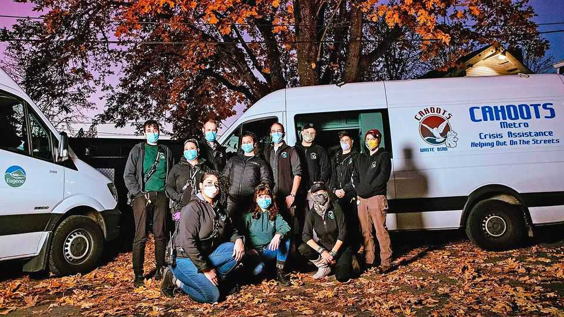

美国 | CAHOOTS完蛋了
美国模范移动危机服务的兴衰
一个由嬉皮士开始、被佐兰·马姆达尼称赞的计划出了什么问题
2025年11月6日

摘要：在10月的纽约市长辩论中，领先者佐兰·马姆达尼说CAHOOTS"俄勒冈州尤金的一个项目"可以作为纽约如何在不使用警察的情况下处理心理健康危机的模式。但许多尤金人感到困惑，因为经过36年，CAHOOTS在4月7日结束了在该市的所有服务。它的消亡是一个奇怪的故事，混合了嬉皮士、警务、精神疾病和纯粹的管理不善。研究显示它减少了23%的警察出警和76%的逮捕概率，但最终因无法适应新要求和内部动荡而关闭。

在10月的纽约市长辩论中，领先者佐兰·马姆达尼说CAHOOTS，"俄勒冈州尤金的一个项目"，可以作为纽约如何在不使用警察的情况下处理心理健康危机的模式。许多尤金人感到困惑，因为经过36年，CAHOOTS在4月7日结束了在该市的所有服务。它的消亡是一个奇怪的故事，混合了嬉皮士、警务、精神疾病和纯粹的管理不善。

【一｜CAHOOTS如何运作】
CAHOOTS应该这样运作。当丽贝卡·希尔15岁时，她吞下大量药丸试图自杀。一名工作人员开车送她回家，这样她的父母就不会发现。"我很害怕，CAHOOTS在我身边，当没有其他成年人时，"她说。十多年后，希尔准备从停车场跳下时，一个陌生人问她是否需要帮助。"除非你要推我，"希尔女士回答。相反，陌生人打电话给CAHOOTS，他们与希尔女士交谈了一小时，然后开车送她到治疗中心。"我的生命被CAHOOTS工作人员向我展示的善良和冷静所拯救，"她说。

【二｜研究证明价值】
也在尤金的俄勒冈大学的一些研究人员分析了911呼叫数据以量化该项目的价值。罗里·罗尔夫斯教授估计，由于CAHOOTS，警察被派往的呼叫减少了23%。另一位俄勒冈教授乔纳森·戴维斯合写了一篇论文，显示CAHOOTS将911呼叫以逮捕结束的概率降低了76%。每次逮捕都花费纳税人，所以该服务提供了显著节省。"CAHOOTS是扩大警察部队的低成本方式，"戴维斯先生说。

【三｜起源】
它开始时不是这样。1969年，少数无政府主义嬉皮士创立了白鸟诊所，为所有人提供免费心理健康服务。"这是一个经典的尤金式、反体制、反权威、把规则扔出窗外"的解决方案，现在CAHOOTS的负责人贾斯汀·马代拉说。在前二十年，白鸟与警察非正式合作，警察经常把糟糕的迷幻之旅的人送到诊所。

【四｜正式化】
尽管双方都有担忧，尤金警察和白鸟在1989年正式化了他们的合作，创建了CAHOOTS，一个理想主义医护人员协助警察处理911呼叫的服务。正式地，CAHOOTS代表"街头危机援助帮助"，但它也承认嬉皮士对与警察如此密切合作感到不安。

【五｜实际运作良好】
然而，在实地，紧张的迹象很少。"我绝对喜欢与他们合作，"马代拉先生说。警察也有同感。在尤金的姐妹城市斯普林菲尔德，CAHOOTS继续运作。"你可以问我们的任何警官，他们都会说CAHOOTS带来的价值是城市应该继续优先考虑的东西，"斯普林菲尔德警察局的贾斯汀·迈尔斯中尉说。尤金警察为CAHOOTS提供了40%的资金，拥有50名员工和四辆面包车在城市巡逻，提供24小时服务。

【六｜全国关注与终结】
然后是全国关注和终结的开始。2021年1月，《每日秀》将CAHOOTS描述为"削减警察资金"的试运行。波特兰和丹佛创建了以它为模式的服务。俄勒冈参议员罗恩·怀登在国会提出了CAHOOTS法案。

但CAHOOTS没有准备好应对CAHOOTS法案。该项目只有在收集数据以衡量有效性时才能向医疗补助收费。担心这会减少其许多无家可归客户的信任，CAHOOTS抵制新规定并错过了。白鸟也经历了内部动荡。自由放任的组织试图拥抱组织结构图。2022年，工人成立了工会。

【七｜丑闻与关闭】
然后，根据今年1月向联邦法院提交的诉讼，一名CAHOOTS医护人员声称她被一名同事强奸，后来被打。2月，白鸟失去了主任，10月，它以60万美元解决了诉讼。随着纽约考虑创建自己的移动危机服务，原始项目是否有机会回到它的家乡？"我们仍然对这个想法持开放态度，"马代拉先生说。■

