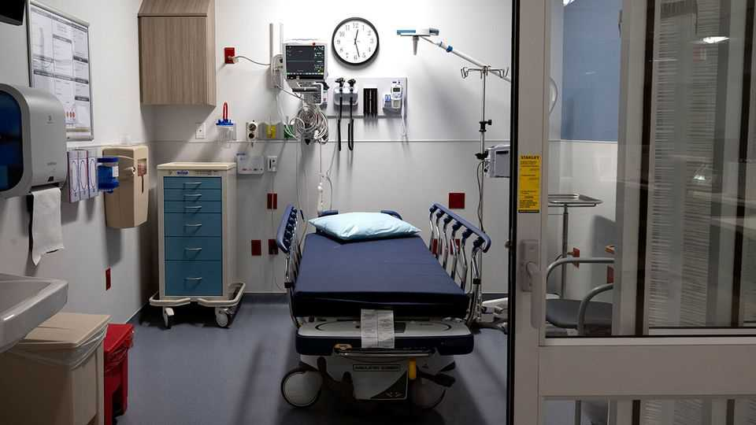

美国 | 医药大采购
美国医疗成本正在飙升
一个主要原因是人们寻求更多治疗
2025年11月6日

摘要：美国人每年秋天都要选择健康保险计划，今年选择将带来价格冲击。根据咨询公司PWC，团体保险的医疗成本将上涨8.5%。原因包括劳动力短缺推高工资、医院和诊所合并增加价格压力，但还有一个特定于医学的趋势：美国人正在使用更多医疗保健。常见癌症筛查比2019年上升60-80%，处方药使用增加14%。推动因素包括新药、人口老龄化和心理健康治疗激增。

美国人对他们的秋季仪式有根深蒂固的奉献，无论是摘苹果还是在美式足球比赛前在体育场停车场烧烤。但也有一个不那么节日的秋季例行公事：开放注册，员工选择健康保险计划的年度窗口。今年，选择将带来价格冲击。根据咨询公司PWC，团体保险的医疗成本将上涨8.5%（见图表）。

其他行业观察者预测类似的价格上涨将很快到来。通过《平价医疗法案》市场购买的计划的成本也将在2026年飙升，因为增强的大流行时代补贴到期，除非补贴作为重新开放联邦政府谈判的一部分延长，正如民主党所寻求的。

【一｜价格上涨的原因】
团体计划的价格，大多数美国人使用的雇主提供保险的支柱，正在上涨，原因也在更广泛的经济中看到。近年来的劳动力短缺推高了工资。医院和诊所的合并增加了价格压力。但也有一个特定于医学的趋势：美国人正在使用更多医疗保健。

【二｜使用量增加】
这种变化以各种方式看到。到2024年底，一些常见癌症筛查比2019年上升60-80%。处方药使用在同一时期增加14%。"全面来看，人们更多地参与医疗系统，"哈佛医学院健康政策教授迈克尔·切尔纽说。雇主赞助计划中预期价格上涨的大部分来自更多使用，咨询公司Mercer的苏尼特·帕特尔估计。他说，这与大流行前不同。最近增加使用的部分可能是延迟护理的追赶，但大流行五年后，现在更大的使用似乎已经固化。

【三｜三大趋势】
不清楚增加背后到底是什么，但至少有三大趋势似乎在起作用：新药、人口老龄化和心理健康治疗激增。

【四｜新药成本】
仅2024年，药物净支出就增长11.4%（见图表），由几个特别高成本的治疗推动。约八分之一的美国人现在尝试过GLP-1，昂贵的减肥药。新的且价格令人瞠目结舌的癌症和免疫学药物也正在进入市场。批准的新癌症药物的中位年成本约为20万美元。"我们每天学习如何治疗以前不治疗的东西，这往往要花钱，"健康研究机构KFF的加里·克拉克斯顿说。

【五｜人口老龄化】
此外，婴儿潮一代随着年龄增长获得更多护理。最终，几乎所有人都会迁移到Medicare，一个为65岁以上的人提供的政府健康保险系统，但与此同时，许多人仍在使用雇主提供的保险。

【六｜心理健康激增】
对所有工人来说，医学的一个领域看到索赔激增。2023年1月至2024年12月，住院心理健康索赔增长80%，而门诊索赔上升40%。最大增长是由于焦虑、抑郁和发育障碍的索赔。

【七｜成本与结果】
理论上，所有这些支出应该意味着更健康的人。实际上，美国在健康上的支出比其他富裕国家多，但没有更好的结果。■

