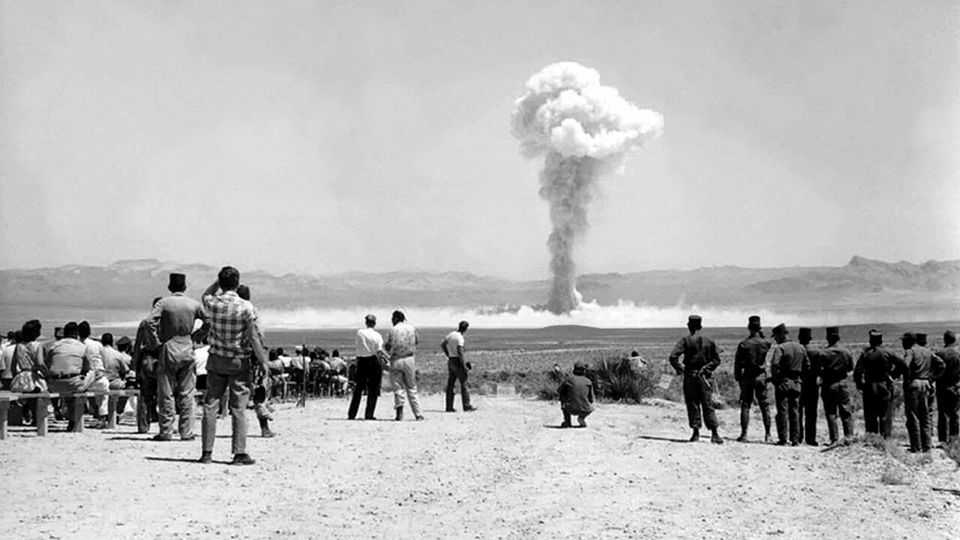

美国 | 战略愚蠢
特朗普关于核武器测试的令人担忧的混乱
一个充满错误的帖子增加了核危险
2025年11月6日

摘要：凯瑟琳·比格洛的电影《炸药屋》探索了核危机的恐怖和不确定性。但现实世界中，特朗普这个拥有唯一权力发射数千枚核弹的反复无常总统，对核武器表现出深深的困惑，他的国家安全工作人员努力纠正他。10月29日，他出人意料地在Truth Social上宣布命令五角大楼"开始测试"核武器。但他的帖子充满错误和不一致，可能他想的不是核弹头而是运载工具？无论如何，这种模糊在核问题上可能是危险的。

"炸药屋"，凯瑟琳·比格洛关于对美国核打击的电影，探索了核危机的恐怖和不确定性。一枚洲际弹道导弹（ICBM）正朝芝加哥飞去，但没有人能告诉是朝鲜、中国还是俄罗斯发射的。几分钟内，总统正在决定是否报复——从"三分熟"、"五分熟"和"全熟"热核选项菜单中选择——知道任何选项都可能导致世界末日。这种虚构的核战争迷雾已经足够可怕。但现实世界呢，唐纳德·特朗普，一个拥有唯一权力发射数千枚核弹的反复无常总统，对核武器表现出深深的困惑，他的国家安全工作人员努力纠正他？

【一｜混乱的宣布】
10月29日，特朗普出人意料地在Truth Social上宣布，他正在命令五角大楼"立即开始测试"核武器。从表面上看，特朗普正在宣布美国将自1992年以来首次在内华达恢复地下核爆炸。但他的帖子充满错误和不一致，以至于也许，一些人建议，特朗普想的不是核弹头而是运载它们的手段？

【二｜模糊的危险】
一些计算的模糊一直是威慑的一部分，但美国的核政策从未像特朗普对关税和外交的反复无常方法，威胁和虚张声势可以产生优势。在核问题上，模糊可能是危险的，"当没有人知道总统在说什么时"，前五角大楼高级官员埃里克·埃德尔曼指出。当全球正在进入一个新的核时代时，特朗普抛出他的可能政策并没有帮助，这个时代的特点是令人担忧的混合：加深的大国竞争、俄罗斯的核威胁、中国的快速建设、更多国家拥核的压力，以及明年限制美国和俄罗斯远程核武器的新START条约到期。

【三｜帖子中的错误】
特朗普的社交媒体帖子从一开始就混乱，声称"美国拥有比任何其他国家更多的核武器"。美国科学家联合会的最佳开源估计评估，美国拥有5,177枚弹头库存，而俄罗斯为5,459枚。特朗普声称中国"将在五年内甚至更多"，尽管五角大楼估计到2030年它将拥有约1,000枚弹头，可能到2035年有1,500枚。

【四｜命令的困惑】
他的命令是最大的困惑。"由于其他国家的测试计划，我已经指示战争部开始测试我们的核武器，在平等基础上。该过程将立即开始，"他写道。如果他想的是弹头，指控没有意义：本世纪已知进行爆炸测试的唯一国家是朝鲜，最后一次在2017年。如果特朗普想的是运载系统，那么命令是多余的：美国定期测试其ICBM——实际上本周就这样做了。

【五｜官员的解释】
国家安全官员一直无法解释。被提名领导战略司令部、负责任何核战争的理查德·科雷尔海军上将建议，特朗普可能一直在谈论运载系统。负责弹头测试的能源部长克里斯·赖特谈到新弹头的"系统测试"，没有核爆炸。但在接受CBS新闻采访时，特朗普似乎专注于地下爆炸，坚持认为其他国家正在进行，美国也应该这样做。

【六｜选项与风险】
特朗普面前有一系列选项。最好的将是确认他不会进行爆炸核测试，除非对手这样做，但这样的后退将不符合他的性格。他可以宣布自己对赖特先生的计划或最新的民兵II ICBM测试感到满意。更冒险的一步将是命令低当量地下测试，尽管好处可能不值得反弹。最危险的将是说服自己进行全面爆炸核测试。

【七｜中国的优势】
大多数美国核专家，包括倾向共和党的，认为中国从恢复核测试中获益最多。这是因为多年来它进行的测试（45次）远少于俄罗斯（715次）或美国（1,030次）。官员们认为他们有历史数据和超级计算机来模拟核爆炸并确保武器可靠。恢复全面地下测试可能需要数年时间和国会资金。

【八｜两个风险】
特朗普的核迷雾中有两个明显的风险。一个是中国或俄罗斯将利用他的模糊恢复核测试。俄罗斯领导人弗拉基米尔·普京命令他的工作人员计划可能恢复测试。第二个危险是，美国强硬派现在将推动测试。他的第一任政府玩弄了这个想法。去年，特朗普的前国家安全顾问罗伯特·奥布莱恩认可了它。参议员汤姆·科顿，曾经被视为潜在的国防部长，引用特朗普的言论，同时赞扬"这种测试的明显好处，以确保库存完全准备就绪"并"发出强烈的决心和威慑信息"。

然而，正如比格洛女士有缺陷的电影中的总统所学到的，准备好不足以避免核灾难；错误可能是危险的，正如他反思的那样，"我们都建造了一座充满炸药的房子[...]但我们继续住在里面"。■

