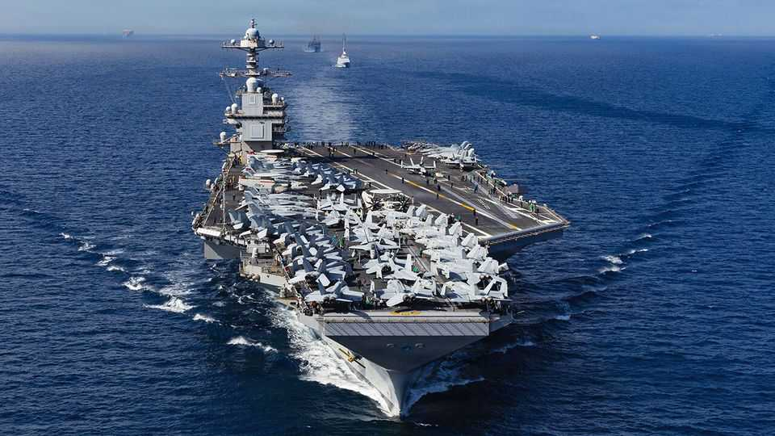
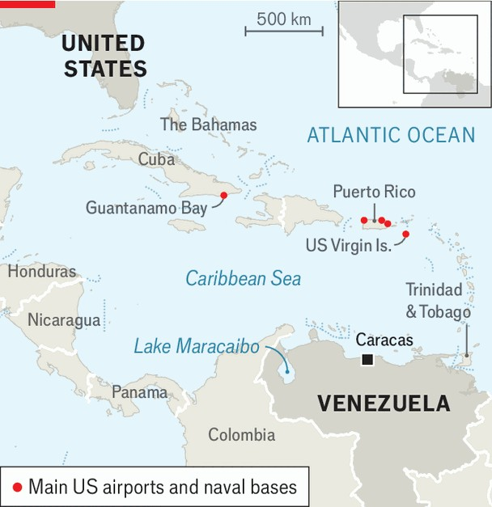

美洲 | 再次政权更迭
随着特朗普测试"美洲优先"主义，委内瑞拉战争迫在眉睫
聚集的舰队可能重复"反恐战争"的错误
2025年11月6日

摘要："我们在全球部署了美国资产和利益，但当我们在自己的半球这样做时...每个人都有些恐慌。"美国国务卿马可·卢比奥这样驳斥了对针对"毒品恐怖分子"的聚集军事行动的担忧。自9月以来，美国军队多次打击据称的贩毒船只。现在他们正在加勒比海集结强大的海军力量并威胁轰炸委内瑞拉。推翻该国强人尼古拉斯·马杜罗的努力几乎没有掩饰。特朗普将毒品帮派重新定义为恐怖分子而不是罪犯，以证明对他们使用军事力量是合理的。这带来了代价高昂的军事纠缠风险。

"我们在全球部署了美国资产和利益，但当我们在自己的半球这样做时...每个人都有些恐慌。"因此，美国国务卿马可·卢比奥驳斥了对针对"毒品恐怖分子"的聚集军事行动的担忧。自9月以来，美国军队多次打击据称的贩毒船只。现在他们正在加勒比海集结强大的海军力量并威胁轰炸委内瑞拉。推翻该国强人尼古拉斯·马杜罗的努力几乎没有掩饰。当被问及马杜罗的日子是否屈指可数时，唐纳德·特朗普总统告诉CBS新闻："我会说是的。我想是的，是的。"

【一｜军事集结】
一个航母打击群正在前往加入加勒比海力量。波多黎各的一个休眠基地已经重新开放。轰炸机在委内瑞拉上空嗡嗡作响，而海军陆战队正在演练两栖登陆。中央情报局已被授权进行秘密行动。

【二｜历史与动机】
美国的炮舰外交复活了在拉丁美洲军事干预和政变策划的黑暗历史，往往由对敌对势力的恐惧驱动，这在冷战后有所减弱。它的回归部分源于对伊朗、俄罗斯，特别是中国正在获得影响力的担忧。但这主要是关于特朗普先生对确保国土安全的痴迷，加上他想要表现得像一个强大的政治家。几个月前，他担心中国接管巴拿马运河和美国需要接管格陵兰。现在他转向委内瑞拉，由一个可疑的新主义帮助。

【三｜新主义】
特朗普政府将毒品帮派重新定义为恐怖分子而不是罪犯，以证明对他们使用军事力量是合理的。它将马杜罗先生直接与帮派联系起来，以证明对其政权的压力是合理的。卢比奥先生称毒品帮派为"西半球的基地组织"。像"全球反恐战争"一样，新的毒品恐怖战争带来了代价高昂的军事纠缠风险——这来自一个发誓结束美国"永久战争"的总统。YouGov上个月的民意调查发现，多数美国人反对在委内瑞拉采取军事行动。（另一个，由AtlasIntel进行，显示大多数拉丁美洲人支持这个想法。）

【四｜矛盾的行动】
美国的行动奇怪地矛盾。如果委内瑞拉是一个恐怖主义国家，为什么美国结束了约60万委内瑞拉寻求庇护者的"临时保护身份"并将一些人送回毒品圣战分子？满载被驱逐者的航班每周两次降落在委内瑞拉，即使B-1和B-52威胁轰炸这个地方。雪佛龙租用的油轮仍从马拉开波湖起航，满载运往美国炼油厂的石油。

【五｜关系恶化】
今年早些时候，与委内瑞拉的关系似乎正在改善。该国从监狱释放了几名美国人。雪佛龙被允许在7月恢复石油运输。但几乎立即之后，出现了大转折。财政部将一个名为"太阳卡特尔"（Cartel de Los Soles）的神秘组织标记为"特别指定的全球恐怖分子"，这是一个与高级军官有关的毒品走私集团。马杜罗被确定为其头目。该卡特尔被指控帮助另一个委内瑞拉帮派"阿拉瓜列车"（Tren de Aragua），后者在2月已被指定为"外国恐怖组织"。8月，国务院将对导致逮捕或定罪马杜罗的信息的赏金翻倍至5000万美元。9月2日，导弹开始落在据称的贩毒船只上。到目前为止，已有60多人被杀。烧焦的尸块已经冲上特立尼达和多巴哥的海滩。

【六｜权力平衡变化】
官员们说，所有这些都反映了特朗普先生的演变。交易者给外交一个机会，对结果感到失望，然后加大了压力。这种转变也反映了他的助手之间不断变化的权力平衡。里奇·格内尔，特朗普先生的"特殊任务特使"，领导了与马杜罗的谈判，据说支持外交。卢比奥先生，也担任国家安全顾问，推动强硬路线。一位古巴血统的前参议员，他强调恢复美国在其半球的影响力。

【七｜"美洲优先"主义】
因此，卢比奥先生将他的新保守主义本能与特朗普先生的美国优先本土主义融合。他认为，美国的许多麻烦，从移民到毒品走私，都来自美洲。随着国内政策延伸到外交政策，美国优先成为"美洲优先"。他可能窥见一个机会，按照美国的喜好重塑加勒比海。如果马杜罗倒台，那么像古巴和尼加拉瓜这样的敌人可能会失去获得补贴的委内瑞拉石油的机会并被破坏稳定。

【八｜多米诺骨牌效应】
然而，多米诺骨牌可能以另一种方式倒下。一个搞砸的干预可能导致委内瑞拉及其以外的混乱，煽动反美主义并加剧毒品和移民问题。

【九｜乐观与悲观】
乐观主义者认为干预将类似于1983年对格林纳达和1989年对巴拿马的短暂、成功的入侵。批评者指责委内瑞拉是一个更大、更复杂的国家，干预可能类似于在阿富汗、伊拉克和利比亚的灾难。无论哪种方式，几乎没有迹象表明特朗普政府有一个连贯的计划来推翻马杜罗，更不用说之后会发生什么。

【十｜马杜罗的弱点】
美国最大的资产是马杜罗及其政权的不受欢迎和非法性。它主持了政治镇压和经济崩溃，导致世界上最大的难民潮之一。马杜罗操纵了2024年总统选举，禁止反对派领导人玛丽亚·科里纳·马查多参选。她的替身埃德蒙多·冈萨雷斯仍然以压倒性优势获胜，但政权宣布了虚假结果。

【十一｜最佳希望】
推翻马杜罗的最佳希望是，大声的武力炫耀将破解他的政权。美国最大和最新的航母杰拉尔德·福特号的接近可能会集中注意力。"我假设中央情报局的作用是向政权和军队中的人传递大量信息，说'看，马杜罗必须走。你没有理由和他一起倒下'，"特朗普第一任期委内瑞拉特使埃利奥特·艾布拉姆斯说。

【十二｜让步与威胁】
已经提供了让步。根据《迈阿密先驱报》，一项提议是创建一个由高级查韦斯主义者减去马杜罗的过渡政府。另一项，由《纽约时报》报道，提供了对石油和矿产资源的特权访问，以及中国、俄罗斯和伊朗的作用减少。"他提供了一切，"特朗普在10月17日宣布。"你知道为什么吗？因为他不想和美国搞事情。"

【十三｜马杜罗仍控制枪支】
然而，马杜罗仍然控制枪支。在古巴情报的帮助下，他正在加大对可疑对手的清洗。数十名被认为不忠的军官在监狱中，许多人被折磨，他们的家人也受到威胁和监禁。很少有人会冒险站出来反对马杜罗，直到他们确定他正在下台。

【十四｜可能需要使用武力】
因此，特朗普可能必须使用武力，而不仅仅是威胁。他更喜欢对美国军队风险很小的快速突然袭击，比如6月对伊朗核设施的轰炸。但对于委内瑞拉，特朗普似乎正在通过电报他的行动来建立压力。泄露表明他可能首先瞄准偏远地点，也许是与毒品网络有关的机场。如果它变成对政权的持续空袭，防空系统将必须被摧毁。

【十五｜地面部队的问题】
但仅凭空中力量很少，如果有的话，在没有地面友好力量的情况下成功推翻政府——这在委内瑞拉似乎不存在。也许特朗普政府认为它可以从空中杀死马杜罗（假设它准备撤销自1976年以来禁止暗杀外国领导人的行政命令）。这也很难。伊拉克独裁者萨达姆·侯赛因只有在2003年美国军队占领伊拉克后才被抓获。向委内瑞拉派遣地面部队将非常不受欢迎。

【十六｜成功的关键】
任何干预的成功将取决于它是否改善国家，以及这是否持续。有两个关键问题。首先，反对派能否统治委内瑞拉这个烂摊子？它的许多领导人都在流亡。马查多女士，今年诺贝尔和平奖得主，在委内瑞拉躲藏，但可以沟通。她支持特朗普，告诉彭博社："我相信已经发生的升级是迫使马杜罗理解是时候离开的唯一方式。"并非所有反对派人物都分享这一观点。尽管如此，马查多女士说她有过渡前100小时和前100天的计划。

【十七｜残余势力的战斗】
也不清楚政权的任何残余——军队单位、集体组织（武装民兵兼社区组织）和国家安全特工——更不用说在委内瑞拉运作的犯罪集团和哥伦比亚叛乱分子，是否会选择战斗。如果他们这样做，短期战争可能变成长期反叛乱。

【十八｜三种情景】
华盛顿智库战略与国际研究中心的瑞安·伯格看到三种情景：委内瑞拉军队抛弃马杜罗并夺取权力；美国与他或他集团的一部分谈判过渡；或政权在美国的军事行动下崩溃。他说，前两者提供稳定但可能没有太多民主。第三种可能将合法的反对派带到权力，但更不稳定。也很可能特朗普失去兴趣并继续前进，也许在表面打击后宣布成功。

【十九｜FAFO警告】
1月，特朗普发布了一个模因，自己看起来像一个黑帮，旁边有一个标志，写着"FAFO"——"搞事情然后发现后果"的缩写。这是对哥伦比亚的警告，因为它（短暂地）拒绝接受被驱逐者。它也可能适用于其他地方。特朗普准备好发现干预委内瑞拉的后果了吗？■

