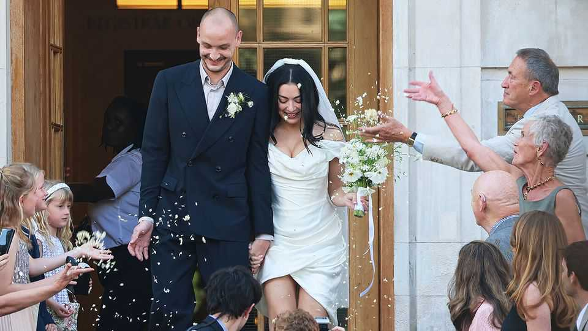

Culture | Don't get me to the church on time
Looking for a chic wedding venue? Try a town hall
Low-key marriage ceremonies are back in fashion
November 6th 2025 
 

THE GROOM wore a Giorgio Armani suit. The bride wore a short white dress by Vivienne Westwood with her signature black sunglasses. This summer Charli XCX married George Daniel, the drummer of The 1975, a chart-topping band, at Hackney Town Hall in London. Their nuptials reflected her devil-may-care vibe: the newlyweds posed for pictures on the steps of the public building (pictured above) before decamping to a nearby restaurant to smoke cigarettes and drink cocktails. The event also reflected a growing trend: many couples, turned off by the ostentation of a big wedding, are heading to town halls instead. (Though few will get the chance to celebrate a second time as "Mr and Mrs XCX" did, by 
hosting a rave in Italy.) This year marriages and civil partnerships at two of London's most popular town halls, Old Marylebone and Islington, have jumped 29% and 51% respectively from pre-pandemic levels. In New York weddings at the Manhattan marriage bureau increased by 22% between 2022 and 2024. 

备注

- <strong><em>Groom</em></strong>：/[ɡruːm]/ "新郎"；文中用来指婚礼中的新郎，强调这是婚礼场景；指新郎。 
- <strong><em>Giorgio Armani</em></strong>：/[ˈdʒɔːdʒiəʊ ɑːˈmɑːni]/ "乔治·阿玛尼"；文中用来指意大利时尚品牌，强调这是高端服装；指意大利时尚品牌。 
- <strong><em>bride</em></strong>：/[braɪd]/ "新娘"；文中用来指婚礼中的新娘，强调这是婚礼场景；指新娘。 
- <strong><em>Vivienne Westwood</em></strong>：/[vɪˈvjen ˈwestwʊd]/ "薇薇安·韦斯特伍德"；文中用来指英国时尚设计师，强调这是高端服装；指英国时尚品牌。 
- <strong><em>signature</em></strong>：/[ˈsɪɡnɪtʃə]/ "标志性的"；文中用来表达Vivienne Westwood的标志性黑色太阳镜，强调这是她的风格；指标志性的。 
- <strong><em>drummer</em></strong>：/[ˈdrʌmə]/ "鼓手"；文中用来指George Daniel是乐队鼓手，强调他的职业；由drum（鼓）加-er构成。 
- <strong><em>chart-topping</em></strong>：/[tʃɑːt ˈtɒpɪŋ]/ "排行榜第一的"；文中用来表达The 1975是排行榜第一的乐队，强调其成功；由chart（排行榜）和topping（顶部的）构成。 
- <strong><em>nuptials</em></strong>：/[ˈnʌpʃəlz]/ "婚礼"；文中用来表达Charli XCX的婚礼，强调这是正式用语；指婚礼。 
- <strong><em>devil-may-care</em></strong>：/[ˈdevəl meɪ keə]/ "满不在乎的、随性的"；文中用来表达Charli XCX的随性风格，强调她的个性；固定短语，指满不在乎的。 
- <strong><em>vibe</em></strong>：/[vaɪb]/ "氛围、感觉"；文中用来表达Charli XCX的风格感觉，强调这是非正式用语；俚语，指氛围或感觉。 
- <strong><em>newlyweds</em></strong>：/[ˈnjuːliwedz]/ "新婚夫妇"；文中用来指Charli XCX和George Daniel，强调他们刚结婚；由newly（新地）和wed（结婚）构成。 
- <strong><em>posed</em></strong>：/[pəʊzd]/ "摆姿势"；文中用来表达新婚夫妇在公共建筑台阶上拍照，强调这是婚礼活动；动词原形是pose（摆姿势）。 
- <strong><em>decamping</em></strong>：/[dɪˈkæmpɪŋ]/ "离开、转移"；文中用来表达新婚夫妇转移到附近餐厅，强调这是非正式的婚礼；动词原形是decamp（离开）。 
- <strong><em>cocktails</em></strong>：/[ˈkɒkteɪlz]/ "鸡尾酒"；文中用来表达新婚夫妇喝鸡尾酒，强调这是轻松的庆祝；指鸡尾酒。 
- <strong><em>turned off</em></strong>：/[tɜːnd ɒf]/ "被...排斥"；文中用来表达许多情侣被盛大婚礼的炫耀排斥，强调他们不喜欢传统婚礼；turn off是固定短语，指排斥。 
- <strong><em>ostentation</em></strong>：/[ˌɒstenˈteɪʃən]/ "炫耀、铺张"；文中用来表达盛大婚礼的炫耀，强调这是传统婚礼的特征；指炫耀或铺张。 
- <strong><em>hosting</em></strong>：/[ˈhəʊstɪŋ]/ "举办"；文中用来表达在意大利举办狂欢派对，强调这是第二次庆祝；动词原形是host（举办）。 
- <strong><em>rave</em></strong>：/[reɪv]/ "狂欢派对"；文中用来表达在意大利举办的狂欢派对，强调这是非正式的庆祝；指大型狂欢派对。 
- <strong><em>civil partnerships</em></strong>：/[ˈsɪvəl ˈpɑːtnəʃɪps]/ "民事伴侣关系"；文中用来表达在市政厅登记的民事伴侣关系，强调这是法律认可的关系；civil指民事的，partnerships指伙伴关系。 
- <strong><em>respectively</em></strong>：/[rɪˈspektɪvli]/ "分别地"；文中用来表达两个市政厅的增长率分别是29%和51%，强调数据对比；指分别地。 
- <strong><em>pre-pandemic</em></strong>：/[priː pænˈdemɪk]/ "疫情前的"；文中用来表达与疫情前水平对比，强调时间背景；由pre-（前）和pandemic（大流行病）构成。 
- <strong><em>bureau</em></strong>：/[ˈbjʊərəʊ]/ "局、办事处"；文中用来表达曼哈顿婚姻登记处，强调这是政府机构；指局或办事处。 
 
Instead of lavishly designed bouquets, brides can grab something from the local florist. Couples can have their reception at the pub, bake their own cake or take public transport. "There's just something so chic about getting on the Tube to go to your own wedding," noted one TikTok user. According to a recent wedding-trends report by Pinterest, an image-sharing platform, searches for "registry-office elopement" were 190% higher in December 2024 than a year earlier. 

备注

- <strong><em>lavishly</em></strong>：/[ˈlævɪʃli]/ "大手笔地、奢侈地"；文中用来表达精心设计的花束，强调传统婚礼的奢华；由lavish（奢侈的）加-ly构成。 
- <strong><em>bouquets</em></strong>：/[buːˈkeɪz]/ "花束"；文中用来表达新娘的花束，强调这是传统婚礼的元素；来自法语，指花束。 
- <strong><em>florist</em></strong>：/[ˈflɒrɪst]/ "花店"；文中用来表达从当地花店买花，强调这是简单的方式；由flora（花）加-ist构成。 
- <strong><em>reception</em></strong>：/[rɪˈsepʃən]/ "招待会"；文中用来表达婚礼招待会，强调这是庆祝活动；指招待会或接待。 
- <strong><em>pub</em></strong>：/[pʌb]/ "酒吧"；文中用来表达在酒吧举办招待会，强调这是非正式的选择；指酒吧。 
- <strong><em>bake</em></strong>：/[beɪk]/ "烘焙"；文中用来表达自己烘焙蛋糕，强调这是DIY的方式；指烘焙。 
- <strong><em>public transport</em></strong>：/[ˈpʌblɪk trænsˈpɔːt]/ "公共交通"；文中用来表达乘坐公共交通参加婚礼，强调这是简单的方式；public指公共的，transport指交通。 
- <strong><em>chic</em></strong>：/[ʃiːk]/ "时尚的、优雅的"；文中用来表达乘坐地铁参加婚礼很时尚，强调这是新潮流；来自法语，指时尚的。 
- <strong><em>Tube</em></strong>：/[tjuːb]/ "地铁"；文中用来表达伦敦地铁，强调这是公共交通；指伦敦地铁。 
- <strong><em>TikTok</em></strong>：/[ˈtɪktɒk]/ "抖音"；文中用来指社交媒体平台，强调这是用户评论；指社交媒体平台。 
- <strong><em>wedding-trends</em></strong>：/[ˈwedɪŋ trendz]/ "婚礼趋势"；文中用来表达婚礼趋势报告，强调这是市场研究；wedding指婚礼，trends指趋势。 
- <strong><em>Pinterest</em></strong>：/[ˈpɪntrɪst]/ "Pinterest"；文中用来指图片分享平台，强调这是数据来源；指图片分享平台。 
- <strong><em>registry-office</em></strong>：/[ˈredʒɪstri ˈɒfɪs]/ "登记处"；文中用来表达婚姻登记处，强调这是政府机构；registry指登记，office指办公室。 
- <strong><em>elopement</em></strong>：/[ɪˈləʊpmənt]/ "私奔"；文中用来表达在登记处私奔，强调这是简单低调的婚礼；由elope（私奔）加-ment构成。 
 
Town-hall weddings first became properly trendy in the 1970s and 1980s. Sir Mick Jagger, the frontman of the Rolling Stones, got married at a town hall in St Tropez in 1971. Old Marylebone Town Hall has seen more celebrity nuptials than perhaps any other venue in Britain. It has hosted three Beatles weddings—one of Sir Ringo Starr's and two of Sir Paul McCartney's—and two Oasis ones (both Liam Gallagher's). 

备注

- <strong><em>trendy</em></strong>：/[ˈtrendi]/ "时尚的、流行的"；文中用来表达市政厅婚礼在1970-80年代变得流行，强调这是历史趋势；由trend（趋势）加-y构成。 
- <strong><em>frontman</em></strong>：/[ˈfrʌntmæn]/ "主唱"；文中用来指Mick Jagger是滚石乐队主唱，强调他的身份；由front（前面）和man（人）构成。 
- <strong><em>Rolling Stones</em></strong>：/[ˈrəʊlɪŋ stəʊnz]/ "滚石乐队"；文中用来指英国摇滚乐队，强调这是知名乐队；指英国摇滚乐队。 
- <strong><em>St Tropez</em></strong>：/[sæn trəʊˈpeɪ]/ "圣特罗佩"；文中用来指法国度假胜地，强调这是婚礼地点；指法国度假胜地。 
- <strong><em>celebrity</em></strong>：/[sɪˈlebrɪti]/ "名人"；文中用来表达名人婚礼，强调这是知名人士；指名人或明星。 
- <strong><em>venue</em></strong>：/[ˈvenjuː]/ "场地"；文中用来表达婚礼场地，强调这是举办地点；指场地或场所。 
- <strong><em>hosted</em></strong>：/[ˈhəʊstɪd]/ "举办"；文中用来表达Old Marylebone Town Hall举办过多次名人婚礼，强调这是知名场地；动词原形是host（举办）。 
- <strong><em>Beatles</em></strong>：/[ˈbiːtəlz]/ "披头士乐队"；文中用来指英国摇滚乐队，强调这是知名乐队；指英国摇滚乐队。 
- <strong><em>Oasis</em></strong>：/[əʊˈeɪsɪs]/ "绿洲乐队"；文中用来指英国摇滚乐队，强调这是知名乐队；指英国摇滚乐队。 
 
Small-scale soirées are back in fashion for two reasons. One is price. Weddings in Britain and America cost on average around $30,000, but couples can marry at a courthouse or town hall for as little as $100. Stef Reyes, a wedding photographer in New York, says many couples want to save for the future rather than splurge on a single day. 

备注

- <strong><em>soirées</em></strong>：/[ˈswɑːreɪz]/ "晚会、聚会"；文中用来表达小型聚会，强调这是非正式的庆祝；来自法语，指晚会。 
- <strong><em>courthouse</em></strong>：/[ˈkɔːthaʊs]/ "法院"；文中用来表达在法院结婚，强调这是政府机构；由court（法院）和house（房子）构成。 
- <strong><em>photographer</em></strong>：/[fəˈtɒɡrəfə]/ "摄影师"；文中用来指婚礼摄影师，强调这是专业人士；由photo（照片）和grapher（记录者）构成。 
- <strong><em>splurge</em></strong>：/[splɜːdʒ]/ "挥霍、大手笔花费"；文中用来表达不想在一天内挥霍，强调节省的重要性；指挥霍或大手笔花费。 
 
The other factor is stress. Town-hall nuptials are intimate and quick. According to a survey released this year by the Knot, a wedding-planning website, couples prize authenticity, and want their wedding day to reflect who they are. That may mean a church and all the trimmings for some, but many others prefer a quick trip to the registry office followed by a pint down the road.■ 

备注

- <strong><em>stress</em></strong>：/[stres]/ "压力"；文中用来表达压力是另一个因素，强调传统婚礼的压力；指压力。 
- <strong><em>intimate</em></strong>：/[ˈɪntɪmət]/ "亲密的、私人的"；文中用来表达市政厅婚礼是亲密的，强调这是小型私人的；指亲密的或私人的。 
- <strong><em>the Knot</em></strong>：/[ðə nɒt]/ "The Knot"；文中用来指婚礼策划网站，强调这是数据来源；指婚礼策划网站。 
- <strong><em>prize</em></strong>：/[praɪz]/ "重视、珍视"；文中用来表达情侣重视真实性，强调这是价值观；作动词指重视。 
- <strong><em>authenticity</em></strong>：/[ˌɔːθenˈtɪsɪti]/ "真实性"；文中用来表达情侣重视真实性，强调他们想要真实的婚礼；由authentic（真实的）加-ity构成。 
- <strong><em>reflect</em></strong>：/[rɪˈflekt]/ "反映"；文中用来表达婚礼反映他们是谁，强调个性化；指反映或体现。 
- <strong><em>trimmings</em></strong>：/[ˈtrɪmɪŋz]/ "装饰、配菜"；文中用来表达教堂和所有装饰，强调传统婚礼的元素；由trim（装饰）加-ings构成。 
- <strong><em>pint</em></strong>：/[paɪnt]/ "品脱"；文中用来表达一杯啤酒，强调这是简单的庆祝；指品脱（啤酒单位）。 
- <strong><em>down the road</em></strong>：/[daʊn ðə rəʊd]/ "在附近"；文中用来表达在附近的酒吧，强调这是简单的方式；固定短语，指在附近。 
 
This article was downloaded by zlibrary from https://www.economist.com//culture/2025/11/03/looking-for-a-chic-wedding-venue-try- a-town-hall 
