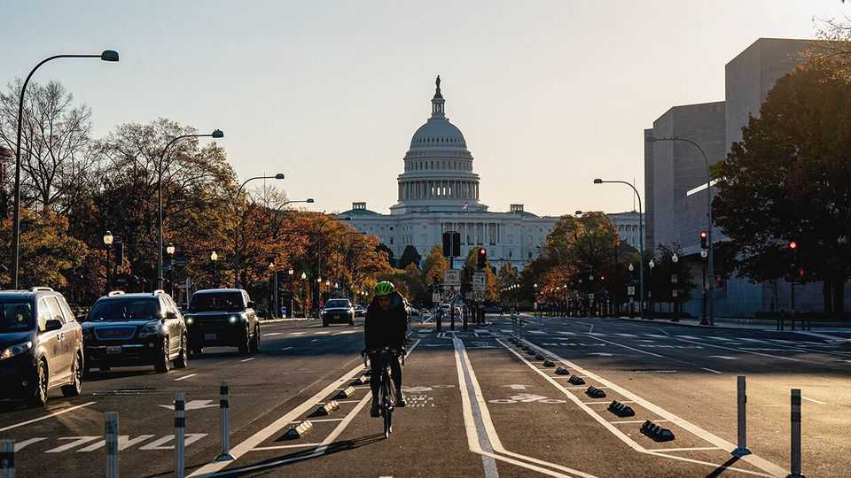
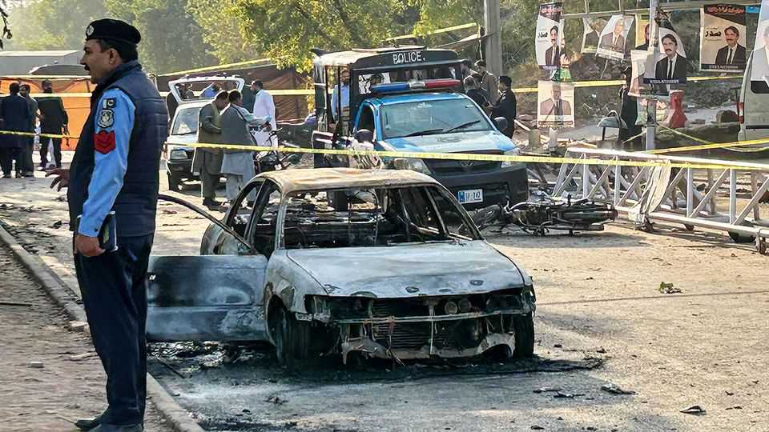

The world this week
Politics
November 13th 2025

America’s Congress passed legislation to end the government shutdown, the longest on record. Several Democrats voted with Republicans to break the impasse, though the deal does nothing to tackle the Democrats’ main concern about the forthcoming expiry of health-insurance tax credits; a separate vote has been promised on that issue. Some left-wingers mumbled that Chuck Schumer should resign as the party’s leader in the Senate. Federal workers who were on furlough returned to work; they will receive back pay. The USS Gerald R. Ford, the world’s largest warship, arrived in Latin American waters, part of a military deployment in the region ordered by Donald Trump to fight drug-smuggling at sea. Tensions are high. Speculation is rife in Venezuela that America will invade the country and topple Nicolás Maduro from the presidency. Colombia’s president, Gustavo

Petro, has ordered his intelligence services not to share information with the United States.

Fighting between rival gang members at a prison in Ecuador killed at least 31 inmates. Most of them had been hanged. The prison service said the trouble started when the convicts resisted being transferred to a new maximum-security prison, a facility which Daniel Noboa, the president, says will break the gangs’ network. At least 300 criminals were recently sent to the new penitentiary.

COP30, the UN conference on climate change, opened in Belém, in northern Brazil. The two-week summit will take place without the United States; Mr Trump withdrew his country from the gathering.

The director-general of the BBC, Britain’s public broadcaster, quit, following revelations that it had run a programme that stitched together two separate parts of Donald Trump’s speech on January 6th 2021 to create an untrue impression of his remarks ahead of the storming of the Capitol in Washington. The programme was broadcast in October 2024 and produced by an independent company. The BBC’s head of news also resigned. The organisation’s critics have long claimed it has a left-wing bias, pointing to a litany of complaints about its reporting, such as on Gaza. Mr Trump has threatened to sue.

Ahmed al-Sharaa, Syria’s leader, visited the White House. After a meeting with Mr Trump it was announced that Syria would join the American-led coalition against Islamic State, a jihadist group still present in Syria. To boost reconstruction, Mr Trump also said that he would suspend some sanctions that have been imposed on the country under the Caesar Act for six months.

In Iraq Muhammad Shia al-Sudani, the prime minister, secured another term in office following a parliamentary election that was won by the coalition he leads. Turnout was a little over 56%.

Jihadists in Mali executed a young social-media influencer who supported the country’s junta. They also claimed to have killed 48 soldiers and wounded dozens more in an attack, though the army did not confirm the

death toll. Conditions in Mali have deteriorated sharply since September, when the jihadists began stopping lorries from delivering fuel. For weeks schools have been shut and business has been disrupted, including in Bamako, the capital.

A car explosion near the historic Red Fort in Delhi, India’s capital, killed at least eight people and was being investigated as an act of terrorism. The Indian press reported that the possible suspect was probably linked to a group of plotters arrested near Delhi earlier in the day, who were found with large quantities of explosives. Narendra Modi, the prime minister, said that “The conspirators behind this will not be spared.”

A suicide-bomber killed 12 people in Islamabad, the first attack on civilians in Pakistan’s capital in a decade. The government blamed the Pakistani Taliban that operates from Afghanistan and said the terrorists were supported by India, a claim that India’s foreign ministry described as baseless. Militants also attacked a military school in north-west Pakistan. “We are in a state of war,” said the defence minister. The Taliban government in Kabul denies that the Pakistan Taliban launches attacks from Afghan territory.

China lodged a formal protest after Japan’s new prime minister, Takaichi Sanae, suggested that any attack by China on Taiwan threatened Japan’s survival and would warrant a military response. Chinese state media described her as a “troublemaker”. China’s consul in Osaka suggested Ms Takaichi’s head should be cut off in a social-media post that was later deleted.

Four Thai soldiers were injured by a landmine while patrolling the border with Cambodia, causing Thailand to suspend the recently signed deal to cease hostilities that have flared up this year. Anutin Charnvirakul, the Thai prime minister, said the incident demonstrated that Cambodia is a continuing security threat. Cambodia denies laying fresh mines. A later skirmish between Thai and Cambodian troops near a disputed village killed one person.

Thailand’s King Maha Vajiralongkorn made a state visit to China to mark 50 years of diplomatic relations. Thailand is an American ally, but the king’s visit underscores what the Thai government describes as a “deep-rooted friendship and mutual understanding” with China.

Nicolas Sarkozy was released from the prison where he was sent immediately after receiving a five-year sentence for conspiring to fund an election campaign with illicit money from Libya. The former French president’s lawyers had requested his release pending his appeal against the verdict. He is subject to strict supervision ahead of that appeal.

Hungary’s populist-right prime minister, Viktor Orban, visited the White House, where he secured an opt-out from America’s sanctions on Russian oil. Hungary relies heavily on Russian energy imports. In order to secure the opt-out, Mr Orban agreed to buy more American liquefied natural gas.

Turkish prosecutors said they would seek a prison sentence of up to 2,352 years for Ekrem Imamoglu, the mayor of Istanbul, who is in detention ahead of his trial for alleged corruption. His supporters say the charges are politically motivated. Mr Imamoglu is the main rival to Recep Tayyip Erdogan, Turkey’s president. His arrest in March triggered protests and a fall in the stockmarket. Separately, 20 Turkish troops were killed when their transport plane crashed in Georgia.

This article was downloaded by zlibrary from [https://www.economist.com//the-world-this-week/2025/11/13/politics](https://www.economist.com//the-world-this-week/2025/11/13/politics)