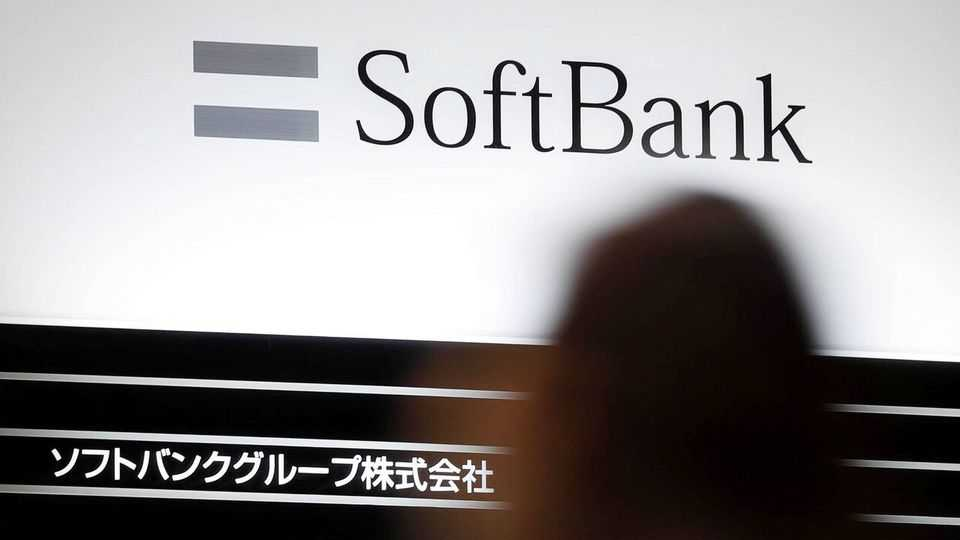
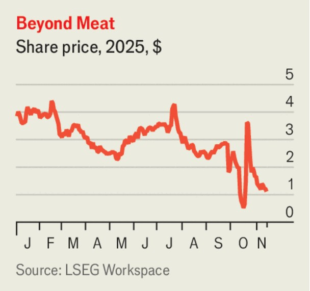

The world this week
Business
November 13th 2025

SoftBank sold its entire stake in Nvidia for $5.8bn. It will use the money to help fund its other AI investments, which include the Stargate project and a possible $1trn AI and robotics hub in Arizona. Its investment in OpenAI, which is a partner in Stargate, is $30bn alone. The Japanese tech conglomerate made net income of ¥2.5trn ($16.2bn) in the latest quarter, double its profit from the same period last year, in part because of investment gains at its Vision Funds. SoftBank also announced a four-for- one stock split starting in January that it hopes will make its shares more accessible to investors. SoftBank’s share price fell on the news it was cashing out of Nvidia, underlining investors’ skittishness about the uncertainty of the huge bets being placed on AI. Tech stocks tumbled recently after several companies announced big increases in their AI spending. The NASDAQ Composite fell

by 3% over a week, though it has since bounced back. Confounding the sceptics, AMD’s stock surged after it forecast bumper sales for its AI chips.

Tesla’s share price struggled to recover from the tumble it took after Elon Musk’s $1trn pay package was approved by the carmaker’s shareholders. Mr Musk will obtain the $1trn reward only if Tesla hits a series of highly ambitious financial and sales goals, including in its development of AI. Mr Musk came onto the stage at the shareholders’ meeting accompanied by dancing robots.

Britain’s economy grew by a tepid 1.3% in the third quarter, year on year, and by just 0.1% compared with the second quarter. Separate data showed the unemployment rate had risen to 5%, the highest since late 2020 and early 2021, amid the pandemic. The figures complicate the economic picture for the government as it considers a tax-raising budget on November 26th.

Britain’s weak job figures helped propel the FTSE 100 share-price index to a record high, as investors bet that the Bank of England was now all but certain to cut interest rates at its meeting in December.

Foxconn’s revenues from making AI servers and data-centre equipment surpassed revenues from its consumer-electronics business, such as assembling the iPhone, for the second quarter in a row. The company said it would soon announce a deal with OpenAI.

Lukoil, a big Russian oil company, was thrown into crisis after its proposal to sell its international assets to Gunvor, a commodities-trading group, was blocked by America. Lukoil has been forced to sell its holdings because of America’s sanctions on Russian energy, which come into force on November 21st. The US Treasury said it would not grant a licence to Gunvor to use the assets, describing it as “the Kremlin’s puppet” in a social-media post. Gunvor said the statement was “fundamentally misinformed and false”. Lukoil now has to find another buyer, or write off the assets.

The Trump administration stepped up its effort to scrap the Consumer Financial Protection Bureau, an independent government agency, by deciding that the way it is funded is illegal. The CFPB gets its funding from the Federal Reserve, and says it has enough money to continue operating

until at least the end of the year. The agency has been hated by conservatives ever since its launch in 2011 under the Dodd-Frank Act.

Paramount published its first earnings since being taken over by Skydance Media and reported a big rise in revenues from streaming. It is increasing the subscription cost in America for Paramount+ from January. Paramount Skydance, as it is formally known, also increased its estimate of cost savings (ie, lay-offs) from the merger from $2bn to $3bn.

Underlining the intense competition in the market for weight-loss drugs, Pfizer won a bidding war for Metsera, a biotech firm specialising in obesity treatments, with a deal worth up to $10bn. Pfizer had to increase its offer when Novo Nordisk submitted a rival proposal in late October. The process even went to court, when Pfizer tried to get a judge to block Novo’s proposal (the judge rejected the lawsuit). Metsera described Pfizer’s litigation as “nonsense”, but it ultimately accepted Pfizer’s deal because Novo’s plan risked an antitrust challenge.

Beyond Meat reported another quarterly net loss and produced a sales forecast that came in under analysts’ expectations. The maker of plant-based meat was the darling of Wall Street in 2019 when its share price surged to almost $240, before the pandemic and rising cost of living caused consumers

to spurn its pricey grub. Though the share price has since slumped it has lately become something of a meme stock, rising by nearly 600% over three days in October.

This article was downloaded by zlibrary from [https://www.economist.com//the-world-this-week/2025/11/13/business](https://www.economist.com//the-world-this-week/2025/11/13/business)