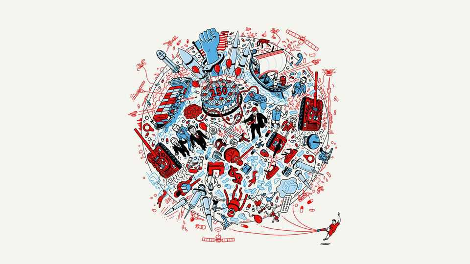

The World Ahead
The World Ahead 2026
Future-gazing analysis, predictions and speculation
November 13th 2025

EVERY NOVEMBER we publish our annual predictive guide to the coming year, The World Ahead. In this year’s edition, our correspondents and invited experts consider the uncertain global outlook in geopolitics, economics, technology and culture; analyse how Donald Trump’s reshaping of global norms means problems for Europe and opportunities for China; and look forward to space missions, video games and improved weight-loss drugs. See the full edition. This article was downloaded by zlibrary from https://www.economist.com//the-world-ahead/2025/11/13/the-world-ahead-2026

Leaders

How markets could topple the global economy The hidden risks in Taiwan’s boom How the exasperating, indispensable BBC must change Mexico’s surprising record on murder How to avoid Africa’s next war