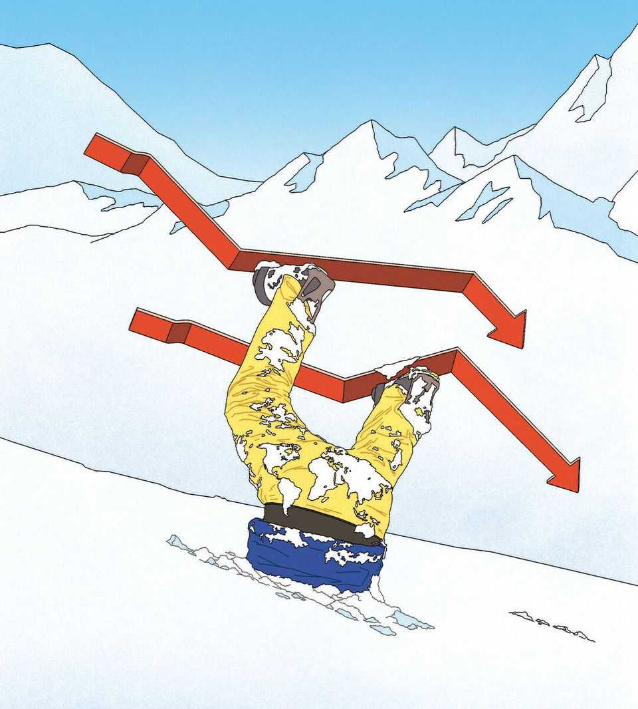

Leaders | Artificial-intelligence test
How markets could topple the global economy
If the AI bubble bursts, an unusual recession could follow
November 13th 2025

IF AMERICA’S stockmarket crashes, it will be one of the most predicted financial implosions in history. Everyone from bank bosses to the IMF has warned about the stratospheric valuations of America’s tech companies. Central bankers are bracing for financial trouble; investors who made their names betting against subprime mortgage bonds in 2007-09 have resurfaced for another “big short”. At any sign of a wobble, such as a recent slight weekly fall in the NASDAQ index of tech stocks, speculation mounts that the market is on the precipice. And no wonder. The cyclically adjusted price-earnings ratio of the S&P 500 index of stocks, propelled by the “magnificent seven” tech giants, has reached levels last seen during the dotcom boom. Investors are betting that the vast spending on artificial intelligence (ai) will pay off. Yet the numbers

are daunting. For companies to achieve a 10% return on the AI capex projected by 2030, they will collectively need $650bn of annual AI revenues —equivalent to over $400 per year from every iPhone user, reckons JPMorgan Chase, a bank. History shows such lofty expectations are often disappointed, at first, by new technologies, even if they go on to change the world.

Yet although a market crash would surprise almost nobody, few have thought about its consequences. That is partly because the chances of a big fall in stockmarkets bringing about a broad financial crisis are, for now, slim. Unlike in the late 2000s, when widespread leverage and complex financial engineering helped cause a debt-fuelled bubble in subprime housing, today’s AI euphoria has been mostly equity-financed. What is more, the real economy has shown in recent years that it can weather shocks, from Europe’s energy crisis to American tariffs, remarkably well. Recessions are increasingly rare events.

Still, it would be a mistake to think that the effect of big stockmarket losses would stop at the wallets of investors. The longer the boom goes on, the more opaque its financing becomes. And even without financial Armageddon, a dramatic stockmarket fall might at last topple a hitherto resilient world economy into a downturn.

The root of the vulnerability is the American consumer. Stocks account for 21% of the country’s household wealth—about a quarter as much again as at the height of the dotcom boom. Assets related to AI are responsible for nearly half the increase in Americans’ wealth over the past year. As households have become wealthier, they have grown comfortable saving less than they did before the covid-19 pandemic (albeit not as little as during the subprime boom).

A crash would put these trends into reverse. We calculate that a fall in stocks comparable to the dotcom bust would reduce American households’ net worth by 8%. That could cause a big retrenchment in consumer spending. By one rule of thumb, the pullback would amount to 1.6% of GDP—enough to push America, where the labour market is already suffering, into a recession. The effect on the consumer would dwarf what is likely from any

drying up of AI investment, much of which goes on chips imported from Taiwan.

The shock, and weaker American demand, would spill over to low-growth Europe and deflationary China, compounding the blow to exporters from President Donald Trump’s tariffs. And because foreigners have $18trn-worth of exposure to American stocks, there would be a mini-wealth effect globally.

The good news is that a global recession with its roots in the equity markets need not be deep—just as the downturn that followed the dotcom crash was shallow, and avoided by many big economies. Importantly, the Federal Reserve has enough room to lower interest rates to boost demand, and some countries would respond with fiscal stimulus. Yet a downturn would expose vulnerabilities in today’s economic and geopolitical landscape by further weakening America’s hegemony, undermining government budgets and worsening protectionist instincts.

Without the AI boom, the American economy would be left looking as it did in the spring: threatened by tariffs, beleaguered institutions and increasingly fractious politics (as we published this, America’s longest-ever government shutdown was only just coming to an end). In a recession America would usually be a haven. But in these circumstances—and with America taking the worst growth downgrade—a rush to the dollar, which is down by 8% this year, would not be assured. Although a weaker dollar would be a blessing for the rest of the world, for which a pricier greenback tightens financial conditions, it would strengthen the idea that American exceptionalism is not what it was. The risk to the dollar would be especially great given that 2026 could bring far greater political influence over the Federal Reserve, as our annual supplement, The World Ahead 2026, explains.

A recession would also put indebted governments everywhere to a stern fiscal test. Central banks would cut interest rates, easing the costs of servicing the rich world’s enormous debt pile, which is worth 110% of its GDP. But deficits would widen, too, as welfare spending rose and tax receipts fell. In the most vulnerable economies, fiscal fears might cause long-term bond yields to stay put or even rise as central banks cut short-term rates—a dynamic that has occasionally been on display over the past two

years. It is hard to imagine markets affording France or Britain, say, much space for stimulus.

The final consequence would be for trade. Americans spending less would almost certainly reduce the trade deficit, which would please Mr Trump. With markets in a bad way, the White House would also be less belligerent on trade. But the other global-trade flashpoint—China’s surplus in manufactured goods—would worsen. Already, European and Asian producers must compete with a glut of Chinese goods, which is growing as China exports less to America. A slowdown in America would cause that glut to swell further, sharpening the protectionist backlash. The world may be predicting an American stockmarket crash. That does not mean it is prepared for the consequences. ■

For subscribers only: to see how we design each week’s cover, sign up to our weekly Cover Story newsletter.

This article was downloaded by zlibrary from https://www.economist.com//leaders/2025/11/13/how-markets-could-topple-the-global- economy