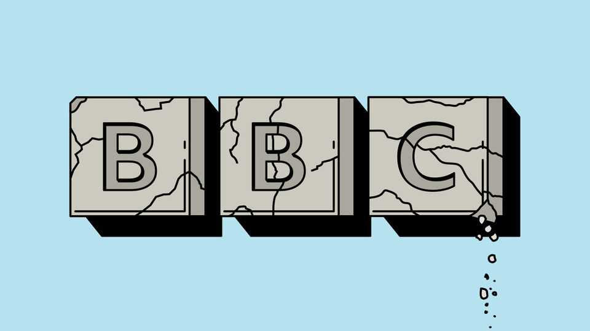

Leaders | Do adjust your sets
How the exasperating, indispensable BBC must change
Its latest crisis needs to spur reforms to bolster its news division
November 13th 2025

Most of Donald Trump’s broadsides against the news media are ridiculous. But his anger over a BBC documentary about him that aired last year is justified. An episode of “Panorama”, a venerable current-affairs show, spliced together two unrelated remarks by Mr Trump to create what looked like a call for violence on January 6th 2021. It was an egregious case of what America’s president likes to call “fake news”. The stitch-up of Mr Trump follows a string of editorial missteps. In February a BBC documentary about Gaza neglected to mention that the 13-year-old narrator’s father was a Hamas official. In June it broadcast a live music performance featuring calls for the deaths of Israeli soldiers. The BBC’s

boss, Tim Davie, was right to quit this week—but that may not be the end of it. Mr Trump says he will sue for $1bn, though he has less leverage over the BBC than he did over American broadcasters he has previously shaken down. The BBC’s critics at home have renewed calls to gut it.

Their central accusation is one of bias. The BBC’s journalism is far from “corrupt”, as Mr Trump claims, and it makes a better stab at political balance than many European public-service broadcasters. But there is some truth to the accusation of a cultural slant. Age and region have replaced social class as the main political divides in Britain, making it harder than ever for a young, London-based organisation to reflect the country’s attitudes. Surveys show that right-wing Britons are less happy with the BBC than centrists and left-wingers. Since everyone has to pay for the BBC, that disparity is a problem.

Yet much of the criticism is led by people whose preferred solution would be to get rid of the BBC altogether. That would be a terrible mistake. The BBC is one of the world’s biggest sources of original reporting. As newspapers wither and television is swallowed by streamers like Netflix that don’t do news, a future with a smaller or non-existent BBC News would be one in which less was known about the world. The BBC provides what America sorely lacks: a central repository for fact. It also plays an outsize role in debunking fake news with services like Verify—work that has seldom been more necessary.

The BBC has even greater value abroad, where it is a source of soft power for Britain and a standard-bearer of liberal values more broadly. The Trump administration has foolishly tried to silence Voice of America and cut aid to foreign news outlets—just as China, Russia and others pour resources into spreading their authoritarian ideas around the world. On Facebook the five most-followed news pages are run by Chinese outlets, pushing their version of the news in English. The BBC’s page is sixth. Cutting back now would be an act of self-harm.

That is why the BBC should be reimagined to focus on the vital public- service output that the market does not provide. In the streaming age, audiences are spoilt for choice when it comes to entertainment, so it is absurd that Britons are forced to pay for BBC shows such as “Strictly Come

Dancing”. Better to turn its entertainment arm into an opt-in service and bolster its news operation with stable, arm’s-length public funding, whether from a licence fee or general taxation.

A more sharply focused BBC would be better equipped to navigate a media landscape evolving at dizzying speed. The corporation has been slowed down by bureaucratic inertia and a cumbersome governance structure. A shake-up might usefully include replacing its warring top brass with people who are interested in improving the BBC’s coverage, rather than merely defending or sabotaging it. A strong BBC is good for Britain and the world. A clumsy one will become a liability. ■

Subscribers to The Economist can sign up to our Opinion newsletter, which brings together the best of our leaders, columns, guest essays and reader correspondence.

This article was downloaded by zlibrary from https://www.economist.com//leaders/2025/11/12/how-the-exasperating-indispensable- bbc-must-change