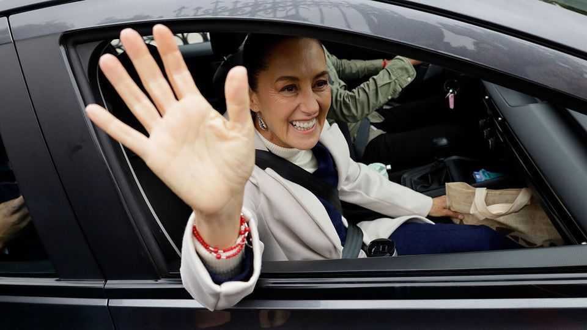

Leaders | Taking on the gangs
Mexico’s surprising record on murder
Claudia Sheinbaum’s security strategy is working. She has a mountain to climb
November 13th 2025

Donald Trump’s war on drug gangs has so far consisted mostly of blowing up small boats off Venezuela and Colombia. At least 76 people have been killed in strikes that are almost certainly illegal. The Pentagon claims that the vessels it destroys are carrying drugs to the United States. The world’s largest warship, the USS Gerald R. Ford, has just arrived in the Caribbean to join the fray (and to heap pressure on the dictatorial regime of Nicolás Maduro in Venezuela). It should worry Mexico that its northern neighbour wields deadly force so freely against alleged drug-traffickers. For years now the country has been overrun by some of the most powerful drug gangs on the planet. They, not

gangsters in Venezuela or Colombia, are the true source of the fentanyl that claims some 50,000 American lives every year—the drug problem about which Mr Trump is most exercised.

Moreover, Mr Trump’s government cares little for any distinctions between gangsters and the governments which allow them to operate within their territory, whether through collusion or incompetence. The United States labels Mr Maduro a “narco-terrorist” and sends its most powerful military assets to his shores. Mexico’s politics are riddled with drug money and mobsters, too. Mr Trump could unleash violence against the real threat on his doorstep at any moment. That would destabilise Mexico’s politics and its vital trading relationship with the United States, already assailed by Mr Trump’s tariffs.

Claudia Sheinbaum, Mexico’s president, understands that allowing extensive drug-trafficking operations to continue in her country exposes Mexico to significant peril. She also wants to stop gangs murdering around 30,000 Mexicans each year. A secure Mexico matters for its own people, for North American integration and prosperity, and to keep Mr Trump at bay. Throughout her campaign and presidency, security has been the issue that Ms Sheinbaum has emphasised most.

So Mexicans will welcome the good news. Since taking office in October 2024 Ms Sheinbaum’s government claims to have cut murders by 32%. That figure overstates the improvement, but our analysis suggests that the underlying trend is real. Arrests are up, as are seizures of weapons and drugs. The amount of fentanyl seized at the United States border is way down (although it is hard to say whether that represents a genuine reduction, or merely gangsters finding new smuggling methods). Ms Sheinbaum is the first Mexican leader in years to curb the power of the gangs.

And yet this is merely a good start on a gargantuan problem, the solving of which will run long beyond her term in office. To push the gangs back further, and fend off Mr Trump, Ms Sheinbaum must spend more on security and criminal justice. Her government spends less than 1% of GDP on them, and its plan for 2026 cuts the security ministry’s budget by 18%. That is indefensible when gangsters run much of the country.

Her government should also be more honest about the situation it faces. It has made genuine progress against gangs and the violence they perpetuate. Trumpeting cherry-picked statistics is unnecessary and damages long-run credibility.

Most difficult of all, Ms Sheinbaum must confront Mexico’s rotten politics. She has yet to investigate powerful politicians—many of them in her own party—who are credibly accused of links to criminal groups. Unless the political-criminal nexus is broken, any reduction in violence cannot last.

Mexico has plenty of other problems: creaking energy infrastructure, flaccid economic growth and a large fiscal deficit. But without consistent improvements in security, and confidence that such improvements will continue, making Mexico a better place to live and invest will be all but impossible. And if Ms Sheinbaum cannot convincingly curb Mexico’s gangs, Mr Trump may attempt to do it for her. ■

Subscribers to The Economist can sign up to our Opinion newsletter, which brings together the best of our leaders, columns, guest essays and reader correspondence.

This article was downloaded by zlibrary from [https://www.economist.com//leaders/2025/11/13/mexicos-surprising-record-on-murder](https://www.economist.com//leaders/2025/11/13/mexicos-surprising-record-on-murder)