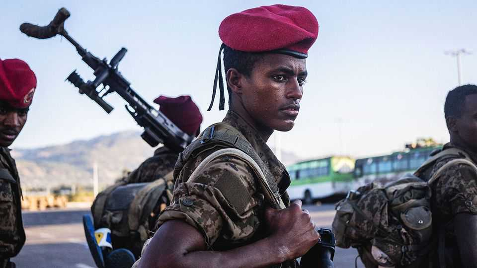

Leaders | The Horn of Africa
How to avoid Africa’s next war
Pressure from America and its allies can prevent a return to fighting
November 13th 2025

Three years ago one of the deadliest conflicts of the 21st century ended when Ethiopia’s government struck a peace deal with the Tigray People’s Liberation Front (TPLF), the ruling party of the country’s northernmost region. Hundreds of thousands may have died in the brutal war that preceded the deal. Now it is unravelling. Abiy Ahmed, Ethiopia’s autocratic leader, is ignoring it and many in the TPLF and Tigray’s armed forces sound ready to return to the battlefield. Ominously, skirmishes are breaking out on the region’s southern border. Ethiopia’s army has responded with drone strikes. On November 7th the TPLF accused the government of a “strategy of extermination”.

Another war in Tigray would be a catastrophe—and not just for Tigrayans and other Ethiopians. It would intensify and expand the sprawling, multi- country conflict zone that now covers much of the Horn of Africa, creating what may be the largest area of violence and anarchy in the world. A feature of this conflict is the role of outside powers, including some Gulf states, which exert influence over their proxies. The best chance for de-escalation lies with America and these outside powers, who must push their allies to stop fighting and start talking again.

Ethiopia is home to 130m people and is among Africa’s most fissiparous and fragile states. Bloody insurgencies have raged across the multi-ethnic federation since Mr Abiy took office in 2018. Renewed fighting in Tigray would spill across Ethiopia’s borders. It could draw in Eritrea, a gulag state to the north run by a long-serving dictator, Isaias Afwerki. Mr Abiy struck a peace deal with Eritrea in 2018, winning a Nobel peace prize in the process. But relations have deteriorated. Mr Abiy wants to grab access to the Red Sea, which Ethiopia lost when Eritrea seceded from it in 1993. Many now fear a new war over Eritrea’s ports, and perhaps even over Eritrea’s independence. It is possible Eritrean troops might fight alongside the TPLF. Meanwhile Sudan, stretching alongside Ethiopia, Tigray and Eritrea, is gripped by its own savage civil war. The danger is that all these conflicts merge into a regional war, with fighters and flows of arms and refugees mixing.

It is not too late to prevent this scenario—if powerful outsiders use their clout. Mr Abiy counts the United Arab Emirates (UAE) as his most prized patron. Last year Eritrea signed a security pact with Egypt. This year it has been busily trying to bolster ties with Saudi Arabia. America has influence both indirectly through its Gulf allies, and through its relationships with Mr Abiy and Mr Isaias, both of whom want warmer bilateral ties with the superpower. Encouragingly, American diplomats have been pushing for restraint, in contrast to 2020, when America implicitly gave a green light to Ethiopia’s war on Tigray. In a visit to Ethiopia in September, Massad Boulos, President Donald Trump’s Africa adviser, discouraged Mr Abiy from pursuing sea access by force. America has also threatened sanctions on several Tigrayan officials, whom it fears are warmongering.

America, Egypt, Saudi Arabia and the UAE must push Ethiopia and Tigray to avoid war and honour the peace agreement of 2022. Mr Trump has shown a willingness to try to defuse conflicts, brokering a truce in June over eastern Congo and last month underwriting a deal between Cambodia and Thailand. Both are imperfect and fragile, but better than nothing. Mr Trump makes no secret of his desire to follow in Mr Abiy’s footsteps and bag a Nobel prize. Both men should remember it is easier to stop a war from starting than it is to end one. ■

Subscribers to The Economist can sign up to our Opinion newsletter, which brings together the best of our leaders, columns, guest essays and reader correspondence.

This article was downloaded by zlibrary from [https://www.economist.com//leaders/2025/11/13/how-to-avoid-africas-next-war](https://www.economist.com//leaders/2025/11/13/how-to-avoid-africas-next-war)

Letters

How dangerous is life in Syria?