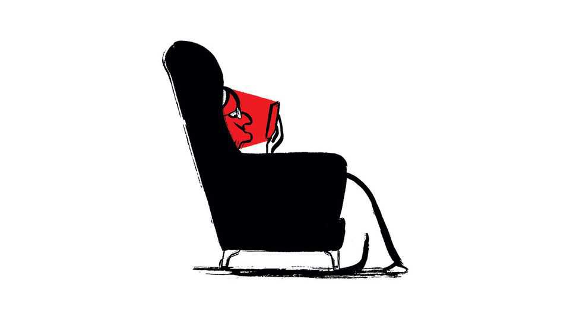

Letters | A selection of correspondence
How dangerous is life in Syria?
Also this week, Silicon Valley, victimhood, aid to Africa, the elderly and smartphones, political power
November 13th 2025

Letters are welcome via email to letters@economist.comFind out more about how we process your letter “Know your limits” (November 1st) reflected on the complex geopolitics at play and the uncertainties in post-Assad Syria. The country “remains a potential minefield” you said. Indeed. Syria has quietly become the most dangerous country in the world when it comes to landmines. According to the Landmine Monitor, Syria is carpeted with landmines, cluster munitions and other deadly ordnance. The UN estimates that a third of Syrians now live amid some form of explosive contamination. The highest levels are in governorates such as Aleppo, Idlib, Ar-Raqqa and Deir-ez-Zor.

As millions of refugees and internally displaced people return to their homes the risk of accidents from the debris of war is rising sharply. More than 1,400 Syrians have been killed or injured since the fall of Bashar al-Assad, including 155 children. In recent months our emergency hotlines in affected areas have received ten times as many calls as before, as over a million people attempt to rebuild lives in mine-strewn communities.

Yet despite the scale of the danger, international funding for clearance and risk education in Syria remains a fraction of that provided to higher-profile conflicts. Until donors recognise that this hidden war continues long after the bombs stop falling, Syria’s reconstruction will remain perilous and its potential impaired.

James DenselowDirector of strategyHALO TrustWashington, DC

I read your article on the attempts by Jensen Huang, the chief executive of Nvidia, at cosying up to the Trump administration in order to persuade it to reopen Chinese markets (“Serving chips”, November 1st). This is despite Silicon Valley’s self-proclaimed importance about its independence from Washington.

It’s a stark contrast to Bill Gurley’s sermon from 2023, “2,851 Miles”. The renowned venture-capitalist named his presentation after the precise mileage between Sand Hill Road in Silicon Valley and Washington, arguing that the long distance from the capital was a big factor behind the legacy of innovation and maverick ambition of the VC class. Oh how times have changed.

Jack LaughlinBoston

Bagehot’s critique of the obsession with victims in British policymaking made important points about how poor decisions are made by elevating the experience of victims above all else (November 1st). The column mentioned the furore when four victims of the grooming-gangs scandal resigned from the inquiry looking into the crimes, because they thought it was being “watered down” from its original purpose of focusing solely on the gangs.

Those four victims wanted a government minister to resign, causing other victims to come to the minister’s defence. “It took a victim to stop a victim,” remarked Bagehot.

The concerns raised about the scope of the inquiry were not mere victimhood politics, but rather a warning about institutional failure. Sometimes victims speak up because they recognise the same patterns of evasion they experienced before. Such concerns can’t be categorised as the “idolatry” of victims. Sometimes victims have to be listened to. Otherwise we risk creating exactly what Bagehot warns against: more victims of state failure.

Craig FergusonVancouver

For a newspaper that champions consumer sovereignty, the experience of victims should be seen as valuable customer feedback. Far from dominating public discourse, their insights are only beginning to be valued as the key to improving our public and private institutions. Prompt service, fair hearings and efficient processes mean fewer victims in future.

Julia MargoDeputy chief executiveFair HearingLondon

Your leader urging America to do more for Africa quoted George W. Bush when he launched his AIDS initiative in 2003: “Seldom has history offered a greater opportunity to do so much for so many” (“America First need not be Africa last”, November 1st). It might just as truthfully be stated that “Never have so few squandered such largesse for so many.”

In 2025 few leaders of African countries vocally support the United States at the UN, and many of those who do are conditional in their support. A fundamental ethical axiom common to global morality is reciprocity, or do to others what they would do to you. It is thus both immoral and strategically naive to act against countries like America that provide aid, because they may stop providing it.

It is to be regretted that aid to Africa has been reduced by the Trump administration, but the fact remains that Africa is as steadfastly against America as it was before the cuts, indicating that the aid was of no strategic

benefit to the United States anyway. African countries stubbornly continue to show open support for America’s rivals. South Africa, for example, recently provided facilities at Cape Town for a Russian warship.

The question needs to be asked. Is America to be blamed for reducing aid in the face of such protracted African hostility? I think for many morally and strategically oriented people the answer is clearly no.

Professor David ColdwellUniversity of the WitwatersrandJohannesburg

Several African governments have moved swiftly to mitigate the shock from America’s cuts to aid, especially in health. In Nigeria a national transition plan for USAID-funded programmes has been launched and $200m added to the health budget. Kenya has created emergency domestic-financing lines to sustain HIV and community-health services after the American freeze. Ghana mobilised revenue and health levies to bridge a USAID funding gap. Rwanda expanded national-insurance funding to preserve HIV coverage following PEPFAR cuts. South Africa earmarked an additional $1.5bn for health spending in its 2025 budget. Meanwhile, Malawi, Mozambique, Uganda and Zambia reoriented service delivery and issued mitigation measures immediately to ensure continuity of care for HIV/AIDS, tuberculosis and malaria.

Under international law governments have a duty to respect, protect and fulfil the right to health of their citizens. Recognising these domestic responses presents a more balanced and accurate picture of Africa’s evolving health-sovereignty landscape, defined by growing political resolve and accountability.

Haileyesus GetahunChief executiveHealth Development Partnership for Africa and the CaribbeanKigali, Rwanda

You captured the enduring tension between the Democratic city of St Louis and the Republican state government in Missouri (”Why rot the sheriff?”, November 8th). But you also repeated a familiar, and damaging, mischaracterisation. The piece stated that St Louis had the highest murder rate of any city in America until recently and cited weak academic

proficiency in the city’s schools. Those figures are technically accurate, yet they rest on a misleading foundation.

Unlike nearly every other big American city, St Louis is independent of its county. Its official crime and education statistics therefore cover only the dense urban core, about 65 square miles and 300,000 residents, whereas places such as Kansas City or Chicago report over far larger areas that include extensive suburban zones. The result is that St Louis appears dramatically worse on a per-head comparison, even though its metropolitan crime rate is broadly similar to other Midwestern metros such as Kansas City, Cleveland, or Memphis.This nuance may seem technical, but it matters. Persistent misstatements reinforce an image of a city defined by danger and decline, rather than by the realities of its economy, universities and cultural life. That reputation affects our ability to attract visitors, conventions, students to institutions such as Washington University in St Louis, and the talent our employers need.Patrick DrakeSt Louis, Missouri

Regarding your report on elderly people becoming “The new screen addicts” (October 25th), we have conducted research into developing smartphones for older consumers that are simple to use and designed with impairments in mind. As we explored what the elderly might need we expected that the most popular apps they would want pre-downloaded on their devices would

be practical, things like Google maps, transport information, a clock, weather forecasts and so on.

However, the most requested apps were social, such as TikTok and Facebook. This was also the case when we spoke to residents in assisted- living apartments. For example, one lady talked me through, in detail, her favourite pastor’s TikTok account. We’re all a bit more alike than we like to think.

BERTIE ASPINALLManaging directorChatsie and SafetyModeLondon

I have attempted to read the print edition of The Economist every week since the early 1970s, but the immediacy of the little screen has gobbled up those short periods of time when I would read a few more articles, either at a bus stop (I view an app for bus times) or in a doctor’s waiting room (I consult an app for appointments) or a car-repair shop (which messages me when the car is ready). So it is IT efficiencies that have changed my screen habits rather than the availability of entertainment. I no longer buy any other print journals, but still read The Economist first thing in the morning and last thing at night when screens are switched off, and on occasional train journeys or flights. Despite your digital offers, it’s one traditional habit I will not drop.

GED PARKERWashington, Tyne and Wear

You observed how some political scammers in China are so well connected that they “wield genuine political clout” (“Cheating the chiefs”, October 18th). I am reminded of Varys, from “Game of Thrones”, who remarked that “Power resides where men believe it resides. It’s a trick, a shadow on the wall, and a very small man can cast a very large shadow.”

Anders JohnsonLos Gatos, California

This article was downloaded by zlibrary from [https://www.economist.com//letters/2025/11/13/how-dangerous-is-life-in-syria](https://www.economist.com//letters/2025/11/13/how-dangerous-is-life-in-syria)

By Invitation

A human-rights researcher on why she pushed back when China bullied her university