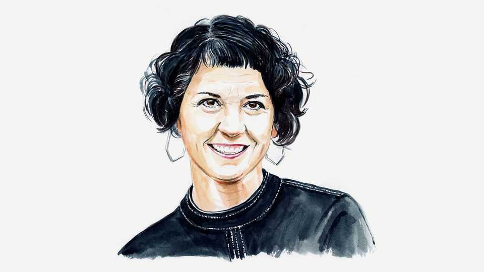

By Invitation | University challenge
A human-rights researcher on why she pushed back when China bullied her university
Democratic governments must resist authoritarian states trying to co-opt their institutions, writes Laura Murphy
November 13th 2025

In august last year a senior colleague informed me that the university where I work, Sheffield Hallam University (shu), would not publish my team’s research exposing Uyghur forced labour in the critical-minerals sector in China. I was also told that, if necessary, shu was prepared to take the highly unusual step of voluntarily returning hundreds of thousands of pounds in grant funding rather than have future projects bear the imprimatur of the Helena Kennedy Centre (hkc), the university’s human-rights research institute for which I had been working since 2019.

What could possibly induce a university to make such a surprising decision, especially one that had spent years standing up to harassment from Chinese authorities for its research on Uyghur forced labour, and whose own chancellor had been hit with sanctions by the Chinese government for her criticism of rights abuses in China?

It took a freedom-of-information request for me to find out. Last month I learned that only weeks before I received that call, Chinese security-service agents had visited the university’s student-recruitment office in Beijing and “confirmed that access to shu.ac.uk [the university website] is restricted [within China] due to the hkc research papers being available through the website”. The agents had told the university’s student-recruitment officer that they wanted her to share with them the details of upcoming conversations with shu colleagues in Britain. This was, an administrator noted, “an instruction, not a request”.

There had also been a similar visit in April 2024. A shu internal document reported: “The tone was threatening and the message to cease the research activity was clear.”

The research in question was a series of reports my team had published documenting the systematic use of forced labour in the Uyghur region of China (known in China as the Xinjiang Uyghur Autonomous Region). Government-imposed forced labour affects at least a fifth of the Uyghur and Kazakh population in the region, making it probably the largest system of state-imposed forced labour the world has seen since the Holocaust. The Chinese government and Chinese companies had for years tried to stop my team from publicising the resulting risk to the integrity of international supply chains—including for solar modules, clothing, cars, electronics, chemicals and, not inconsequentially, critical minerals.

I knew that these interrogations had taken place and that the university had legitimate concerns about the safety of colleagues in Beijing. I had also been informed that our insurer would no longer cover social-science research at the university for defamation because of the risk our research posed. However, in internal briefing notes and emails circulated during that crucial decision-making period, the administrators considered the security of the staff member only briefly. They considered the insurance not at all. The

documents don’t reveal any serious contemplation of my academic freedom or personal security and only rarely mention the security of our Uyghur team members, despite the fact that these interrogations apparently involved questions regarding me specifically, my secondment as a policy adviser to the us Department of Homeland Security and the status of my team’s research.

What the university’s administrators did consider extensively and explicitly was the Chinese-student market. Their concerns included the inability to communicate with prospective students, the pending renewal of the shu China-office licence and the risk that Chinese students might boycott the university, or that China’s education ministry could dissuade students from attending, or that China could refuse recognition of shu degrees.

After cataloguing numerous commercial concerns, one briefing document concluded: “Attempting to retain the business in China and publication of the research are now untenable bedfellows.”

By September the university recorded its decision in its risk-assessment timeline, this time in a passive-voice sentence that shook me when I read it: “In September 2024 a decision by the university not to publish a final phase of the research on forced labour in China was communicated to the [Chinese] National Security Service, along with the confirmation Helena Kennedy [a veteran human-rights barrister] will be standing down as chancellor. Immediately, relations improved…The threat to staff wellbeing appears to be removed.”

Whatever the reasons—whether commercial, legal, ethical or reputational— these documents suggest the university had knowingly and deliberately complied with the demands of a foreign state-security agency to silence me and my researchers, among them Uyghurs who risked their own and their families’ wellbeing to expose Chinese abuses. shu administrators clearly no longer shared their courage.

Academic freedom is the cornerstone of knowledge production in democratic societies. Preserving it requires that universities shelter researchers from the retaliation of authoritarian governments by refusing to surrender to threats or put harnesses on their faculty’s research agenda.

Universities protect that freedom in part by securing the necessary insurance to cover their researchers. And they provide financial and administrative support to faculty to pursue the questions that animate them, regardless of whether they are considered “sensitive”.

shu has recently conceded after I threatened legal action, and will allow me to continue my research on China. The university apologised “for any uncertainty” that I had “felt in relation to [my] research” and later “for some of the communications” relating to my work.

But I am not alone. Researchers who study the misdeeds of authoritarian governments are almost always under threat. Most cannot afford the extraordinary costs of bringing legal action. (I had a grant from Law for Change to support my claim.) They are justifiably afraid that if they speak up they’ll lose what little protection they do enjoy from their universities— not the least of which is their paycheques.

Democratic governments need to build a fortress around academic freedom. Britain’s should heed the University and College Union’s call to restore public funding to higher education, which would allow universities to recruit international students because they believe that a diverse student body is the foundation of a robust education, not for fear that they might fail financially if they do not. Governments should explicitly prohibit universities from direct or indirect contact with foreign security agencies and intervene on their behalf any time foreign governments exert even the slightest pressure.

We should all worry deeply about a world in which authoritarian governments use threats against people at home to silence critics of human- rights abuses abroad. We must not allow those who seek to deny rights abuses to co-opt our democratic institutions, such as courts, media or universities. Those who comply with such demands encourage bad actors to extort similar submission out of others. The effects are corrosive of our institutions, our freedoms, our knowledge and our power to effect change. ■

Laura Murphy is a professor at the Helena Kennedy Centre for International Justice at Sheffield Hallam University, and a fellow at the Harvard Kennedy School’s Carr-Ryan Centre for Human Rights.

Editor’s Note: Sheffield Hallam University says that its decision not to continue with Professor Murphy’s research “was taken based on our understanding of a complex set of circumstances at the time, including being unable to secure the necessary professional-indemnity insurance”. The decision “was not based on commercial interests in China”. It adds: “We have apologised to Professor Murphy and wish to make clear our commitment to supporting her research and to securing and promoting freedom of speech and academic freedom within the law.”

This article was downloaded by zlibrary from https://www.economist.com//by-invitation/2025/11/11/a-human-rights-researcher-on- why-she-pushed-back-when-china-bullied-her-university

Briefing

Taiwan’s amazing economic achievements are yielding alarming strains