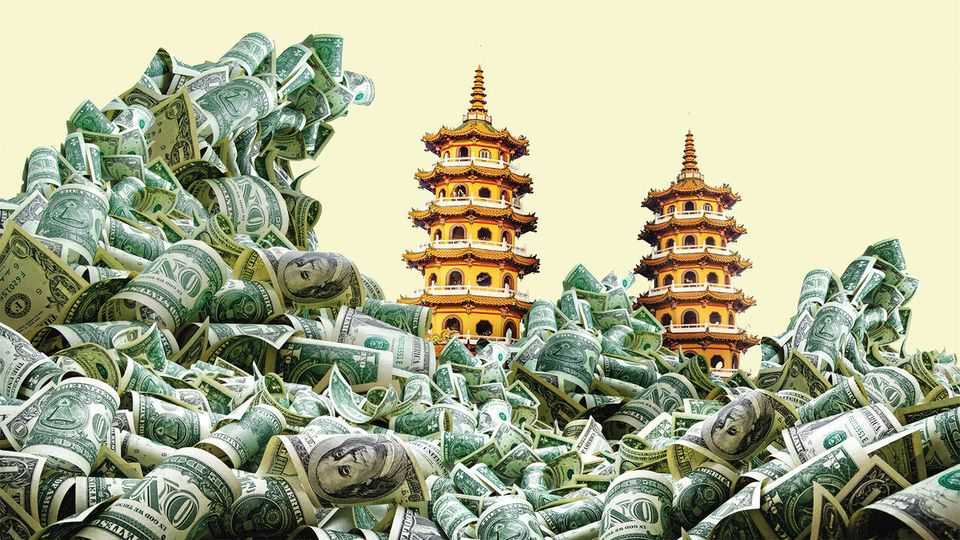
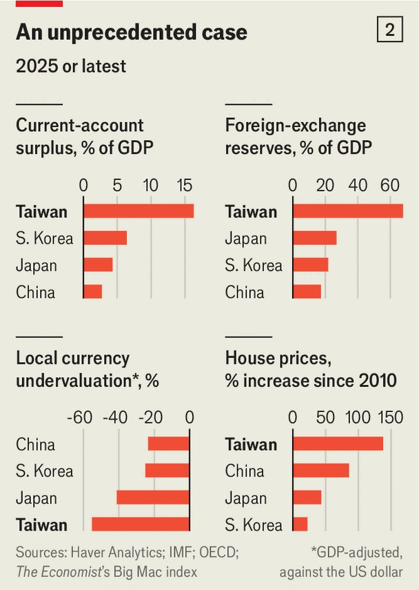
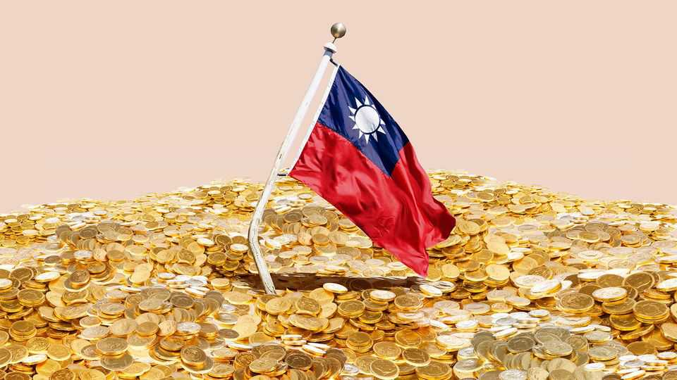

Briefing | Formosan flu
Taiwan’s amazing economic achievements are yielding alarming strains
It has the world’s most undervalued currency and one of its biggest trade surpluses
November 13th 2025

IT IS A wild economic success, but is racked by eye-popping imbalances. It is one of the richest countries in the world, with an output per person higher than Australia, Germany or Japan after adjusting for the cost of living, but has the world’s most undervalued currency, according to The Economist’s Big Mac index. It is on a roll, but risks a messy correction. Economic management does not usually involve many Shakespearean dilemmas, but Taiwan’s quandary is genuinely wrenching: the CBC, its central bank, is naturally reluctant to abandon the policies that have made the country so wealthy, yet clinging to them is clearly unsustainable.

At first glance, there is only good news. The world is buying Taiwanese computer chips as fast as TSMC and other local manufacturers can make them. Exports of chips and servers have soared by 300% over the past five years—and were high to begin with. This surge has yielded stratospheric trade surpluses. In October Taiwan’s monthly goods-trade surplus reached a record $22.6bn, or 31% of GDP at an annualised rate. The current-account surplus, which includes the trade balance and other income that flows across borders, has swollen to 16% of GDP so far this year, up from 10% in the 2010s.

Typically, when a country’s exports surge, its currency will strengthen, since foreigners will need more of it to pay for the goods they are buying. This process can be economically harmful: in the 1970s The Economist coined the phrase “Dutch disease” to describe the economic malaise in the Netherlands, as booming exports of natural gas caused the guilder to appreciate, making other Dutch goods more expensive for foreigners and so hurting the non-gaseous parts of the economy.

For decades, as Taiwan has exported its way to prosperity, the CBC has tried to avoid such a fate by suppressing the value of the local currency. In effect, it has printed and sold lots of Taiwan dollars to buy the American sort. That has helped keep Taiwanese exports competitive, but has also generated big

distortions. Taiwan’s current-account surplus has swollen; its foreign- currency reserves have piled up and house prices have soared. All these imbalances have grown steadily in recent decades (see chart 1); they are all now much more severe than in other, similar economies (see chart 2). Call it Taiwanese disease, or Formosan flu: when a central bank’s efforts to suppress the currency to keep exports competitive leads to worrying economic strains. This condition, although not necessarily fatal, will certainly not improve without treatment.

The most obvious symptom of the ailment is the value of the Taiwan dollar. How cheap is it? The Big Mac index operates on the premise that an identical burger from McDonald’s ought to cost the same in every country, at least after adjusting for countries’ relative wealth. If the price of a Taiwanese burger, once translated into American dollars, is much lower than that of an American one, it suggests that the Taiwan dollar is undervalued. A Taiwanese Big Mac, it turns out, costs 56% less than an American one. America is a fraction wealthier than Taiwan, but that affects things only on the margins. Adjusting for this, we calculate that the Taiwan dollar is 55% undervalued, the most of all 53 currencies we track in this way despite a relatively sharp appreciation earlier this year.

More elaborate efforts to compare the Taiwan dollar’s valuation turn up similar results. An index produced by William Cline of the Peterson Institute for International Economics, an American think-tank, assesses the “fundamental equilibrium” of a currency—the level which would keep current-account surpluses below 3% of GDP. Mr Cline finds that since 2008 the Taiwan dollar has been on average 24% weaker than that.

The CBC claims it does not suppress the Taiwan dollar’s value, but merely “leans against the wind” to reduce volatility. Yet if the CBC were indifferent to the direction the wind was blowing, its foreign-currency reserves would bounce up and down, or perhaps grow modestly owing to investment returns. Instead, they have grown steadily and massively, from $90bn (32% of GDP) in 1998 to $600bn (72% of GDP).

Another symptom of Formosan flu is Taiwan’s huge and growing current- account surplus. This is the mathematical corollary of other countries’ deficits, the CBC notes. Places that invest more than they save, like America, need countries like Taiwan, which does the opposite, to finance the difference. Yet that raises the question of why Taiwan’s savings are so abundant.

There could be many reasons for this: scant domestic investment opportunities, a fast-ageing population saving for retirement or a sudden export boom. Yet none of these fully accounts for the savings glut. Domestic investment does not look abnormally low. As a share of output, it is in line with other rich, export-oriented countries, such as Germany, Japan and South Korea. Taiwan’s demography is also not so unusual for East Asia: excess savings in South Korea, where the population is ageing equally fast, are a third the size of Taiwan’s. And the surge in chip exports over the past five years, as big as it has been, cannot explain the 25-year growth of Taiwan’s current-account surplus.

In fact, Taiwan’s savings are almost as big as those of China, the archetype of an economy engineered to promote exports. Taiwan’s gross national savings rate, at 39% of GDP, far outstrips the rich-world average of 22% and is almost at China’s level (42%). The flipside of all this saving is that Taiwanese are consuming far less than they might. Since 1998 private consumption has fallen by 20 percentage points as a share of GDP, to 45%.

Again, that is close to China’s level (40%) and far below the rich-world average of 60%.

As dry and technical as all this may sound, the CBC is in effect sacrificing the living standards of ordinary Taiwanese on the altar of export competitiveness. Critics say the central bank prioritises export growth with single-minded fervour, an approach which harms the country in several ways. First, keeping the currency weak subsidises exporters at the expense of importers. In Taiwan, where the vast majority of both food and fuel (for vehicles and power plants) is imported, this acts as a transfer from poor households to the owners and employees of exporting firms.

Taiwanese workers have good reason to feel aggrieved. Labour productivity has doubled since 1998, yet unlike in most rich countries or even in wage- suppressed China, pay has not risen in tandem. Taiwanese unit labour costs, a measure of what workers earn per unit of output, have fallen by 25% over the same period. The workers’ share of Taiwan’s swelling industrial output, in other words, has shrunk.

What is more, the CBC’s policies have pumped up property prices, further sapping the purchasing power of ordinary Taiwanese. The Taiwan dollars printed to keep the currency cheap have left Taiwan awash with cash, which has pushed down interest rates. The CBC mops up some of this money by issuing certificates of deposit, sucking cash back out of the financial system. But this “sterilisation” is only partial. Taiwanese banks still have so much money piling up that they have been lending it out to home-buyers at an average rate of just 2% since the mid-2000s (the average rate in 1998 was 8%). Such cheap borrowing, coupled with high savings, has hugely inflated house prices. The CBC has recently tried to curb mortgage lending, and prices have dipped slightly. But they are still more than four times higher than they were in 1998. The median house-price-to-income ratio in Taipei, at 16, is higher than for London, New York or Seoul.

Policymakers and even voters may see these costs as a worthwhile sacrifice to preserve export-led growth. But the imbalances created by a bulging current-account surplus can also foster financial risk. Until recently, the CBC simply took all the hard currency it was piling up from selling Taiwan dollars and invested it abroad. But its reserve accumulation has slowed since

2012, perhaps because the CBC was anxious that America might declare it a currency manipulator, as it has done twice before. Instead the CBC has found a subtler way to channel the windfall, through the life-insurance industry.

Life insurance is extremely popular in Taiwan: the average person holds more than two policies. The insurers plough household savings into foreign assets, mostly American Treasury bonds. Since 2012 these firms’ share of Taiwan’s foreign holdings has doubled to 31%, whereas the CBC’s slice has halved, to 19%. The CBC has encouraged this overseas investment spree by reducing the risk for the insurance firms through interventions in the market for foreign-currency swaps. By the end of last year it had built up a $77bn stash of such derivatives, in effect making it much cheaper for the insurers to hedge their exposure to swings in currency markets.

Taiwanese insurers have made $960bn of promises to savers, which are backed by $700bn in higher-return foreign (principally American) assets. The industry thus suffers from an alarming mismatch, backing Taiwan-dollar promises with American-dollar holdings. Although the CBC has helped them reduce their exposure to movements in exchange rates, this hedging has not eliminated the risk entirely. A stronger Taiwan dollar would still shrink the value of their foreign assets, without diminishing their liabilities. Brad Setser and Josh Younger, two American economists, estimate the unhedged risk at around $200bn, or about a quarter of Taiwan’s GDP. A sharp appreciation of the Taiwan dollar could leave the insurers insolvent. Allowing them to collapse, however, would devastate Taiwanese savers. The insurers have become too big to fail.

The CBC is not simply being reckless. Its policies are rooted in Taiwan’s sense of vulnerability. Because of China’s attempts to isolate Taiwan diplomatically, it is not a member of the IMF. It would have no obvious recourse in a currency crisis. A war with the mainland would create a hard- currency crunch. A weak currency, and the accumulation of reserves that it spurs, would help ward off the first risk and cope with the second. The CBC thinks its approach was vindicated by the Asian financial crisis of 1997-98, which Taiwan escaped largely unscathed even as South Korea turned to the IMF for a $58bn bail-out. Most important, coddling exporters has made the country rich. Why mess with success?

Powerful forces are arrayed to defend the status quo. Exporters, naturally, lobby fiercely against currency appreciation. Half of exports by listed Taiwanese manufacturers could be rendered unprofitable by a 10% rise in the currency, estimates Goldman Sachs, a bank. Low-tech firms account for around 70% of jobs in manufacturing. They compete primarily on price, making a cheap currency a near-existential need. David Chuang, a machinery-industry representative who also runs a machine-tool maker, says the Taiwan dollar’s appreciation this year forced his firm into bruising contract re-negotiations.

Even chipmakers with more pricing power suffer when the Taiwan dollar appreciates: TSMC has said every 1% rise pinches its operating margin by 0.4 percentage points. Dennis Chen of Win Semiconductors, another chipmaker, says the government should maintain a tough line on currency- speculating “vultures”, for fear of hurting manufacturers. Politicians, understandably, are sympathetic.

In addition, the CBC’s transfers of profits to the government have become a crucial revenue stream. These made up 6% of all government revenue in 2023, compared with a rich-world average of 0.4%. In one bumper year the central bank’s contribution was 15% of the government’s income.

The CBC has unusual clout in Taiwanese politics. Officials fear it. “None of us wanted to be seen criticising” the CBC’s all-powerful governor, says a former minister. Perng Fai-nan, who was governor from 1998 to 2018, and his hand-picked successor, Yang Chin-long, have been known to call critics’ bosses to complain, according to four people with direct knowledge of such incidents.

In “The Privilege of Getting Rich”, a polemic against the CBC published in 2021, four Taiwanese economists argue that, in its hostility to criticism, the central bank “behaves like that of a less developed country”. Unlike consensus-driven central banks such as America’s Federal Reserve, Messrs Perng and Yang have dominated decision-making at the CBC. “Many colleagues within the CBC are also critical” of its foreign-exchange policies, says Chen Nan-Kuang, who was its deputy governor from 2018 to 2023. “But the CBC has many means of intimidation.”

The political clout of the governor of the CBC is exceeded only by Taiwan’s president, says another former deputy governor. (Mr Perng’s governorship spanned the tenure of four presidents.) In part this reflects Taiwan’s political history. After China’s nationalist rulers retreated to Taiwan in 1949 having lost China’s civil war, they imposed martial law. It was not lifted until 1987. The central bank became part of the autocracy imposed by the ruling Kuomintang party (KMT), with the governorship seen as a stepping stone to high office. “The KMT believed that if they wanted to control the economy, they had to control not only the central bank but also the commercial banks. This mindset has not changed today,” says Wu Tsong-Min, a former member

of the CBC’s board and author of a forthcoming history of Taiwan’s economic institutions.

Although the CBC is a technocratic institution these days, it is still willing to assert its authority. In 2021 it banned several big foreign banks from trading currency hedges. (Their alleged misdeed: abetting speculation in grain derivatives.) Such forcefulness frightens foreign banks, which fear that criticism from the CBC may harm sales, says an employee of one which has recently expanded in Taiwan. The cbc also discourages internal dissent. “After criticising the CBC’s currency policy, I was publicly scolded by KMT legislators for paving the way for speculators,” says the second former deputy governor.

The CBC argues that its record speaks for itself, dismisses complaints of over-centralisation or intimidation as “without merit” and questions the motives of its critics. It is clearly not convinced that the Taiwan dollar should strengthen. But its hand could still be forced. In May rumours that American trade negotiators had demanded an appreciation sent the currency soaring 9% in two trading days—the sort of shift rarely seen outside a crisis. Over the past few months the Taiwan dollar has been gradually losing value again. But Taiwan has not yet concluded a trade deal with America’s new administration, unlike China, Japan and South Korea. The value of the Taiwan dollar could easily become a sticking-point in the ongoing talks.

In the meantime the world’s insatiable demand for Taiwanese computer chips keeps pushing Taiwan’s trade surpluses ever higher, applying constant upward pressure on the currency, adding to the risks posed by the life- insurers’ currency mismatch and possibly stoking resentment within America’s negotiating team. Taiwan’s suppression of its currency may have served it well in the past, but as time goes on it looks less and less tenable. ■

This article was downloaded by zlibrary from https://www.economist.com//briefing/2025/11/13/taiwans-amazing-economic- achievements-are-yielding-alarming-strains

United States

See how Donald Trump is creating his own police force Democrats collapsed in the shutdown fight One of the poorest states in America introduces free child care Parents on e-bikes are transforming the school run Florida is running a radical experiment in education Why the Democrats may lose again to Donald Trump